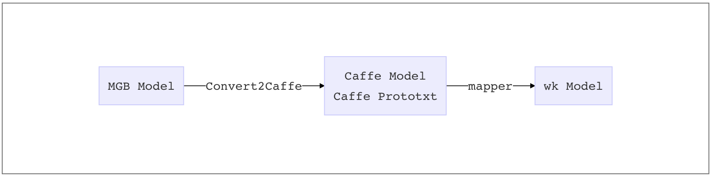
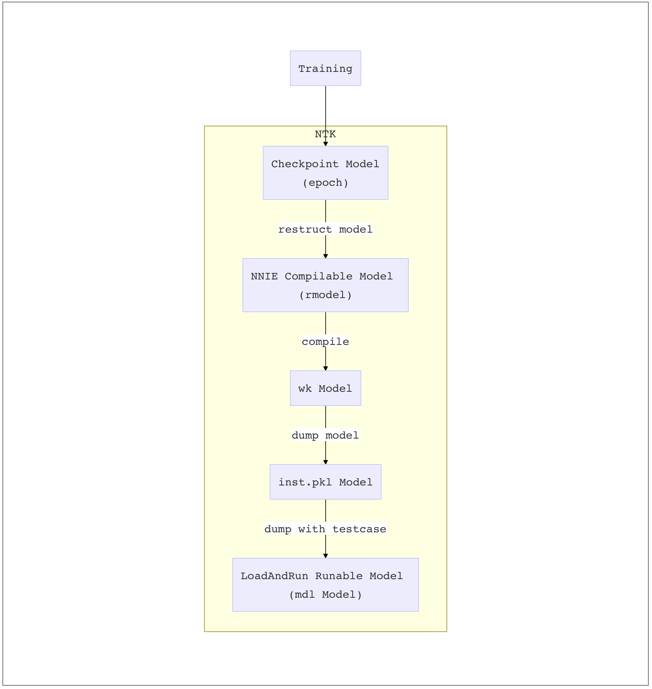

# 测试工具链

本章将介绍与NNIE整体测试相关的工具，其中将会涉及NNIE 编译器，NNIEToolKit，NextOfflineTester 等。NNIE编译器由海思提供，其可将Caffe 模型转换为NNIE可运行的wk模型。NNIEToolKit 是识别组使用的一个工具，针对识别组的模型特点，对NNIE编译器进行了封装，能使用从Megbrain模型到wk、inst.pkl、mdl等模型的转换。最后将简要介绍NextOfflineTester，及其如何实现在NNIE上进行特征抽取并完成最终的指标测试。

## NNIE编译过程

在NNIE上面运行的模型，需要将使用Hisi提供的编译器，将网络模型编译成wk模型，方能在NNIE设备上运行。编译过程主要编译过程主要包含了量化相关的操作，即将原有Float32类型的参数转化为INT8类型的参数；其次，会计算feature map量化的scale参数，这一步要求在编译的时候提供部分数据作为校准集（calibration set），用于估算feature map的分布并计算scale参数。最后会包含在NNIE运行过程中所必须的指令集。从一个MegBrain Model 编译成一个wk模型整体流程如下。



由于mapper仅支持编译Caffe 模型，所以需要将现有的MGB Model先转换成Caffe模型，这一步可以使用Engine部门提供的转换脚本，该脚本在megdl路径下（一般为：megdl/MegHair/utils/tocaffe/convert.py）。该脚本接收3个必需参数；-i：输入MGB模型，-b: 输出Caffe 参数文件（caffemodel），-c：输出Caffe 结构文件（prototxt）；以及一个可选参数--inplace，该参数会将caffe中可以进行in-place操作的opr设置为in-place格式，推荐打开本参数，可加快NNIE模型执行速度。

得到Caffe 模型之后，即可使用Hisi提供的mapper 将Caffe模型转换成wk模型。本小节将主要介绍NNIE的后续部分将主要介绍编译器基本使用方法，NNIE网络模型约束及NNIE性能优化建议等。

## 编译器

### 编译器版本

NNIE 在SDK包中提供了对应版本的SDK工具，在tool\nnie\linux\mapper目录中，该工具为Linux版本使用。由于hisi 可能会随时修改mapper的bug，所以会不定期发布补丁版本。 

### 编译器使用

在得到mapper及 caffe model 之后，可开始编译网络模型，编译模型步骤需要依赖相关lib库，可在NNIE Mapper Lib下载，内部包含3559、3516两个版本的NNIE编译器所需要的lib库。下载后将对应lib库地址加入LD_LIBRARY_PATH环境变量中，即可开始编译。

编译器执行过程中接受一个config file 作为参数，所有编译信息放置在该配置文件内。运行方式如下

```bash
## 执行示例
./nnie_mapper NET.cfg
```

其返回对应结果如下所示

```bash
Mapper Version 1.1.2.2_B010_P002 (NNIE_1.1) 1904031504157241
begin net parsing....
end net parsing
begin prev optimizing....
end prev optimizing....
begin net quantalizing(CPU)....
end quantalizing
begin optimizing....
end optimizing
begin NNIE[0] mem allocation....
end NNIE[0] memory allocating
begin NNIE[0] instruction generating....
end NNIE[0] instruction generating
begin parameter compressing....
end parameter compressing
begin compress index generating....
end compress index generating
begin binary code generating....
end binary code generating
begin quant files writing....
end quant files writing
```

第一行表示编译器版本信息，后续部分为内部执行操作。

执行完成后，当前文件夹下生成多个文件，其中包括文件树及重点文件说明如下所示。

```bash
├── cnn_net_tree.dot ## 编译后网络结构，采用DOT语言描述
├── cnn_net_tree_gv.dot
├── cnn_net_tree_org.dot
├── cnn_net_tree_pre.dot
├── cnn_net_tree_pre_org.dot
├── dout_nne_para.txt
├── ibd_para.txt
├── instruction.txt
├── inst.wk  ## 生成的wk模型
├── mapper_debug.log
├── mapper_error.log
├── mapper_param  ## 经过量化及反量化后的参数
│   ├── comp2:NET:Block_2a:conv3x3_1:conv_fold_blob0_weight.float
...
├── mapper_quant ## 最后一张calibration图片的中间层结果，详细说明见下文
│   ├── comp2:NET:Block_2a:conv3x3_1:conv_fold_weight-anti.float
...
├── netmem_info.data
└── RUNTIME.txt

```

输出文件中，inst.wk 即为最终的NNIE 模型，该模型可直接使用SDK进行调用并在NNIE进行Inference。由于不同业务线的需求不同，部分业务线Dev同学可直接使用wk模型进行集成，部分业务线会要求将模型封装成conf，并交给Dev侧集成。具体部分可与Dev协商，本节不在赘述。

上述输出内容中，有一个输出信息比较重要，可用于后续量化debug，故在此先做强调。mapper_quant 文件夹中会包含最后一张calibration 图片的中间结果以及对应网络量化后权重信息。详细说明见下表。

| 文件名 | 内容含义 |备注|
| :--- | :--- | :--- |
|\$(layer\_name)\_bias.hex|量化后的bias，十六进制，24.0格式||
| \$(layer\_name)\_weight.hex | 量化后的weight，十六进制，1.3.4 或 1.5.7格式，8bit数或16bit数 | |
| \$(layer\_name)\_weight-anti.float | 反量化后的weight，浮点 ||
| \$(layer\_name)\_input\$(layer\_id)\_\$C\_\$H\_\$W\_anti\_quant.linear.float | 反量化后的input，浮点 | 最后一张calibration 图片结果 |
|$(layer\_name)\_input\$(layer\_id)\_\$C\_\$H\_\$W\_quant.nonlinear.hex  | 量化后的input，十六进制，1.3.4 或 1.5.7格式 | 最后一张calibration 图片结果 |
| \$(layer\_name)\_output\$(layer\_id)\_\$C\_\$H\_\$W\_quant.linear.hex | 使用反量化的input，做forward后的output，十六进制，20.12格式 | 最后一张calibration 图片结果 |

上述文件细节文件说明：

1. hex表示十六进制文件，可直接用vim打开，每一行对应一个十六进制数，即为NNIE内部的整型表示，可能是两个数（八位）或四个数（十六位）。float表示浮点文件，即反量化后的浮点数。1.3.4或1.5.7表示定点形式的实数表示法，1位符号位，3或5位整数位，4或7位小数位。
2. Hisi所有结果均以单行形式表示，即每一行一个数。但实际模型中的结果为四维张量（NCHW），只需要将四维张量reshape(-1)即可得到对应的海思表示顺序。注意：若为FC层结果（NC），则需要先进行转置在reshape(-1)。

其他说明：

1. nonlinear 表示非线性，是量化后的值。

2. linear 表示线性，是量化前或反量化后的值

3. Input/output 是$(layer_name) 这层的输入、输出。mapper_quant 只保存最后一张图片inference的数据 。

4. anti_quant.linear.float 是quant.nonlinear.hex 反量化的结果。

### 编译器参数

介绍完编译器使用方式及输入输出后，需要详细介绍一下编译器的参数，即上述中NET.cfg的形式。识别组配置文件大致如下所示

```bash
[prototxt_file] /tmp/nnie_7a65e9e6cc0dc448c3c407561c112fbe/NET.txt
[caffemodel_file] /tmp/nnie_7a65e9e6cc0dc448c3c407561c112fbe/NET.caffemodel
[net_type] 0
[batch_num] 0
[image_list] /tmp/nnie_7a65e9e6cc0dc448c3c407561c112fbe/input_img0_comp_fullface_stn.txt
[image_type] 1
[norm_type] 2
[mean_file] /home/xx/projects/NNIEToolKit/ntk/config_file/minus128.txt
[image_list] /tmp/nnie_7a65e9e6cc0dc448c3c407561c112fbe/input_img0_comp2_stn.txt
[image_type] 1
[norm_type] 2
[mean_file] /home/xx/projects/NNIEToolKit/ntk/config_file/minus128.txt
[image_list] /tmp/nnie_7a65e9e6cc0dc448c3c407561c112fbe/input_img0_comp3_stn.txt
[image_type] 1
[norm_type] 2
[mean_file] /home/xx/projects/NNIEToolKit/ntk/config_file/minus128.txt
[compress_mode] 1
[compile_mode] 2
[log_level] 3
```

细节说明如下表

| 配置选项            | 取值范围                                | 描述                                                         |
| ------------------- | --------------------------------------- | ------------------------------------------------------------ |
| prototxt_file       | -                                       | 网络描述文件，详细要求见“3.2 Prototxt要求”，描述外支持情况与caffe相同。 |
| net_type            | {0, 1, 2}                               | 网络的类型。   0：CNN（不包含LSTM/RNN/ROIPooling/PSROIPooling的任意网络）；   1：ROI/PSROI（包含ROI Pooling和PSROI Pooling的网络）；   2：Recurrent（包含LSTM、RNN的网络）；识别侧仅使用0类型，其他特殊类型及对应层的设置请查阅Hisi官方文档。 |
| caffemodel_file     | -                                       | 网络模型数据文件。                                           |
| image_list          | -                                       | 网络中如果存在多个输入层，则需要配置多个image_list顶，顺序、个数与prototxt完全对应。   如果网络的数据输入是灰度或者RGB图像输入，即image_type配置不为0，image_list配置为所有参考图片的list，内容示意如下图图示，图片的格式支持以下几种：   ".bmp", ".dib",   ".jpeg", ".jpg", ".jpe", ".jp2",   ".png", ".webp", ".pbm", ".pgm",   ".ppm", ".sr", ".ras", ".tiff",   ".tif",  ".BMP",   ".DIB", ".JPEG", ".JPG", ".JPE", ".JP2",   ".PNG", ".WEBP", ".PBM", ".PGM",   ".PPM", ".SR", ".RAS", ".TIFF",   ".TIF"   如果网络的输入是feature   map或者FC向量输入，即image_type配置为0，将c*h*w个点（即一个完整的张量）以浮点文本的形式输出在一行内，点与点之间以空格或逗号分隔。如果是多帧输入，则每一行输出一个完整的张量。Recurrent输入时，格式等同于feature map输入，每行一个向量，一句话写成连续的多行，多句量化时需要将每一句的帧数都补齐为最大帧数。 |
| image_type          | {0,1,3,5}                               | 表示网络实际执行时输入给网络的数据类型，该配置跟image_list相关。   0：表示网络数据输入为 SVP_BLOB_TYPE_S32（参考《HiSVP API参考》）或者向量的类型（VEC_S32和SEQ_S32）；此时要求image_list配置为feature map文件；   1：表示网络数据输入为SVP_BLOB_TYPE_U8（普通的灰度图和RGB图）类型； 此时要求image_list配置是RGB图或者灰度图片的list文件；   3：网络数据输入为SVP_BLOB_TYPE_YUV420SP类型；   5：网络数据输入为SVP_BLOB_TYPE_YUV422SP类型；   当配置为3或者5时，image_list配置为RGB图片的list文件。 |
| norm_type           | {0, 1, 2, 3, 4, 5}                      | 表示对网络数据输入的预处理方法。注意image_type配置为0时，norm_type只能配置为0；image_type配置为3或者5时，网络输入数据为YUV图像，但是NNIE硬件会根据RGB_order配置项自动转为RGB或者BGR图像，此时norm_type配置方法跟image_type为1时一致。   0：不做任何预处理；   1：mean file，减图像均值；   2：channel mean_value，减通道均值；   3：data_scale，对图像像素值乘以data_scale；   4：mean filewith data_scale，减图像均值后再乘以data_scale；   5：channel mean_value with data_scale，减通道均值后再乘以data_scale。 |
| data_scale          | (1/4096, FLT_MAX)   default: 0.00390625 | 数据预处理缩放比例，配置为浮点数，配合norm_type使用   本参数可省略，默认为0.00390625=1/256。FLT_MAX等于3.402823466e+38。 |
| mean_file           | -                                       | norm_type为1、4时，表示均值文件xxx.binaryproto；   norm_type为2、5时，表示通道均值文件；   norm_type为0、3时，用户也需要配置mean_file项，但具体内容可以是一个无效路径，比如null；通道均值文件mean.txt中每一行的浮点数表示对应的通道均值，如单通道只有一个值。 |
| batch_num           | [0, 256]   default: 256                 | 0/1：single（单张）模式；   >1：batch（多张）模式。   采用single模式mapper一个任务只能处理一张图片，内部存储全部为一张图片分配，减少数据调度次数。   采用batch模式，在计算FC时batch_num张图片同时计算，计算资源利用率高。 |
| sparse_rate         | [0, 1]   default: 0                     | NNIE引擎采用了参数压缩技术以减少带宽占用，为了提高压缩率，可通对FC参数进稀疏处理。   用户通过sparse_rate数值指定多少比例的FC参数稀疏为0，例如配0.5，则FC参数有50%将被稀疏为0，由于数据变的稀疏，压缩模块会获得更好的压缩率。稀疏值越高，计算FC时所需参数带宽越低，但精度会有所下降。 |
| compile_mode        | {0, 1, 2}   default: 0                  | 0：Low-bandwidth(低带宽模式，默认)：通过量化算法使参数与数据位宽最少，使系统所需带宽达到最小，但会有精度损失；   1：High-precision(高精度模式): 结果精度最好，但是性能会下降；；   2：User-specify(用户配置模式): 需要用户在prototxt中标明所有使用高精度计算的层，标注规则请见prototxt_file说明； |
| compress_mode       | {0, 1}   default: 0                     | 配置压缩模式。   0：Normal模式（包含Normal、Ternary、Binary、Sparse四种压缩模式的自动切换）；   1：Bypass模式，关闭压缩功能。   要求：   可不填，默认为Normal模式；用户提供的参数只有三种值且正负对称时，nnie_mapper会自动进入Ternary模式；用户提供的参数只有两种值且包含0时，nnie_mapper会自动进入Binary模式； |
| max_roi_frame_cnt   | [1, 5000]   default: 300                | 包含ROI/PSROI网络的RPN阶段输出的候选框最大数目。   默认值：300。 |
| roi_coordinate_file | -                                       | Mapper在网络模型转化过程中输入给ROI Pooling或PSROI Pooling层的配置参数，用于指定ROI框的坐标信息，每一行五个值，分别代表batch_index(int)、left_x（float）、top_y（float）、right_x（float）、bottom_y（float），不同的框以换行符分隔。   框坐标是在caffe中使用输入给mapper的image_list的相同图片运行到RPN层的输出结果，如Faster RCNN网络中Proposal 层的top为rois，在caffe forward结束后，通过np.savetxt('rois.txt',   net.blobs['rois'].data[...], fmt="%.6f") 保存框坐标为文件。需要保证两者图片输入顺序相同，同时要保证caffe运行时输入给网络的分辨率跟配置给mapper的prototxt中的分辨率相同。   For example:   0    734.01  147.02  806.03    294.04   0    723.05  157.06  818.07    306.08   1    749.09  170.10  817.11    310.12   1    678.13  220.14  855.15    374.16   如果一个网络中有多个ROI   Pooling或PSROI   Pooling层，则需要配置多行坐标文件，个数与ROI Pooling或PSROI Pooling层个数对应，配置的顺序也需要与prototxt内对应层顺序相同； |
| is_simulation       | {0, 1}   default: 0                     | 网络模型转化类型。   0：Chip，芯片模式，网络模型转化成在芯片上加载的wk文件，指令仿真也使用此模式；   1：Simulation，仿真模式，网络模型转化成在PC端仿真上加载的wk文件，功能仿真使用此模式； |
| instructions_name   | string length < 120   default: inst     | nnie_mapper生成的知识库文件名称。   默认生成如下格式的知识库名：inst.wk；用户也可以自行修改生成的知识库名字。 |
| internal_stride     | {16, 32}   default: 16                  | 用户根据DDR颗粒对应的最佳读写效率配置中间结果的对齐方式。   要求：   DDR3对应16，DDR4对应32，可不填，默认为16； |
| is_check_prototxt   | {0, 1}   default: 0                     | 检查网络描述文件标志。   0：mapper模式，对prototxt、caffemodel等进行转化。   1：网络过滤器模式，对prototxt文件是否符合支持规格进行检查。 |
| ­log_level          | {0, 1, 2, 3}   default: 0               | 设置是否开启日志文件，以及配置打印的等级，本参数可省略，当省略时，为不打印日志文件。   0：打印main函数流程，cfg文件等信息；   1：打印nnie_mapper解析到的文件信息，包含image_list、prototxt、内存分配过程；   2：打印中间表示信息；   3：打印详细信息，有大量文件输出，转化耗时较长，请谨慎使用； |
| recurrent_tmax      | [1, 1024]   default: 1024               | Recurrent网络（包含LSTM/RNN层）每一句话的最大桢数，支持[1, 1024]范围内的配置，减小配置值可以减小临时缓存大小。 |
| RGB_order           | {RGB, BGR}   default: BGR               | image_type设置为0时，该参数无效；   image_type设置为1时，不管该参数配置何值，要求用户板端输入必须为BGR_Planar格式图像；   image_type设置为3、5时，表示YUV图像数据转成RGB Planar或者BGR Planar图像输入给网络。   本参数可省略。 |

  

### 网络模型约束

NNIE 目前支持经典网络的实现，如VGG、ResNet、Inception Net等识别网络，Faster R-CNN、YOLO、SSD、RFCN等检测网络，以及SegNet、FCN等场景分割网络。如果你的网络是标准的网络，没有任何Trick的话，则可以放心的使用。但是如果有一些其他Trick的话就需要额外注意一下了。

NNIE由于硬件特性的原因，导致其对网络进行了一些硬性限制，这些限制需要使用者格外注意，网络限制主要包含三个部分：1. 不支持的层，需要使用者手动扩充或自定义custom layer。2. 对层本身参数的限制，NNIE支持大部分Caffe 1.0版本所设计的层，但是对层本身的参数进行了约束和限制。3. 对层与层之间层级关系的约束，NNIE中，部分层不能直接相连，如InnerProduct后面不可连接MatMul层等之类的约束。


**不支持的层**

一个网络的层可分为如下的3类：

- 标准层：NNIE支持的Caffe标准层，比如Convolution，Pooling层等；

这部分层无需所任何操作就可以直接使用

- 扩展层：NNIE支持的公开但非Caffe标准层包括ROIPooling、Normalize、PSROIPooling、Upsample、CReLU、PassThrough、Depthwise Convolution、RReLU、Permute

针对使用了扩展层的网络，用户可以二选一操作：

1. 按照扩展Caffe的caffe.proto以及扩展层代码实现，并以此基础来进行训练，对应部署的deploy.prototxt满足mapper要求。

2. 使用开源的扩展cafferbgirshick/py-faster-rcnncaffe.protomapperdeploy.prototxt3.1.4.3 扩展层在中的定义中要求以便识别。

详细扩展方式见hisi官方文档第3.1.4章节

- Non-support层：NNIE不支持的层，比如Caffe中专用于Tranning的层、其他非Caffe框架中的一些层或者用户自定义的私有层等。

其次还有一部分层是NNIE未实现的，但是可以自己手动编写Caffe实现，对该层进行扩充，如Proposal Layer及Custom Layer，这些层会被放置在CPU上进行执行，详见hisi官方文档第 3.1.5 章节


**对层本省参数的限制**

NNIE 本身支持Caffe 1.0标准，但是对该标准进行了一些约束，所以在进行网络设计的时候，需要额外注意。R侧较为经常会触及的约束主要包括以下内容。

1. NNIE 对大多数层，feature map的weight 均只支持到4096维
2. NNIE 不支持对Batch维度进行的任何操作，在网络中不允许任何可能修改Batch维度的操作
3. NNIE 对于大多数整数参数，如kernel size、padding等，仅支持1～255
4. Power层指数部分仅支持-3、-2、-1、-1/2、1/2、1、2、3
5. Convolution层的Group参数最大仅支持到2048

其余非常见部分，可以参考hisi官方文档第 3.1.6.2 章节。如果拿不准某一个层是否支持，或者拿不准其支持的规格如何，一定要查询文档进行确定！

**对层与层之间层级关系的约束**

NNIE 在约束层内部参数的同时，还可能会对层与层的层级关系进行约束。

NNIE 主要对InnerProduct、LSTM、RNN、SPP、Proposal、MatMul、CReLU、ROIPooling、PSROIPooling等层进行了网络层级的约束，如果你在网络设计的过程中使用了这些层，可以查阅一下hisi官方文档第 3.1.6.1 章节，确实自己所设计的网络对应层前后是否存在不可连接的层。


## NTK 编译工具

NNIEToolKit(NTK) 是专为R侧识别组所开发的编译工具，其结合了识别模型的特性，能够实现将训练过程中的checkpoint模型转换成NNIE可编译模型，并且对该模型进行编译，生成wk模型、inst.pkl模型及mdl模型。其整体流程入下图所示。




NKT由模型训练过程中存在的checkpoint出发，首先通过restruct model将模型处理成NNIE能够编译的模型，其中就包括输入处理，opr替换，吸BN，加PCA等操作。这一步完成之后将模型送入编译脚本中，这里NTK对原始的编译器（mapper）做了一个封装，能够实现编译带STN的网络，并生成wk模型。其后会对wk模型进行一个封装，将wk模型封装成mgb的一个layer，并补充mgb的输入和输出，打包成inst.pkl模型。最后利用dump with testcase 脚本，封装入数据，生成mdl模型。最后这个mdl模型就可以被load and run调用，在板端运行得到NNIE实际结果。

###TODO 补充NTK实现细节


## 累积误差分析工具

分析的对象是Qfloat和Q之间的gap，分析方法主要是逐层比对，大体分为以下几步

- Step1: 给定wk网络，利用海思编译器，得到单图做calibration，单图inference结果
- Step2: 给定mgb网络，在对应的地方插入量化算子，得到单图inference结果
- Step3: 自动匹配或者手动指定wk和mgb算子名称的对应关系，执行逐层结果比对


### Step1

核心脚本如下所示:

```bash
set -x
set -e
work_root=/unsullied/sharefs/chenxi/swap-tmp/nnie_hconcat2
model_file=/home/chenxi/projects/edge-codebase/work_scripts/buri_float_rmodel_hconcat2.pkl

mkdir -p $work_root
python3 compile_model.py --model $model_file --cali_dir calibration/QC-BMK --strip_var NET:conv7x7:conv --has_stn --cali_num 61 --cali_start 0
mv /tmp/output-ntk-start-0-total-61 $work_root &
for i in $(seq 0 60); do
    python3 compile_model.py --model $model_file --cali_dir calibration/QC-BMK --strip_var NET:conv7x7:conv --has_stn --cali_num 1 --cali_start $i
    mv /tmp/output-ntk-start-${i}-total-1 $work_root &
done
sleep 2m

python3 collect_data_parallel2.py --model $model_file  --work-root $work_root

```


- `compile_model.py`有两个比较重要的参数，表征哪些图用来做calibration集合，一个是`--cali_start`，另外一个是`--cali_num`，相当于start和len。每调用一次，会在`/tmp`下生成形如`output-ntk-start-x-total-y`，其中`x`就是`cali_start`，`y`就是`cali_num`。文件说明如下所示。

|别名|文件名| 内容含义| 备注|
| :------------- | ------------------- | :------------------ | --------------- |
|                | #(layer\_name)\_weight.hex                                    | 量化后的weight，十六进制，1.3.4 或 1.5.7格式，8bit数或16bit数 |                                 |
|                | #(layer\_name)\_weight-anti.float                             | 反量化后的weight，浮点                                       |                                 |
| dequant_float  | #(layer\_name)\_input#(layer\_id)\_#C\_#H\_#W\_anti\_quant.linear.float | 反量化后的input，浮点                                        | 最后一张calibration set图片结果 |
| int8           | #(layer\_name)\_input#(layer\_id)\_#C\_#H\_#W\_quant.nonlinear.hex  | 量化后的input，十六进制，1.3.4 或 1.5.7格式                  | 最后一张calibration set图片结果 |
| original_float | #(layer\_name)\_output#(layer\_id)\_#C\_#H\_#W\_quant.linear.hex    | 使用反量化的input，做forward后的output，十六进制，20.12格式  | 最后一张calibration set图片结果 |

- `collect_data_parallel2.py`是把上面文件夹里面的原始文件进行解析成一个graph，存储到`infos.pkl`里面。`infos.pkl`里面是个dict，会有三个key, `in_edges`, `out_edges`和`node_info`。
  - `in_edges`和`out_edges`是记录每个节点的流出的节点，流入的节点以及每个节点输出的信息。
  - `node_info`本身也是个dict，代表这个经过这个opr运算后的输出信息，key有`dequant_float, int8`, `original_float`。dequant_float和int8是匹配一对对的，是通过这个opr的后续opr的输入解析出来的；original_float是通过这个opr的输出解析出来的，是原始的float。注意有可能出现dequant_float和original_float不匹配的问题，这个原因在于当opr有多个输入的时候，input0和input1等顺序是未知的。

### Step2和Step3
这里的操作比较常规，纯python逻辑，跟海思关系不大
