# 量化元素
本章首先会介绍海思媒体处理芯片智能视觉异构加速平台(SVP)，其中NNIE是重要的组成部分。然后我们会从量化函数Q，单算子量化，多算子量化以及校准技术这四个方面展开，对NNIE的原理做一个比较全面的讲解，同时中间穿插一些量化误差分析。

## NNIE 介绍	
### SVP简介
SVP(Smart Vision Platform)是海思媒体处理芯片智能视觉异构加速平台。该平台包含了CPU、DSP、NNIE(Neural Network Inference Engine)等多个硬件处理单元和运行在这些硬件上SDK开发环境，以及配套的工具链开发环境。

SVP开发框架如下图所示。目前SVP中包含的硬件处理单元有CPU、vision DSP、NNIE，其中某些硬件可能有多核。

不同的硬件有不同的配套工具链，用户的应用程序需要结合这些工具的使用来开发。

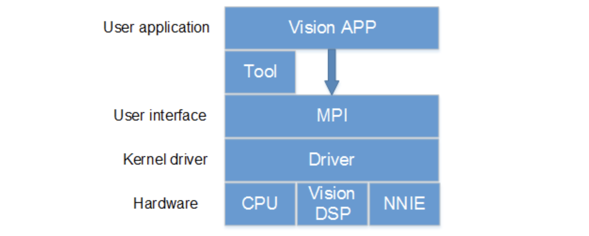

**注意**:

1. 不同的芯片SVP可能会使用不同的硬件资源。
2. 即便是使用相同的硬件型号，硬件的配置也不一定相同。
3. 针对CPU的具体规格，请参考ARM官方文档。
4. DSP和NNIE的硬件规格，可以参考《Hi35xx Vxxx ultra-HD Mobile Camera SoC用户指南》。

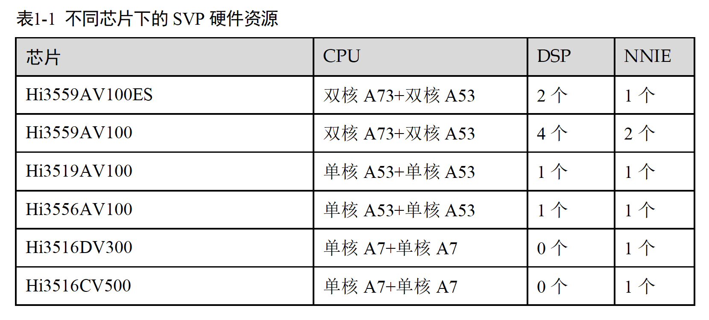

### NNIE 简介
NNIE是Neural Network Inference Engine的简称，是海思媒体SoC中专门针对神经网络特别是深度学习卷积神经网络进行加速处理的硬件单元，支持现有大部分的公开网络，如Alexnet、VGG16、Googlenet、Resnet18、Resnet50等分类网络，Faster R-CNN、YOLO、SSD、RFCN等检测网络，以及SegNet、FCN等场景分割网络。

目前NNIE配套软件及工具链仅支持以Caffe框架，使用其他框架的网络模型需要转化为Caffe框架下的模型。


### 开发流程
以Caffe框架上训练的模型为例，NNIE的开发流程如下图所示。在Caffe上训练、使用NNIE的mapper工具转化都是离线的。通过设置不同的模式，mapper将*.caffemodel转化成在仿真器、仿真库或板端上可加载执行的数据指令文件。一般在开发前期，用户可使用仿真器对训练出来的模型进行精度、性能、带宽进行初步评估，符合用户预期后再使用仿真库进行完整功能的仿真，最后将程序移植到板端。

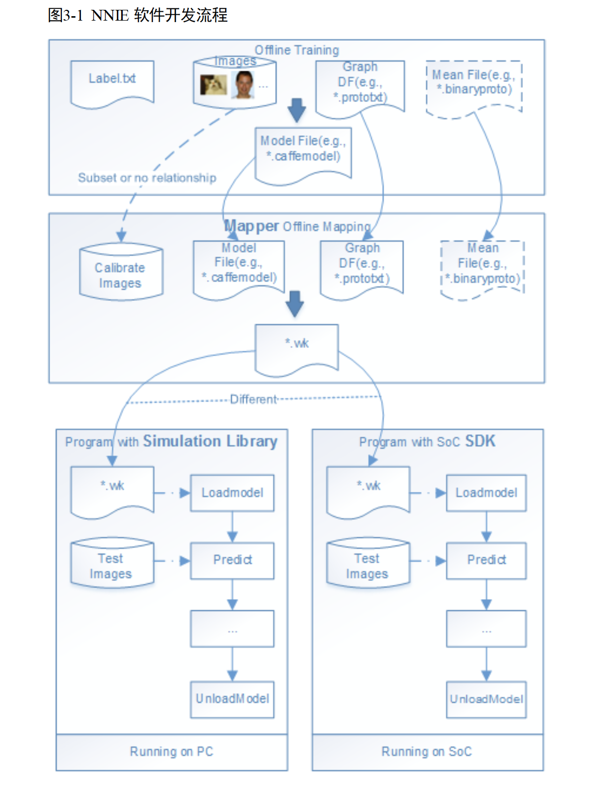


## 量化函数Q

海思虽然没有明确给出量化的细节，但是给了一个仿真器，也就是输入任意的向量，仿真器会返回量化后的值，借助这个工具我们可以慢慢推敲出量化原理。

总体来说是个对称非线性对数量化

- **对称**是指无论正负数首先取绝对值到正数，但是由于量化槽slot数量严格为256，并且0也包含其中，因此正负分配必然是不均匀的，海思采取的是小于0的分配127个，大于0的分配128个。
- **非线性对数**是说量化的时候会先取$\log_2$，然后再做线性均匀量化，量化间隔固定为$s=2^{-4}=0.0625$，量化截断原则是保证最大值，然后根据量化间隔和slot量化槽数量得到最小值。

综合来说，给定一个向量$x$

- 首先对整个向量取$log_2$，得到$\mathit{x\\_log2}$
- 确定最大值。$\mathit{max\\_bound}=\lfloor \max(\mathit{x\\_log2 / s}) \rfloor$
- 确定最小值
  - 原始值为正数的话，有128个slot，因此最小值为$ \mathit{max\\_bound}-127$
  - 原始值为负数的话，有127个slot，因此最小值为$ \mathit{max\\_bound}-126$
- 执行线性量化操作。$\mathit{x\\_clip} = \rm{clip}(\rm{round}(\mathit{x\\_log2/s}), \mathit{min\\_bound}, \mathit{max\\_bound})$
- 修正接近0的数。理论下界会clip到$\mathit{min\\_bound}$，但是如果数值小到一定值，是会近似到0，这个值就是最小值的一半，在对数域为$ \mathit{max\\_bound}-127-16$ (原始值为正数) 或者 $ \mathit{max\\_bound}-126-16$ (原始值为负数)

下面是python代码示例:

```python
def mimic_hisi(x, delta=0.0625):
    x = np.float64(x)
    shp = x.shape # store shape
    x = x.flatten()
    x_abs = np.abs(x)
    x_log2 = np.log2(x_abs) # be aware of 0 -> -inf
    x_sign = np.sign(x)
    x_abs_max = np.max(x_log2)
    max_bound = np.floor(x_abs_max/delta)  # clip towards zero
    min_bound = max_bound - 127 
    clip = np.clip(np.round(x_log2/delta), min_bound, max_bound) 
    modify_mask0 = np.logical_and(x_sign == -1, clip == min_bound) # asymmetric quantization
    clip[modify_mask0] = min_bound + 1
    x_res = 2**(clip*delta)*x_sign
    modify_mask1 = np.logical_and(x_sign == -1, x_log2/delta <= max_bound-126-16) # 1/delta=1/0.0625=16
    modify_mask2 = np.logical_and(x_sign == 1, x_log2/delta <= max_bound-127-16)
    modify_mask = np.logical_or(modify_mask1, modify_mask2)
    x_res[modify_mask] = 0 # set to zero
    x_res = x_res.reshape(*shp)
    return x_res
```


## 单算子量化

在了解NNIE的量化原理之后，我们可以去分析不同层带来的量化误差。为了方便进行量化误差分析，我们使用Hisi提供的名为Cycle仿的工具进行分析。

### Cycle 仿验证

Cycle仿是Hisi用于在CPU上进行NNIE模拟的工具，其运行结果与NNIE高度一致。我们利用某一个发版模型，在NNIE与Cycle仿上同时提取特征，并对比最后结果，结果对比如下：

|类型|值|
|---|---|
|NNIE | [-0.5888623, -2.219482, 0.028809, ..., 0.252686, 0.163818, 0.453613]|
| Cycle | [-0.588862305, -2.2194824, 0.02880859, ..., 0.25268555, 0.16381836, 0.45361328]|
|Max Diff | 5.00000000069889e-7|
| Mean Diff | 2.516387939459405e-7|

经验证，NNIE结果与Cycle仿结果差距主要在计算精度，仅为1e-7量级，可以使用Cycle仿作为板端结果进行分析。

### MatMul 算子
大库search过程，如5w 底库，需要计算特征欧式距离5w 次。在数学上，可以等价转换为一个矩阵乘的过程。匹配分数计算如下：
$$ score = q (query 图片的特征)  * B(底库的特征矩阵)  $$

这里的矩阵乘需要用 NNIE 里的MatMul 算子。由于NNIE 不支持MatMul 算子前后接任何神经网络层，因此这里的search 过程，仅用单层的 MatMul 操作打包成一个 wk，这里记为 search.wk。

由于 q 和 B 都需要支持动态改变的，以支持不同输入、底库更新、底库增删，所以 MatMul 接受2个输入。

search.wk 生成。

#### 附：int8 + search.wk 参数选择的影响
考虑到底库 Base 图片数较多，通常输出 feature 会经过一个 线性的int8量化。流程如下图所示：

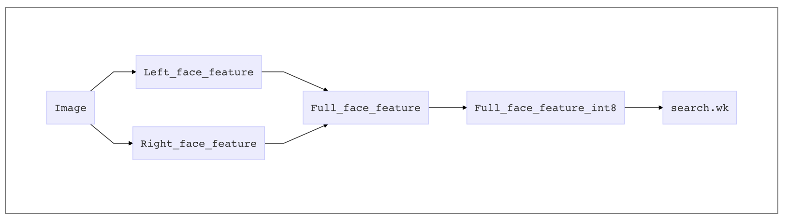

这个int8量化代码如下：

```python
def quant_encode(data, vmin, vdiff):
    scale = 255 - 0
    return np.round(np.clip((data - vmin) / vdiff, 0, 1) * scale).astype('uint8')

def quant_decode(data, vmin, vdiff):
    scale = 255 - 0
    return data.astype(np.float32) * vdiff / scale + vmin
```

其中需要2个参数vmin, vdiff，它们可以直接使用 Validation 数据集（R 侧测试集）上的统计值。使用int8量化后的 feature 在算分时，要与 Float 计算出的阈值对齐，这就需要在工程侧实现时换算 alpha值。

```python
k = 255/vdiff
dist = dist_quant / (k^2)   ## eq1
alpha*dist= alpha_quant*dist_quant  ## eq2
## eq1 + eq2 =>
alpha = alpha_quant * (k^2)
```

那么，vmin, vdiff 的波动对最终阈值的影响有多大？

| vmin      | vidff     | score     |
| -------- | -------- | -------- |
| -7.214599 | 14.428955 | 71.200256 |
| -7.22     | 14.44     | 71.205948 |
| -7.3      | 14.6      | 71.395187 |

从图中可以看出，vmin, vdiff 在四舍五入上的波动，对 score 的影响在0.2分左右，由于没有更好的确定性先验，这里推荐，直接使用 Validation 数据集（R 侧测试集）上的统计值，不做四舍五入取整。

### Conv算子
下图是正常网络训练时候的示意图
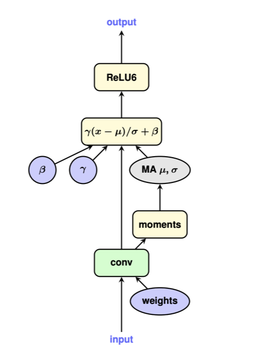

注意$\frac{w*x-\mu}{\sigma}\cdot \gamma + \beta = \frac{w \cdot \gamma}{\sigma} * x  + (\beta - \frac{\mu}{\sigma} \cdot \gamma) $

在qfloat训练的时候，由于有BN的存在，所以我们常用fold的形式，如下所示
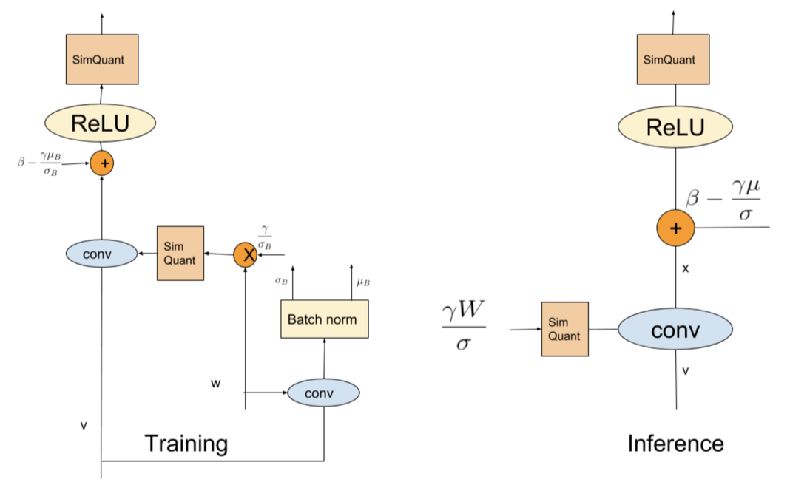


## 全局量化

由于实际的网络使用过程中，不仅仅单层计算所产生的误差可能不足以说明最终结果，逐层的计算将误差累积放大，所以需要对实际模型进行累积误差验证。
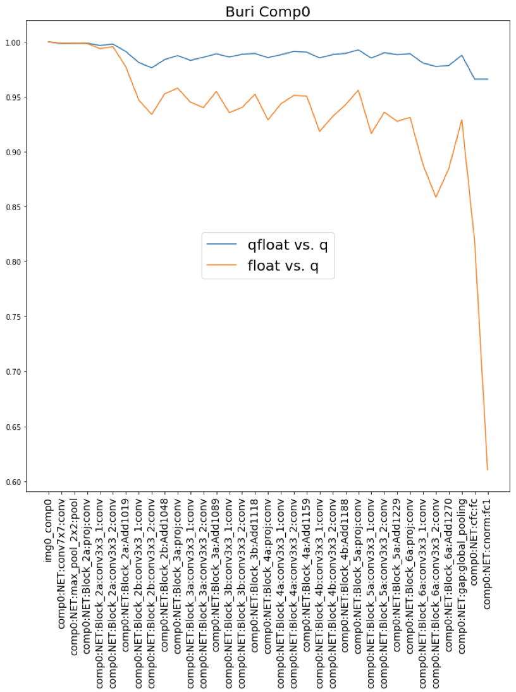

由上图可见，当增加了qfloat的模拟之后，cosine值确实得到了提升

### Quant Check BMK 建立

在验证累积误差的过程中，我们需要有一个Benchmark能够进行误差测试。所以我们建立了一个Quant Check Benchmark（QC-BMK）。对所有图片分别提取GPU和NNIE的feature，然后计算余弦相似度，然后对不同余弦相似度区间的图片进行采样，得到最终的图片BMK。构建过程如下。

**重新确定不同cosine范围及比例**
在对比feature后发现，在现有绝大部分BMK中，cosine均在0.3 以上，所以重新确定QC-BMK建立比例如下，选取图片数暂定100张：

| cosine范围 | 比例 |
| ------ | ------ |
| [0.3, 0.6) | 10 |
| [0.6, 0.7) | 25 |
| [0.7, 0.8) | 25 |
| [0.8, 0.9) | 20 |
| [0.9, 1.0) | 10 |

**QC-BMK建立方式**

1. 对部分已有BMK提取GPU feature及NNIE feature，计算两者cosine相似度。
2. 在上述cosine 区间内，随机提取对应比例的图片，汇总构成QC-BMK

cosine相似度在部分已有BMK中的分布数如下：

| cosine范围 | 数量 | 比例 |
| ------ | ------ | ----- |
| [0.3, 0.6) | 70 | 3.21e-5  |
| [0.6, 0.7) | 333 | 1.53e-4 |
| [0.7, 0.8) | 2665 | 1.22e-3 |
| [0.8, 0.9) | 19303 | 8.84e-3 |
| [0.9, 1.0) | 2160295 | 9.90e-1 |

由此可见，NNIE对于大部分数据而言量化前后的余弦相似度均在[0.9, 1.0)范围内，仅部分图片可能会产生较大误差。

根据比例，随机选取对应数量图片，构成QC-BMK。图例如下，左上角为cosine similarity值。


**QC-BMK迭代**

由于加入的heilongjiang100w中存在大量的黑白人脸图片等，该部分图片主要cosine 集中在 0.6-0.9之间，导致整个QC-BMK被黑白照片占据，无法体现多样性。故进行一次迭代， 剔除heilongjiang100w，重新生成。

提出后cosine 范围分布数如下：

| cosine范围 | 数量 | 比例 |
| ------ | ------ | ----- |
| [0.3, 0.6) | 4 | 2.97e-06  |
| [0.6, 0.7) | 2 | 1.48e-06 |
| [0.7, 0.8) | 36 | 2.67e-05 |
| [0.8, 0.9) | 379 | 2.81e-4 |
| [0.9, 1.0) | 1182245 | 8.77e-1 |

注意：更新后由于部分cosine范围内的实际图片数低于计划选取数量，故实际选取数量=min(实际图片数，计划选取数)。

更新后QC-BMK图示如下：
实际分布：

| cosine范围 | 数量 |
| ------ | ------ |
| [0.3, 0.6) | 4 |
| [0.6, 0.7) | 2 |
| [0.7, 0.8) | 25 |
| [0.8, 0.9) | 20 |
| [0.9, 1.0) | 10 |

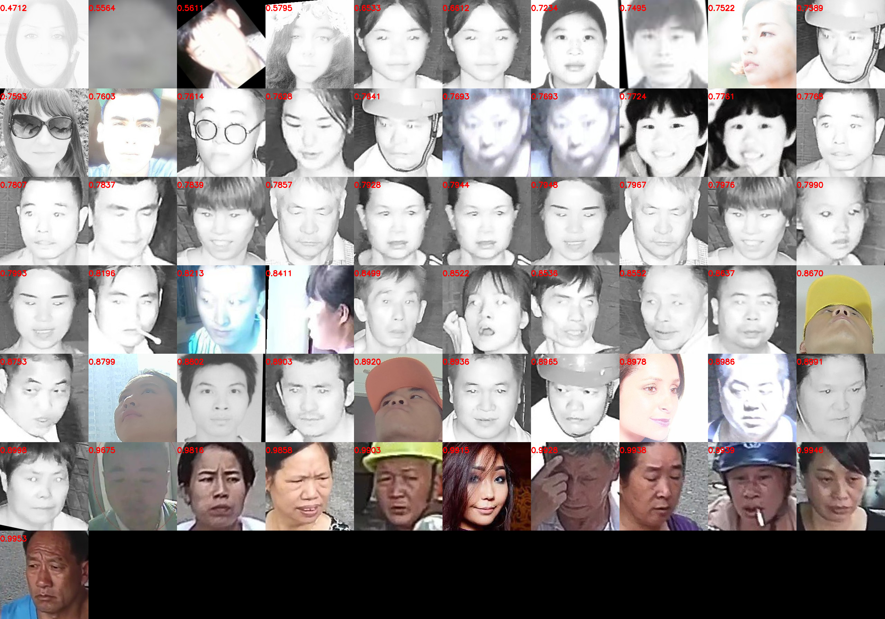

直观上看更新后BMK具备多样性，图片汇总包含曝光，遮挡，大角度，黑白照、人种、性别、年龄等多种情况，故最终采用更新后QC-BMK，并开始后续验证测试。

**TODO逐层量化测试结果**

### 量化策略

通过逐步的观察及测试，我们基本拟合除了NNIE在具体底层实现过程中会被量化的层，如下表所示。

|量化类型 | 层类型|
| --- | --- |
| 量化 |Conv2D、InnerProduct、Pooling、Add、Weight、Concat (W轴) |
| 不量化 | Pow、Concat (H轴)、Reduce、TrueDiv、Reshape、bias |

## 校准（Calibration）

如量化函数Q 一节介绍，每一层参数或激活值的量化，都需要给出相应的 min, max 值，作为一个截断区间。神经网络 NN 参数权重是固定的，所以可以精确地量化；NN 各层激活值的量化，存在未知输入带来的不确定性，所以需要通过与应用场景接近的 Validation 集来反馈可能得量化参数。

通常我们会在 Validation 集或其子集上计算相应的每一层的量化参数（如简单取min, max），这一过程也被称为校准过程，这个用来计算量化参数的数据集被称为校准集（Calibration set）。

当前主流的量化函数库都包含Calibraion 过程，分为以下几种模式：
1. **No Calibration**: 生成模型时不做 Calibration，量化参数实时计算（on the fly）得到。但这种模式会大大降低 inference速度，精度也有损害。

2. **Naive**: 直接取Calibration set在每层的 min, max 作为量化参数。这种方式简单直接，但是当Calibration set图片量变多时，最终精度会随之有明显下降。

3. **Entropy**: 这里采用相对熵，或称为 K-L 散度（**Kullback–Leibler divergence**）来衡量 Float32和Int8分布的差异程度。通过最小化 K-L 散度来计算合适的量化参数：
    $KL_{divergence}(P,Q):= \Sigma_i P_i * log(P_i / Q_i )$ 

   该方法在精度上有较好的效果。

现有的主流量化方式，大多采用了Entropy 或 Naive的模式。

### 科学制定校准集

Calibration set选取建议从网络模型的测试场景随机选择20~50张作为参考图片进行量化，选择的图像要尽量覆盖模型的各个场景（图像要包含分类或检测的目标，如分类网的目标是苹果、梨、桃子，则参考图像至少要包含苹果、梨、桃子。比如检测人、车的模型，参考图像中必须由人、车，不能仅使用人或者无人无车的图像进行量化）。图片影响量化系数，选择典型场景的图片计算出来的量化系数对典型场景的量化误差越小。所以请不要选择偏僻场景、过度曝光、纯黑、纯白的图片，请选择识别率高，色彩均匀的典型场景图片。

在此基础上，我们通过

#### 逐层计算激活值分布

为了探索不同 Benchmark 上掉点显著差异的原因，我们可以逐层统计各层激活值的分布。

通过逐层分析，我们发现，方差最大、分布变化最多的是 input 层。

几个 Benchmark 的 input 层可视化如下：

1. pingan-xiaodai
  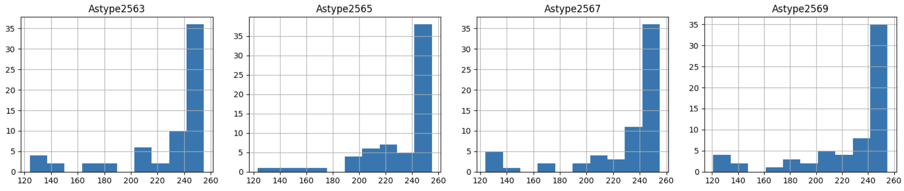

2. multi-angle-v2-aug-inp96
   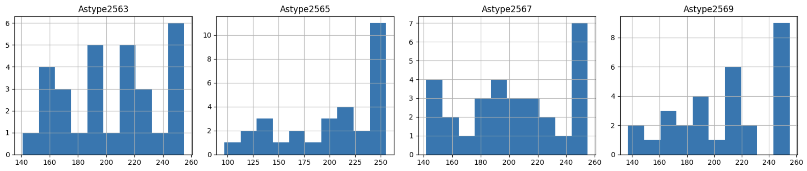

3. fuse-middle-east
   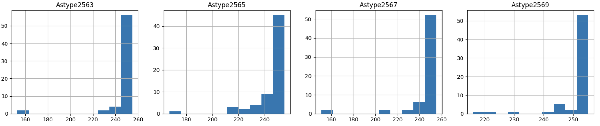

可以看到，4个component 输入均为0~255，但是不同 Benchmark 的 最小值抖动很大，在100~220之间。

从后续的逐层量化掉点分析来看，input 层的量化前后余弦相似度也是从1掉得较多的地方。

#### 生成 Calibration 集

1. 用各层min,max激活对应的图片组合起来，构成Calibration 集
2. 挑选 Benchmark 中图片，构成Calibration 集
3. 从训练集和 Benchmark 图片中，构成 Calibration 集


