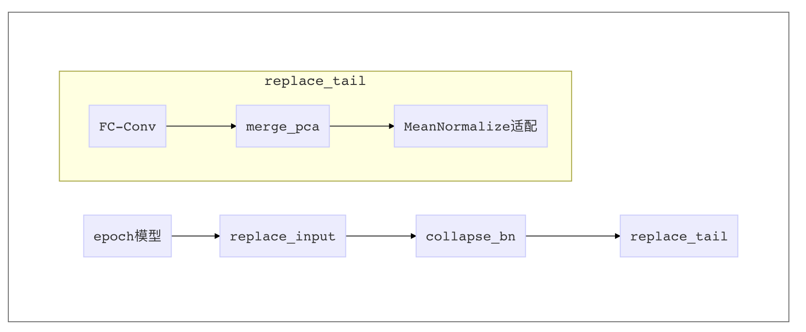
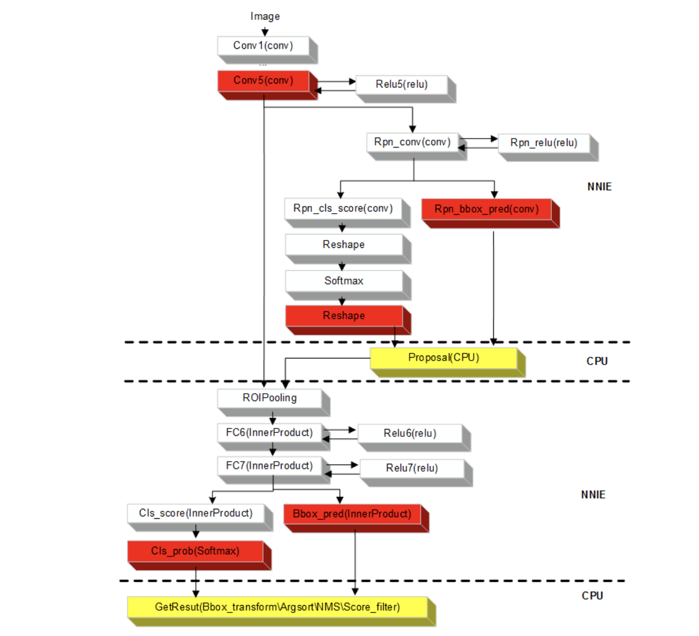
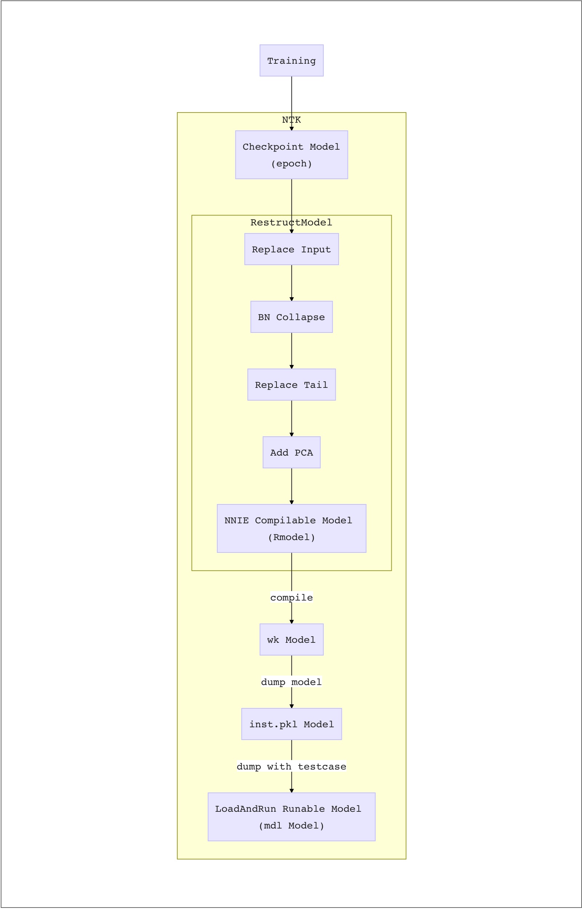
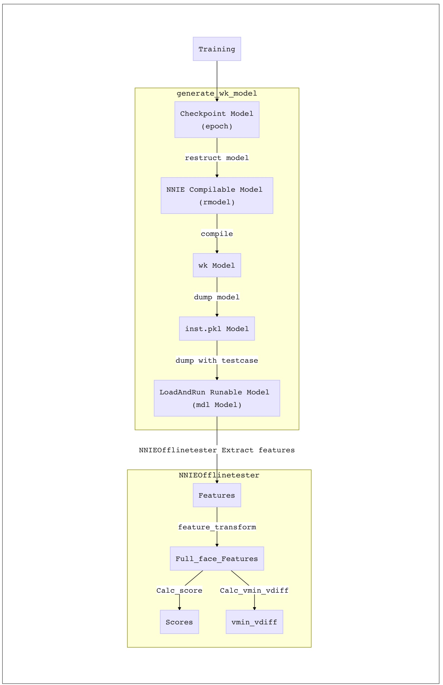

# 实战经验

本章首先介绍NNIE 量化最关键的步骤之一——模型的重构(restruct)，所有自定义的 NNIE 适配操作，都需要在模型 restruct这一步进行处理；接下来，介绍编译模式的设置——高精度及CPU运行；最后通过 CV500, DV300的实战和发版实例，展现 NNIE 模型的整个发版流程和关键点。

## 模型 restruct

在模型进入量化编译前，通常需要 restruct 到一个与 NNIE适配的GPU 模型。通常， 由于NNIE和 Caffe 的限制，这个restruct后模型通常经过了多步转换，与原训练模型有一定 Gap。




restruct操作对整个 NNIE 量化过程至关重要，主要有几点：

1. 所有非最后 opr的FC 层全换为1x1Conv，原因是NNIE规定的FC层后面只能接 softmax 这类 opr。
2. 如在DV300中，restruct 中只存半脸的神经网络权重，所以 PCA也只能存半脸 PCA，这相对于全脸 PCA 会有轻微掉点。（59A 实际操作中，采用 PCA_combine 的方式调用全脸 PCA，这需要额外的输出和后处理）
3. 由于 NNIE 对norm, A1norm 操作无法直接支持，故在 restruct 阶段，就必须用 meanNormalize 或 supportA1norm 等方式，这里的非支持层可能会带来量化掉点，任何 hack 层的量化情况都必须经过实测确认。
4. restruct 时，若最后一层 Feature 不包含norm 等特殊操作，只是 FC 层输出，则可以将 FC 层与 PCA 层合并，从而有效地减少内存占用。但目前实验下，norm 操作依旧能帮助模型在很多复杂 BMK 上的稳定性，这里还是推荐使用 norm。


## 高精度及CPU运行

###  高精度配置

用户指定自定义计算精度（compile_mode = 2）时，在对应层的层名后加上高精度"_hp"（16比特）标记，可实现指定任意层为高精度输入，格式如下所示：

```json
layer { 
    name: "conv5_hp" 
    type: "Convolution" 
    bottom: "conv4" 
    top: "conv5" 
    convolution_param { 
        num_output: 256 
        kernel_size: 3 
        pad: 1 
        stride: 1 
    } 
}
```

只有在compile_mode = 2的情况下，才可以由用户通过 “_hp”标记指定某些层为高精度处理，其他情况下（compile_mode配置为0或1），在层名后加高精度“_hp”标记，编译器会报错。

### CPU 运行配置

对于mapper支持层，可以通过在name字段增加_cpu标记来指定该层切换为cpu执行（包含CPU、DSP等非NNIE执行的，均使用_cpu标志），格式如下所示：

```json
layer { 
   bottom: "rpn_cls_score" 
   top: "rpn_cls_score_reshape" 
   name: "rpn_cls_score_reshape_cpu" 
   type: "Reshape" 
   reshape_param {  
     shape {  
       dim: 0  
       dim: 2  
       dim: -1  
       dim: 0  
     }  
  } 
}
```

注意如下的限制：

1. _cpu不能添加在data层。
2. _data、custom、proposal层后面不能接_cpu层。
3. _cpu不能添加在inplace的激活层。
4. cpu层后面inplace连接的激活层也是_cpu层。
5. cpu层后面不能接upsample层。

### 分段执行prototxt示例
Faster RCNN分为“NNIE→非NNIE→NNIE→非NNIE”4段来执行：



### 高精度对实验结果的影响
经验上，浮点精度对pca 层影响更大，故推荐对最后一层 pca 的 fc 层做高精度量化(加_hp)。

在 DV300模型上实验，结果如下：

| 量化精度  | 说明                | 性能                                 | 半脸时间 |
| --------- | ------------------- | ------------------------------------ | -------- |
| no_hp     | 不设高精度 层       | Baseline                             | 13.95ms  |
| lastfc_hp | pca 层 高精度       | recall 减小0.01%，FP 减小0.03%~0.3%  | 14.3ms   |
| fullfc_hp | pca+ comp fc 高精度 | recall 提升0.01% ，FP减小 0.02%~0.1% | 14.8ms   |

在考虑性能、模型大小、运行时间的情况下，推荐采用 **pca 层 高精度** 方案。


## 加1 Norm实现方式

对于NNIE无法实现的层，我们可以尝试将其转换成NNIE可实现的层，本小节一加1 Normalize为例讲述如何完成该操作。

在识别模型中，经常会出现Normalize层。而且，经常使用加1 Normalize，其形式为 $y=\frac{x}{\sqrt{\lVert x \rVert^2_2 + 1}}$ 。该层无法实现的难点及解决方案在于：

1. NNIE 的Normalize层实现为$y=\frac{x}{\sqrt{\lVert x \rVert^2_2 + \epsilon}}$但$\epsilon$ 仅能设置为1e-10。则可以尝试手动拼出一个Normalize层

2. NNIE不只是Tile 层，无法实现Broadcast。则可以利用Concat实现

3. NNIE的InnerProduct层后续无法Reduction 等层。则可以将InnerProduct层改为Convolution层

基于上述方法，我们可以将加1 Normalize的实现方式转换为下述code。

```python
def concat_boardcast(opr, oupdim, axis):
    k = np.log2(oupdim)
    assert k.is_integer()
    n, m = k // 5, k % 5
    for _ in range(int(n)):
        opr = Concat([opr] * 32, axis=axis)
    if m != 0:
        opr = Concat([opr] * int(2 ** m), axis=axis)
    return opr

def SupportedNormHConcat(f, comp_type, a=1):
    with GroupNode('{}:supportnorm'.format(comp_type)).context_reg():
        flen = f.partial_shape[1]
        f = mgsk.Reshape(f, (-1, 1, 1, flen), name='FeatAxisAtW')
        fmean = ReduceMean(f ** 2, axis=3, name='ReduceMeanAtH')
        fnorm = (fmean + a) ** 0.5
        fnorm.name = '{}:supportnorm:'.format(comp_type) + 'NormAxis'
        fconcat = concat_boardcast(fnorm, flen, axis=2)
        fconcat.name = '{}:supportnorm:'.format(comp_type) + 'NormAxisAtH'
        fconcat = mgsk.Reshape(
                fconcat, (-1, 1, 1, flen),
                name='NormAxisAtW')
        f = f / fconcat
        f.name = '{}:supportnorm'.format(comp_type) + 'NormalizeFeatAtW'
        f = mgsk.Reshape(f, (-1, flen, 1, 1), name='NormalizeFeatAtC')
    return f
```


## 在半脸模型下实现全脸PCA

当某些操作确实无法在NNIE上进行时，可以尝试将其转移到CPU上进行。本小节将以在半脸模型下实现全脸PCA为例讲述如何将操作移至CPU上进行。

在识别模型中，通常需要进行一个PCA及Renorm操作，而PCA操作是针对全脸Feature而言的，即左右半脸提取完半脸Feature后Concat在一起然后做PCA。而GPU模型中，通常的做法是将左右半脸数据在Batch维度进行Concat，并在Inference之后，利用Reshape操作，将batch维度（第0维）转化到feature维度（第1维），然后进行PCA操作。完成后再将Feature Renorm回PCA前的Feature。但是由于NNIE本身并不支持对Batch维度的任何操作，导致这种形式无法在NNIE上进行。而将整个PCA操作移至CPU上进行又很耗时，所以在此这种情况下。我们将PCA进行拆解，从而实现半脸模型下完成全脸PCA。

假设全脸特征为$[X_1, X_2]$, 其中$X_1$, $X_2$分别为左右半脸特征，Y为左右半脸PCA后特征，$[M_1, M_2]$ 为对应特征均值，$[W_1, W_2]^T$为PCA投影矩阵，则有如下表示

$Y=X_1 W_1 + X_2 W_2 - M_1 W_1 - M_2 W_2=[X_1, X_2][W_1, W_2]^T+[-M_1 W_1 - M_2 W_2]=([X_1, X_2] - [M_1,M_2])[W_1, W_2]^T$

将PCA投影矩阵变成$[W_1, W_2]$结构，$[-M_1 W_1-M_2 W_2 ]$  转变成$[\frac{[-M_1 W_1-M_2 W_2 ]}{2},\frac{[-M_1 W_1-M_2 W_2 ]}{2}]$。 则左半脸特征即可变为

$[X_1 W_1 + \frac{[-M_1 W_1-M_2 W_2 ]}{2},X_1 W_2 + \frac{[-M_1 W_1-M_2 W_2 ]}{2}] = X_1[W_1, W_2] + [\frac{[-M_1 W_1-M_2 W_2 ]}{2},\frac{[-M_1 W_1-M_2 W_2 ]}{2}]$

右半边脸特征为

$[X_2 W_1 + \frac{[-M_1 W_1-M_2 W_2 ]}{2},X_2 W_2 + \frac{[-M_1 W_1-M_2 W_2 ]}{2}] = X_2[W_1, W_2] + [\frac{[-M_1 W_1-M_2 W_2 ]}{2},\frac{[-M_1 W_1-M_2 W_2 ]}{2}]$

上述两个式子的右边，则可用一个标准的Convolution层进行实现。

最后我们在将PCA前的Feature 一块拼接到输出层上，则最终特征输出如下所示。

左半脸Feature

$[X_1 W_1 + \frac{[-M_1 W_1-M_2 W_2 ]}{2},X_1 W_2 + \frac{[-M_1 W_1-M_2 W_2 ]}{2}, X_1 - M_1, X_1 - M_2]$

右半脸Feature

$[X_2 W_1 + \frac{[-M_1 W_1-M_2 W_2 ]}{2},X_2 W_2 + \frac{[-M_1 W_1-M_2 W_2 ]}{2}, X_2-M_1, X_2-M_2]$

并且将最终合并的操作放到CPU上进行，code如下

```python
def biaspca_renorm_postprocess_2048(x):
    x0 = x[0]
    x1 = x[1]
    feat_bf_pca = np.concatenate([x0[:, 1024:3072], x1[:, 3072:]], axis=1) 
    feat_af_pca = x0[:, :512] + x1[:, 512:1024]
    prenorm = np.sum(feat_bf_pca ** 2, axis=1, keepdims=True) ** 0.5
    postnorm = np.sum(feat_af_pca ** 2, axis=1, keepdims=True) ** 0.5
    feat = (feat_af_pca / postnorm) * prenorm
    return feat
```

即可实现在半脸模型上实现全脸PCA及对应Renorm操作。

## CV500实例

本章节将以海思四件套 Danio 发版模型为例，介绍如何一步一从训练好的模型转换成可发版模型。

#### 模型编译

综合NNIE测试工具链章节的完整内容，我们可以将整个模型的编译过程表述成下述流程。



我们得到了训练过程中的checkpoint模型之后，就可以调用NTK中的restruct_model.py 脚本，将该模型转化为NNIE可以量化编译的模型。这中间主要包含一下内容：

1. Replace Input：由于模型在训练的过程中，通常是多张图输入，而实际使用的时候并不需要输入那么多张图，所以这里需要将原来N张图输出改成单张图输入。而无法像GPU模型一样改成两张图（左右半脸）的原因是，由于NNIE不支持Batch维度上的任何操作。这就导致识别模型常用的操作无法使用，即将左右半脸数据在Batch维度上Concat，然后通过reshape方式实现半脸转全脸。所以在这种情况下，我们需要将输入改成单张图，然后在CPU上面实现左右半脸的连接。
2. BN Collapse， 即吸BN。
3. Relpace Tail，尾部替换，即将默认Caffe转换下，NNIE无法编译的操作转换成NNIE可以编译的操作，如加1 Norm操作等等，详情见奇技淫巧章节。
4. Add PCA， 加入PCA算子。

完成上述操作后，即可得到NNIE 可以编译的模型，我们称之为Restructed Model (RModel)。

RModel 可以被送入NTK中的compile_model.py脚本，将该模型转换成wk模型、inst.pkl、mdl模型。在compile_model.py脚本中，会涉及到一下几个步骤。

1. 拆分STN，由于NNIE上无法执行warpperspective操作，所以STN输出的透视矩阵需要提取到CPU上面完成透视变换，所以这里需要将STN拆分开，形成两个网络，即STN.pkl 及 NET.pkl， 即表示STN部分部分和后面特征提取的部分。
2. 生成经过STN后的calibration set, 由于本身网络应该是一体的，所以NET.pkl的量化部分需要使用STN后的图片，进行量化。理论上讲应该使用NNIE的STN 转换后的图片作为NET.pkl的calibration set，但是这样工程实现上过于复杂，所以使用了GPU的STN转化后的图片作为NET.pkl的calibration set。
3. 转换成Caffe模型，调用meghair提供的脚本将STN和NET的mgb模型转换成caffe模型
4. 生成cfg文件，Hisi的mapper只接受cfg文件一个输入，所有配置信息全放在cfg文件中，所有这边采用动态生成cfg文件的方式。
5. 编译文件，调用mapper，对caffe模型进行编译，生成wk文件
6. dump model，调用meghair提供的dump model，将wk文件封装成mgb模型，并补充mgb的输入和输出。输出inst.pkl文件，本模型可以供NOT使用抽取板端特征
7. dump with testcase，封装随机数据，生成mdl文件，本模型可以用于测速。

完成模型编译之后，基本所需要的模型均会产生，这个时候就可以根据需要提供对应模型了。


## DV300实例

### NoSTN 发版流程

这里展示 NoSTN 整个发版测试的流程，如下图：


如图所示，在整体流程上，NoSTN 模型和上述 STN 模型基本一致。这里主要说明其与 STN 模型的不同之处：

1. 由于不带 STN 操作，restruct 时只需要一个 NET.pkl，不需做拆分。
2. 相应的，calibration过程直接使用原图 Components。

全流程:

1. `python run.py -c ./cfg_dir/config_template_inu35_nnie_norm_dv300.py`
2. `python tools/parse_score.py -f some_NOTWorkDir`
3. `python tools/feat_analysis.py -f some_NOTWorkDir # 计算 vmin_vdiff`

其中关键Config 配置如下：

```python
config = {
    'deviceType': 'NNIE',  # 'NNIE", 'GPU'
    'NNIE_model_transformers': {
        'convert_type': '4comp_norm_pca', # convert_type to set in ofl_tester/model/restruct_model.py
        'cali_dir': , # calibration_set dir,
        'has_stn': False,
        'compid': '0,1,2,3',
        'compile_device': '3516A',  # current only support 3559A
        'strip_var': 'NET:conv7x7:conv',
        'gray': False,
    },
    'NNIE_config':
        {
            'user_name': 'wufan',  # request for identifying
            'inp_size': 96,
            'comp_ids': '0,1,2,3',
            'flips': '0,1',
            'half_face': '1',
            'inp_num': 8,
            'save_checkpoints': '0',
            'priority': 1,
            'device_type': '3559a',
            'comp_size': 112,
            'gray': '0',
            'has_stn': False,
            'merge_type': 'concat',
            # "force_update": 1,
        }
}
```

