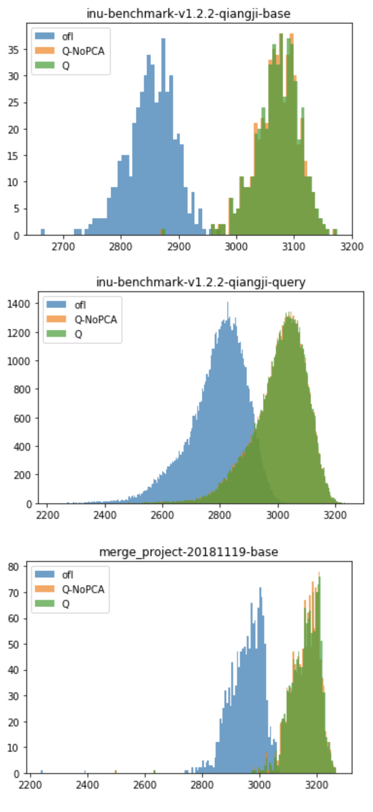
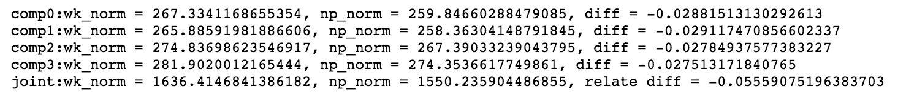
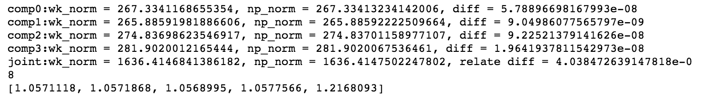
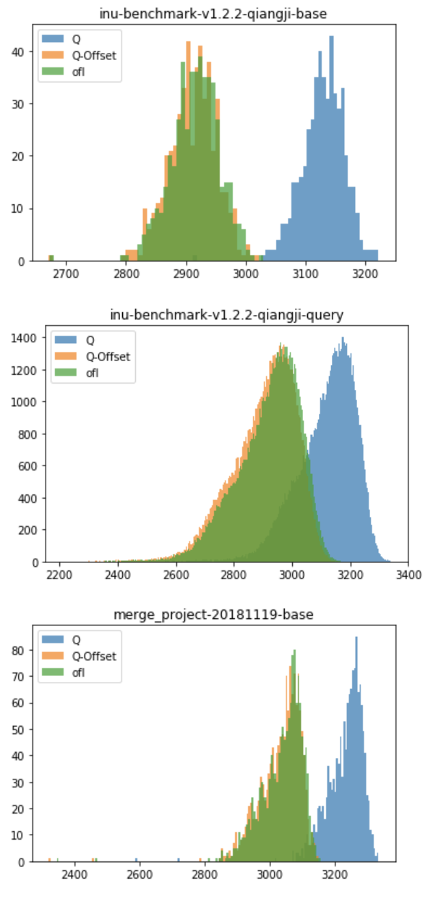
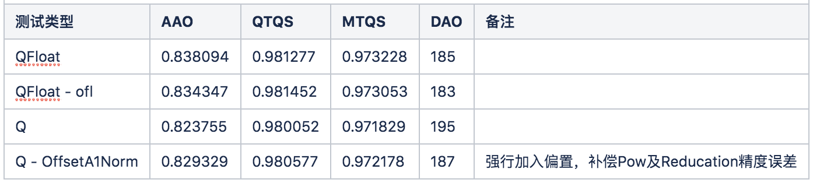

# 踩坑记录

识别组在NNIE上的探索过程，踩了各种大大小小的坑，对 NNIE 量化误差的理解，也一直在更新。本章首先简要介绍遇到量化掉点时， Hisi推荐的编译器 Debug流程以及咨询Hisi的主要方式；然后详细介绍一些量化掉点相关的踩坑经验。

## 编译器 debug 优化

在项目推进的过程中，经常会遇到编译器出现bug，如某些层支持出现问题，某些层精度不对等问题，这个时候就可以与Hisi沟通进行，反馈相关问题。

Hisi推荐在精度出现问题的情况下，编译器Debug流程如下

```
第1步：确认数据是否正确。
找一张有精度问题的图片，编译、指令仿真、caffe都用这张图片。比较仿真和caffe 每层的相似度。
case 1: 如果第一层，即data层的相似度不是0.999，请看第2步。
case 2: 如果第一层是0.99+，后面逐层下降，最后一层小于0.95，请看第3步。
case 3: 如果最后一层的相似度0.99，中间某些层0.90以下，请看第4步。
case 4: 如果所有层的相似度都是0.99+且绝对误差也很小，则很可能是后处理的问题，请看第5步。

第2步：确认data层输入一致。
请检查均值[mean_file]、缩放[data_scale]、预处理方式[norm_type]，是否和caffe一致。
Mxnet 和Darknet(yolo) 网络训练时，默认是RGB，所以编译时，cfg里的[RGB_order]也要配置为RGB。

第3步：确认是否量化误差导致。
修改nnie_mapper的配置项，把[compile_mode] 0 改为 1，即把8bit低精度改为16bit高精度，再重新编译仿真比较相似度。
case 1: 如果相似度明显有提升，所有层都是0.99，则说明是量化误差导致。使用高精度会使性能下降一倍，如果不能接受，请尝试改为[compile_mode] 2，
即自定义高精度，从首层开始，逐层layer name加后缀"_hp"，直到精度和性能平衡(一般只要第一层卷积加_hp，精度就正常了，性能损失也小)。
如果不想使用高精度，还可以使用量化库重训，请联系海思FAE。
case 2: 如果精度没有明显提升，则把明显下降的那层信息反馈给海思，看第6步。

第4步：确认层是否匹配。
nnie_mapper会优化网络结构，以适应硬件执行，所以相似度比较时有可能层和caffe的不匹配。
case 1: 是否inplace层。某些层nnie不支持inplace，会拆开，以非inplace的方式处理。如 concat + relu, fc + scale 等。
请修改prototxt，改为非inplace方式，再跑仿真和caffe比较相似度。
case 2: 是否nnie_mapper修改了网络。请查看cnn_net_tree.dot (nnie_mapper 编译时生成)，和原来的prototxt比较，看是否修改了网络结构。
如upsample, ROIPooling, PSROIPooling等层会加permute 做转换，所以要和permute 的结果比，或直接看后面层的相似度。
case 3: 如果层匹配，而相似度比较低，请把信息反馈给海思，看第7步。

第5步：确认后处理是否正确。
假设caffe 的结果经过caffe的后处理画框或分类，则把仿真的结果也使用caffe的后处理，看是否正常画框或分类。
case 1: 如果正常，则说明是板端后处理问题，请比较板端和caffe的后处理代码。
case 2: 如果不正常，而数据的相似度0.99且绝对误差很小，则说明caffe的后处理代码对数据很敏感，请检查caffe的后处理代码。(此情况很少)

第6步：反馈问题给海思分析。
请把以下信息发给海思：
1)有问题的那层对应的prototxt、weights、caffe和仿真的输入/输出数据。
2)编译用的cfg、图片、均值文件。
3)编译时打印的nnie_mapper版本号。
```

## Hisi 交流

目前与Hisi 交流的渠道主要包括3种形式：1. 海思技术支持平台；2. 邮件；3.微信。

#### 海思技术支持平台

Hisi 推荐使用海思技术支持平台，在其上提交issue的方式进行反馈。这上面提交的问题会经过Hisi 的FAE，对问题进行分发，然后提交给专门的技术人员进行解决。这个方式能够得到对应领域的人员的支持，涵盖面最全。如果你不清楚你所遇到的问题到底属于什么问题，如底层开发问题、编译器问题、网络设计问题等等，则可以通过这种方式进行反馈。

由于Hisi 要求仅有唯一的企业对接人能都有该平台账号，所以贵司仅有一个平台账号。对应R侧各个组内可能有某一个同学知晓该账号，若需要使用该平台，则可以询问组内成员进行问题反馈。R侧识别组同学可以联系wangshupeng进行问题反馈。

#### 邮件

邮件也是Hisi 推荐的交流方式之一，由于提交海思技术支持平台得到的反馈周期性长。而各组同学遇到的普遍是同一类问题，如R侧同学经常遇到编译器问题，Dev侧同学经常遇到开发问题等。所以往往对接的人都是同一个人，这时候不需要经过海思技术支持平台进行问题分发，而可以直接邮件联系对应的Hisi同学进行解答或反馈，如R侧目前主要会接触到的人包括：Michael (负责算法) 、周海林 (负责芯片架构)、李建辉（负责编译器）。由于涉及安全问题，故其邮箱不在此公开。若有相关问题反馈需求，可联系wangshupeng。

#### 微信

Hisi 内部并不推荐使用微信交流，原因是由于Hisi相关实验室为了安全考虑，不允许员工带手机进入。所以通过手机等方式的通行容易出现信息延迟。Hisi 的邮件响应速度会比手机响应速度更快。但是微信可以用于日常不紧急事务的沟通，如咨询相关技术细节等等。在微信上讨论会显得不那么拘谨，也有利于缓和双方关系，更好的推进后续工作。所以如果遇到了Hisi相关的同学，不妨加一下微信。**需要重点提醒的是，在私下与对方工作人员联系的情况下，一定要记得上报leader，防止触碰公司安全红线。**

## 奇技淫巧
#### 量化误差模拟

这里主要记录一次Debug编译器对ReduceMean实现问题而引发精度误差的过程及处理方式。

在测试某次预发版模型在部分BMK上面的feature norm，发现feature norm分布形态相似，但是出现了约200的偏移。测试没有PCA的NNIE模型，发现与原始模型分布几乎相同，说明偏置原因不出在PCA上，并且PCA Renorm未出现问题。


明确Q与ofl下的feature 存在200左右的误差，并逐层debug原因，发现在A1Norm上，相对l2 Norm出现较大下降，如表所示。（数据为tiandy2018_r3_targets）

| 层名 | 量化前L2 | 量化后L2 | 相对L2误差 | cos similarity |
| --- | --- | --- | --- | --- |
|Reshape39665 | 1542.16357421875 | 1636.4146841386182 | 0.06111615622072724| 0.9938006218891774|
|jfc:fc:conv | 6260.697265625 | 6397.477102170111 | 0.021847380689706004| 0.9938634751777561|
|Concat39546 | 1065.9599609375 | 1089.9590241364149 | 0.02251403812372837| 0.990961618995689|
|comp0:NET:cnorm:fc1 | 260.0448913574219 | 267.3341168655354 | 0.028030642978849243| 0.989591058544279|
|comp1:NET:cnorm:fc1 | 259.4969482421875 | 265.88591981886606 | 0.024620603902885806| 0.9912140451881477|
|comp2:NET:cnorm:fc1 | 268.58990478515625 | 274.83698623546917 | 0.023258809579272642| 0.9913810272768576|
|comp3:NET:cnorm:fc1 | 277.8281555175781 | 281.9020012165444 | 0.014663185203014975| 0.9916415698305393|
|comp0:NET:cfc:fc:conv | 533.713134765625 | 532.1600594731143 | -0.0029099439218274368| 0.9895918082192464|
|comp1:NET:cfc:fc:conv | 527.7047729492188 | 522.8915072462171 | -0.009121133538553088| 0.9912145186112944|
|comp2:NET:cfc:fc:conv | 568.9523315429688 | 563.5011783185446 | -0.00958103679730237| 0.9913805138019162|
|comp3:NET:cfc:fc:conv | 608.9256591796875 | 592.6789292422666 | -0.02668097442191492| 0.9916417597358645|

表格说明：

1. comp[0,1,2,3]:NET:cfc:fc:conv 为comp A1Norm前feature map
2. comp[0,1,2,3]:NET:cnorm:fc1 为comp A1Norm后feature map
3. jfc:fc:conv 为joint A1Norm前feature map
4. Reshape39665 为joint A1Norm 后feature map

可见A1Norm 前后，cos similarity并没有发生本质变化，但是norm误差成倍增, 随后debug发现，Power opr存在1e-4的误差。ReduceMean 存在0.05左右的误差。推测可能由于hisi内部精度不足导致。故可强行在A1部分将误差补回变成A1.05。

在上述BMK，比对wk下A1Norm后结果与在numpy 下A1Norm结果，并调整A1部分数值，拉近wk与numpy结果。得到如下数值。在加1情况下，结果如下：

调整加a后，情况如下，最后行为各个comp及joint部分加1调整后的值，即comp0将加1改为加1.0571118。


修改后，板端测试Norm分布变化如下：
Q-Offset 为调整加1后模型板端测试结果


BMK实测结果



结论
1. Reduction/Pow等opr存在精度问题，并且会对feature 模长造成较大影响
2. 强行修正norm后，能够拉齐ofl与Q的norm分布涨点
3. 修正norm后能缓解掉点，相对于之前提升0.6%

