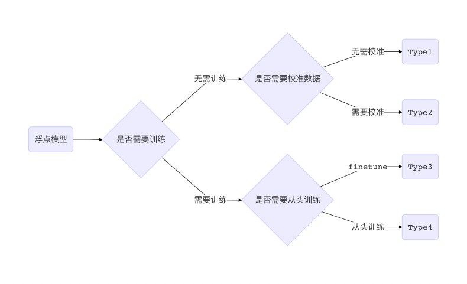
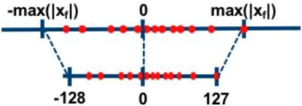
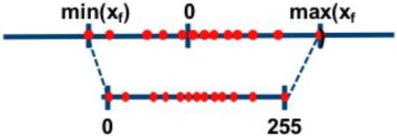
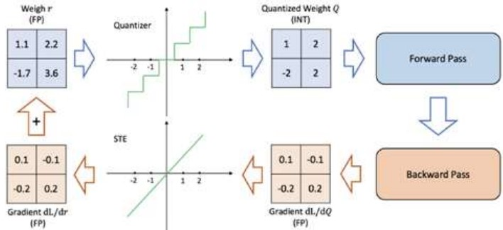
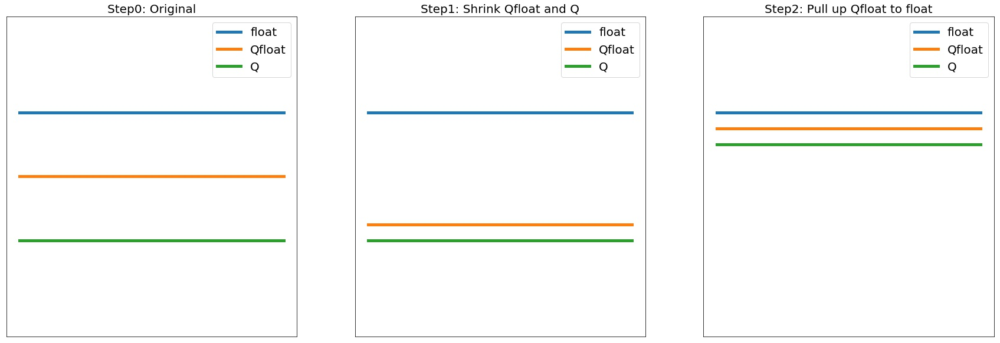

# 量化综述

## 写在前面的话
欢迎来到量化的世界，全书共分5个章节，主要可以分为原理(第1-2章)和实践(第3-5章)两大模块，下面按次序简单介绍一下各章的内容

- 第1章：主要介绍通用量化的原理和解决量化问题的常用思路。
- 第2章：详细介绍NNIE相关的量化算法细节，包括了量化函数、单层量化技巧和多层量化技巧，以及会讨论校准数据集(Calibration Data)的使用方式。
- 第3章：具体介绍NNIE的量化工具链，包括了编译器，NTK和误差分析工具的使用。
- 第4章：结合识别任务，介绍了带STN和不带STN两种设置下的实战例子。
- 第5章：记录踩坑血泪历史，以史为鉴。

## 量化世界观
### 基本的分类

浮点计算由于包含复杂的小数点对齐等操作，往往只在GPU等高功耗设备上大规模使用。随着专用神经网络加速芯片的兴起，低比特非浮点的运算方式越来越普及，甚至最新的Nvidia的Tensorcore也支持INT8甚至INT4计算。因此如何把一个GPU上训练的浮点模型转化为低比特的量化模型，就成为了工业界非常关心的话题。

一般来说，转换过程按转化代价从低到高可以分为以下4种

如上图所示，将一个浮点神经网络转化为低比特数的量化神经网络的方法按代价从低到高可以分为以下4 种：

- Type1是不重新训练模型，也无需校准参数，这种方法的应用较少，一般止步于8bit，小于 8bit 会导致明显的性能下降，如[DFQ](https://arxiv.org/abs/1906.04721)等
- Type2不重新训练模型，直接将网络参数量化以后，再在一些测试集上校准（通常是确定各层激活函数的区间），这种做法比较常用，例如[TensorRT](http://on-demand.gputechconf.com/gtc/2017/presentation/s7310-8-bit-inference-with-tensorrt.pdf), IBC, ACIQ和华为海思等
- Type3是从浮点网络经过微调网络参数得到量化网络，不改变网络拓扑结构，包括[INQ](https://arxiv.org/pdf/1702.03044.pdf), IAO和ALT等
- Type4是重新设计和训练一个量化网络，例如[XNOR-Net](https://arxiv.org/pdf/1603.05279.pdf), [TWN](https://arxiv.org/pdf/1605.04711.pdf), [Dorefa](https://arxiv.org/pdf/1606.06160.pdf)和PACT等

Type1 和 Type2 由于是在模型浮点模型训练之后介入，无需大量训练数据，故而转换代价更低，被称为后量化（Post Quantization）。Type3 和 Type4 则需要在浮点模型训练时就插入一些假量化（FakeQuantize）算子， 模拟计算过程中数值截断后精度降低的情形，故而称为量化感知训练（Quantization Aware Training, QAT）。

更多信息可以参看[通用量化](images/模型量化.pdf) 

### 均匀量化

量化就是将基于浮点数据类型的模型转换为定点数进行运算，其核心就是建立定点数与浮点数等数据之间建立一种数据映射关系，使得以较小的精度损失代价获得了较好的收益。公式如下：
$$
q = f(x)
$$
$x$表示真实的浮点值，$q$表示量化后的定点值。

根据映射函数是否是线性可以将量化算法分为两类：均匀量化和非均匀量化，本文主要介绍均匀量化技术。目前主流的浮点转定点方案基本采用均匀量化，因为这种方案对推理更友好。将一个浮点数根据其值域范围，均匀的映射到一个定点数的表达范围上。

假设一个浮点数$x$的值域范围为$\{x_{min}, x_{max}\}$，要转换到一个表达范围为(0,255) 的 8bit 定点数的转换公式如下:
$$
\begin{aligned}
x_q &= round(x/s)+z\\\\
q&=clamp(x_q,0,255)
\end{aligned}
$$

其中$s$为scale，也叫步长，是个浮点数。$x$为零点，即浮点数中的0，是个定点数。一般scale和$z$的计算方式如下：
$$
\begin{aligned}
scale&=(x_{max}-x_{min})/255\\\\
z&=-round(0-x_{min})/255
\end{aligned}
$$

由上面的公式可以看出，均匀量化因为round和clamp操作也是存在精度损失的，所以会对模型的性能产生影响。如何减轻数据从浮点转换到定点的精度损失，是整个量化研究的重点。

均匀量化方案对应的反量化公式如下:
$$
x_{Q} = (q-z)*s
$$

量化和反量化之后的浮点数与原来的浮点数存在一定的误差。

根据$z$的值是否为 0，可以将均匀量化分为两类：对称量化和非对称量化。

#### 对称量化

如上图所示，所谓的对称量化，即使用一个映射公式将输入数据映射到 [-128,127] 的范围内，图中$-max(|x_f|)$表示的是输入数据的最小值，$max(|x_f|)$表示输入数据的最大值。对称量化的一个核心即零点的处理，映射公式需要保证原始的输入数据中的零点通过映射公式后仍然对应 [-128,127] 区间的零点。总而言之，对称量化通过映射关系将输入数据映射在 [-128,127] 的范围内，对于映射关系而言，我们需要求解的参数为$s$
#### 非对称量化

如上图所示，所谓的非对称量化，即使用一个映射公式将输入数据映射到 [0,255] 的范围内，图中$max(|x_f|)$表示的是输入数据的最小值，$max(|x_f|)$表示输入数据的最大值。总而言之，对称量化通过映射关系将输入数据映射在 [0,255] 的范围内，对于映射关系而言，我们需要求解的参数即$z$和$s$。

#### 定点卷积运算
使用经过量后的定点卷积运算去表示一个原始的浮点卷积的公式如下：

$$
\begin{aligned}
conv(x,w)&=conv((x_{Q}-z_{x})*s_{x},(w_{Q}-z_{w})*s_{w})\\\\
&=s_{x}s_{w}conv(x_{Q}-z_x,w_{Q}-z_w)\\\\
&=s_{x}s_{w}(conv(x_{Q},w_{Q}) - z_x\sum_{k,l,m}x_{Q} - z_w\sum_{k,l,m,n}w_{Q}+z_xz_w)
\end{aligned}
$$

其中$k,l,m,n$分别是$kernel_{size}, ouput_{channel}$和$input_{channel}$的遍历下标。可以看出，当卷积的输入和参数的$z$都是0的时候，浮点卷积将简化成:
$$
conv(x,w)=s_{x}s_{w}conv(x_{Q},w_{Q})
$$

即定点的卷积运算结果和实际输出只有一个 scale 上的偏差，大大的简化了定点的运算逻辑。

当我们把均匀量化中的参数 固定为 0 时，便是对称均匀量化。我们以 int8 的定点数为例, 量化公式如下：
$$
\begin{aligned}
scale&=max(abs(x_{min}),abs(x_{max}))/127\\\\
x_{int}&=round(x/scale)\\\\
x_{Q}&=clamp(x_{int}, -128, 127)
\end{aligned}
$$

出于利用更快的SIMD实现的目的，会把卷积的权重的定点范围表示成 (-127,127)，对应的反量化公式如下：
$$
\begin{aligned}
x_{float}&=x_{Q}*scale\\\\
\end{aligned}
$$

#### 直通估计器

均匀量化直接改变了网络的参数，导致网络的性能会一定的损失，因此需要通过 Type3 和 Type4 两种量化方式恢复模型的精度。

然而在量化网络中，由于存在$round$操作，量化算子部分梯度为0，导致无法使用梯度反向传播算法来更新网络，为了解决这个问题，需要一个直通估计器(STE)，如上图所示。STE 支持将一个算子$f(x)$的梯度设置为$g(x)$，不管其本身的导数如何。举例来说，若$x$是从参数为p的伯努利分布中采样的，即$x~Bernoulli(x)$，$x$的期望是$p$。采样操作是不可导的，后续只有$x$参与运算，因而只有$x$得到梯度。若构建STE，将$p$的梯度在反向传播时设置为$x$的梯度，就可以通过反向传播更新$p$。尽管 STE 只是粗略近似的梯度，但在 QAT 中已被证明是有效的。

### float-Qfloat-Q

我们一般关注的是Type3和Type4，其中Type3的训练成本比较低，理想的是拿到float模型，然后直接finetune若干个epoch即可得到对应的量化模型，这样利于工业流水线化。我们通常把原始的浮点模型称为float模型，用浮点来模拟量化过程的模型叫做Quantized-float模型，简称Qfloat模型；最终能直接上设备运行的模型叫Quantized模型，简称Q模型。由于Qfloat往往无法完美模拟Q，因此在精度上三者的关系往往是`float > Qfloat > Q`或者`float > Q > Qfloat`。这里由于Qfloat可能是Q非常糟糕的模拟，因此Qfloat和Q的关系并不确定，但他们肯定比float要差。

典型的优化过程往往分两个阶段

- 第一个阶段是拉近Qfloat和Q，这样训练阶段的精度可以作为最终Q精度的代理指标，这一阶段偏工程
- 第二阶段是拔高Qfloat逼近float，这样就可以将量化模型性能尽可能恢复到float的精度，这一阶段偏算法

典型的三者关系变化如下所示

### 量化误差指标

给定了向量$x$和$x'=Q(x)$，我们常用以下几种方式进行距离度量

| 名称         | 代号 |公式                                             | 说明                                                         |
| ------------ | ------------------------------------------------ | ------------------------------------------------------------ | -----|
| 余弦距离     | Cosine | $D = \frac{x \cdot x'}{\lVert x \rVert \cdot \lVert x' \rVert}$      | 只能衡量夹角，是个比较弱的指标                               |
| 模长相对变化 | Relative-L1 |$D = \frac{\mathbf{abs}(\lVert x \rVert - \lVert x' \rVert)}{\lVert x \rVert}$ | 可以排除向量本身scale的影响                                  |
| 整数绝对误差 | Integer-Represnetation L1 Distance (IR-L1D) | $D = \mathbf{mean}(\mathbf{abs}(y-y'))$          | 其中$y$和$y'$分别是$x$和$x'$的整数表示，指标含义为平均每个元素偏差多少个量化slot |

常用的指标为cosine和relative-L1

### LV1-LV2-LV3

Qfloat是量化模拟训练的核心，只有正确的Qfloat实现才能将float和Q彼此拉近，否则可能出现Qfloat拉高了但是Q纹丝不动甚至更差的情况。一般来说Qfloat可以划分为三个层次

- LV1: 量化函数
  - 量化离散过程具体表达式是什么？weight和activation是否为同一套？
  - 误差是多少？一般cosine值要到1.0
- LV2: 单个算子
  - 该算子的输入/输出是否要做量化？带有BN的话怎么办？
  - 误差是多少？一般cosine值要到0.999以上
- LV3: 多个算子
  - 误差是多少？一般cosine值要到0.98以上 ($0.999^{20}=0.98$, $0.99^{20}=0.817$)

### 常用量化方案

| 量化方案     | 是否对称       | 量化方式       | 比特数     |
| ------------ | -------------- | -------------- | ---------- |
| 自研方案  | 对称(或非对称) | 线性均匀量化   | 8bit/4bit  |
| NNIE海思方案 | 对称           | 非线性对数量化 | 8bit/16bit |
| T02方案      | 对称           | 线性均匀量化   | 2bit/4bit  |

其中对称指的是量化区间关于原点是对称，但由于零点的存在，因此正负分配不是严格相当，往往会相差1, 例如
- 8bit-mgb的对称线性量化中，量化区间就是[-128, 127]，负数多1个量化槽位slot
- NNIE海思低精度量化中，正数会多1个量化槽位slot。NNIE相关的原理解释详见[量化元素Q](./量化元素.html#q)
