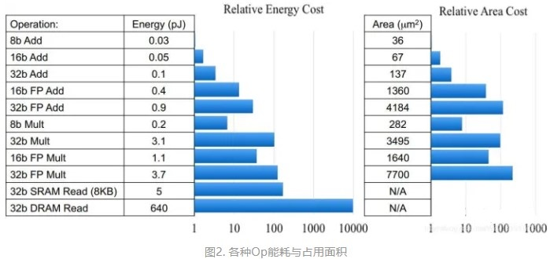
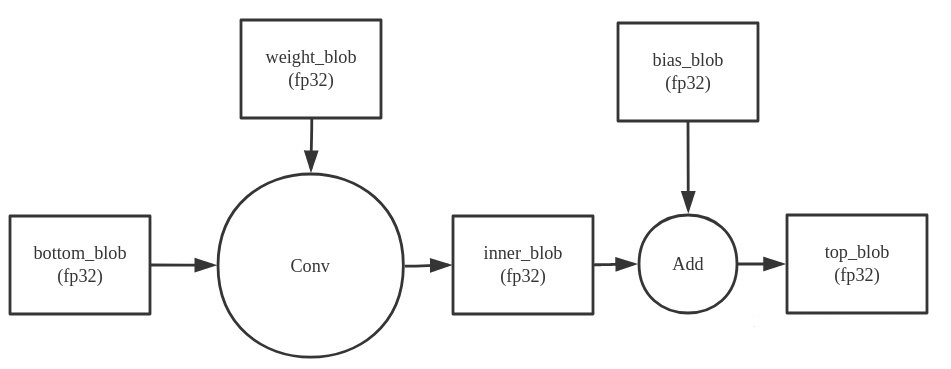
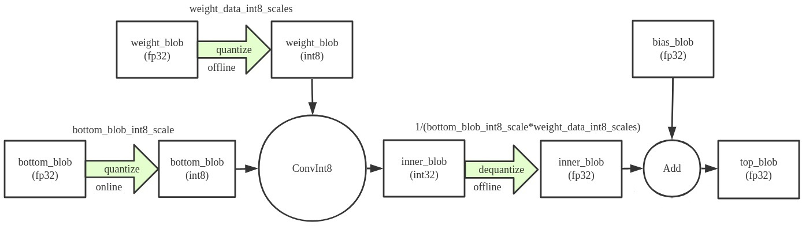
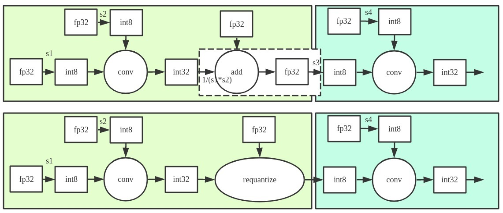
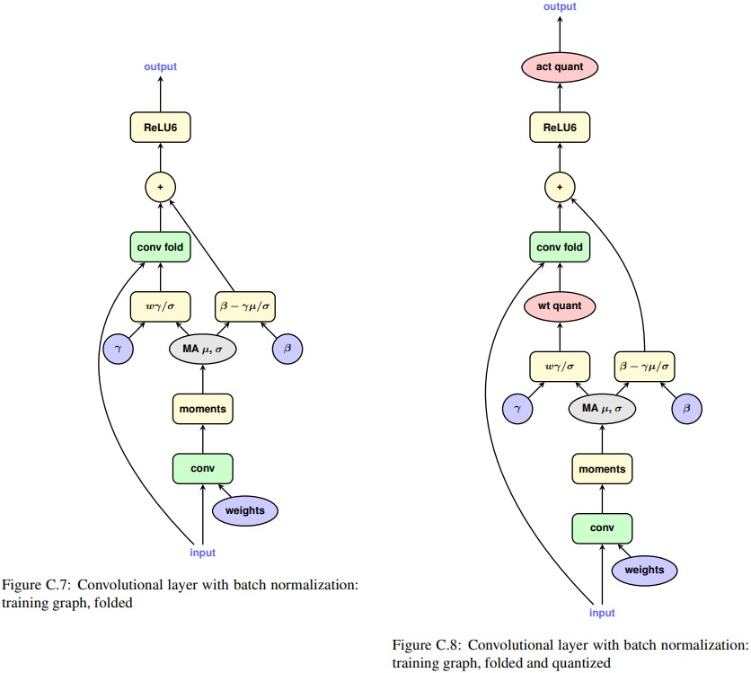

# 理解量化

量化的本质就是用低bit数据的计算来代替高bit数据计算，其带来的好处有：

* 更少的模型体积，接近4倍的减少
* 更快的推理速度，由于更少的内存访问和更快的int8计算，2~4倍的加速

各operator的功耗和面积对比：



## 量化参数及其计算方法

量化参数主要有：scale和zero_point，其计算方法如下：

$$
\begin{aligned}
scale &= \frac{max - min}{Qmax - Qmin}\\\\
zero\_point &= round(Qmin - \frac{min}{scale})
\end{aligned}
$$

其中，Qmax和Qmin是量化后的最大值和最小值，一般为127和-128，max和min是量化前的最大值和最小值。

从float到int8的量化公式如下：

$$
q = clip(round(\frac{x}{scale} + zero\_point))
$$

从int8到float的反量化公式如下：

$$
x = (q - zero\_point) * scale
$$

在pytorch中，可以使用torch.quantize_per_tensor函数进行量化以及做相应的反量化，其使用方法如下：
```
>>> x = torch.rand(2,3, dtype=torch.float32) 
>>> x
tensor([[0.6839, 0.4741, 0.7451],
        [0.9301, 0.1742, 0.6835]])

>>> xq = torch.quantize_per_tensor(x, scale = 0.5, zero_point = 8, dtype=torch.quint8)
tensor([[0.5000, 0.5000, 0.5000],
        [1.0000, 0.0000, 0.5000]], size=(2, 3), dtype=torch.quint8,
       quantization_scheme=torch.per_tensor_affine, scale=0.5, zero_point=8)

>>> xq.int_repr()
tensor([[ 9,  9,  9],
        [10,  8,  9]], dtype=torch.uint8)

>>> xdq = xq.dequantize()
>>> xdq
tensor([[0.5000, 0.5000, 0.5000],
        [1.0000, 0.0000, 0.5000]])
```
Tensor的量化支持两种模式：per tensor 和 per channel

* per tensor，即所有的channel共享一个scale和zero_point，一般用于量化activation
* per channel，即每个channel有一个scale和zero_point， 一般用于量化weight

## 量化类型

从量化的时机来看，量化可以分为两种类型：

* post-training量化，即在训练完成后进行量化，这种量化方式比较简单，但是会损失一些精度
* quantization-aware training量化，即在训练过程中进行量化，这种量化方式比较复杂，但是可以保证精度

post-training量化又可以分为两种类型：

* Post Training Dynamic Quantization，即在训练完成后，对模型进行量化，其中只对weight进行提起量化，而activation在推理过程中进行量化，即每次都要根据实际运算的浮点数据范围每层计算一次scale和zere_point，然后进行量化，这种方式已不是很常见
* Post Training Static Quantization，这种方法最常见，与dynamic量化的不同在于，static量化不仅对weight进行提前量化，而且activation也会利用校准数据集来记录下固定的scale和zero_point，整个过程不存在量化参数的计算

根据量化算法的不同，可以分为：

* 线性量化，即将浮点数映射到固定的区间，然后进行线性映射
* 非线性量化，即将浮点数映射到固定的区间，然后进行非线性映射
* 对称量化，即zero_point为0，一般用于对weight进行量化
* 非对称量化，即zero_point不为0，一般用于对activation进行量化

## 量化模型的计算流程

正常的fp32计算中，一个conv的计算流程如下：


NNCN中动态量化的conv进行int8计算的流程如下：


NNCN中，如果两个conv相连，则会采用requantize，其计算流程如下：


## Post-training量化
### Dynamic Quantization

* 训练完成后再量化模型的权重参数
* 在推理过程中，对activation进行动态量化

dynamic quantization一般只对参数量大的layer进行量化，如：Linear, LSTM, LSTMCell, RNNCell, GRUCell

在pytorch中，量化时，需要对每个operator指定qconfig，qconfig包含了量化的类型，比如：per_tensor_affine, per_channel_affine, per_tensor_symmetric, per_channel_symmetric等，以及量化的位数，比如：int8, int4等；包含observer，observer用来根据四元组(min_val, max_val, qmin, qmax)来计算scale和zero_point,Observer的类型有：MinMaxObserver, MovingAverageMinMaxObserver, HistogramObserver, PerChannelMinMaxObserver, MovingAveragePerChannelMinMaxObserver等。

### Static Quantization

以pytorch来看static quantization的流程如下：

1. 修改并训练模型
在模型输入前加入QuantStub，用来将输入量化;在模型输chunk后加入DeQuantStub，用来将输出反量化;然后训练好模型
2. fuse model
目的是为了提高速度和准确度，可以合并的层有conv+bn，conv+bn+relu，conv+relu，linear+relu，bn+relu，可以将这些op融合成一个op，这样可以减少计算量，提高速度，同时也可以减少量化的误差
3. 设置qconfig
qconfig是要设置到模型或者模型的子module上的。qconfig是QConfig的一个实例，QConfig这个类就是维护了两个observer，一个是activation所使用的observer，一个是op权重所使用的observer。

    | 量化的backend | activation | weight |
    |--|--|--|
    | fbgemm | HistogramObserver  (reduce_range=True) | PerChannelMinMaxObserver(default_per_channel_weight_observer) |
    | qnnpack | HistogramObserver  (reduce_range=False) | MinMaxObserver (default_weight_observer) |
    | 默认（非fbgemm和qnnpack） | MinMaxObserver  (default_observer) | MinMaxObserver (default_weight_observer) |

4. prepare（准备模型）
prepare用来给每个子module插入observer，用来收集和标定数据，就是为了得到四元组(min_val, max_val, qmin, qmax)中的min_val, max_val  
这里observer本质上就是一个nn.Module，它会在forward的时候收集数据，然后在计算完forward之后，会计算出min_val, max_val,而min_val, max_val实际上是存放在observer的buffer中

5. observer（喂数据）
这一步不是训练，是为了获取数据的分布特点，来更好的计算activation的scale和zp。至少要喂上几百个迭代的数据，observer在这个阶段会收集数据，然后计算出min_val, max_val

6. convert（转换模型）
经过第五步，各个op的权重和activation的min_val, max_val都已经计算出来了，接下来就是要将这些min_val, max_val转换成scale和zp，然后将模型中的op替换成量化的op，这个过程就是convert

7. inference（模型推理）

## QAT量化感知训练
QAT本质上就是在模型中插入伪量化节点，也就是对weight和activation做quantize-dequantize操作，这样就可以在训练的时候同时训练模型和量化参数，让量化误差传递到loss，进而来优化模型，这样可以减少量化误差，提高模型的准确率。其训练模型结构如下：


以pytorch来看QAT的流程如下：

1. 修改模型
    * 在模型输入前加入QuantStub，用来将输入量化;在模型输chunk后加入DeQuantStub，用来将输出反量化
    * 对加法等操作加入伪量化节点
    * 将Relu6等操作替换成Relu
2. fuse model
这里同static quantization中的fuse model

3. 设置qconfig
前支持 fbgemm 和 qnnpack 两钟 backend 方案。 官方推荐 x86 平台使用 fbgemm 方案，ARM 平台使用 qnnpack 方案

4. prepare_qat（插入伪量化模块）
按 qconfig 的配置方案给每个层增加 FakeQuantize() 模块，每个 FakeQuantize() 模块内包含相应的 Observer() 模块，在模型执行 forward() 时自动记录数值，供实施量化时使用。

5. train（喂数据）
和静态量化完全不同，在QAT中这一步是用来训练的

6. convert（转换模型）

7. inference（模型推理）

## 参考资料
[https://arxiv.org/pdf/1712.05877.pdf](https://arxiv.org/pdf/1712.05877.pdf)

[PyTorch的量化](https://zhuanlan.zhihu.com/p/299108528)

[NCNN Conv量化](https://zhuanlan.zhihu.com/p/71881443)

[Pytorch量化感知训练流程](http://giantpandacv.com/project/%E9%83%A8%E7%BD%B2%E4%BC%98%E5%8C%96/AI%20%E9%83%A8%E7%BD%B2%E5%8F%8A%E5%85%B6%E5%AE%83%E4%BC%98%E5%8C%96%E7%AE%97%E6%B3%95/Pytorch%E9%87%8F%E5%8C%96%E6%84%9F%E7%9F%A5%E8%AE%AD%E7%BB%83%E8%AF%A6%E8%A7%A3/)

[8-bit Inference with TensorRT](https://on-demand.gputechconf.com/gtc/2017/presentation/s7310-8-bit-inference-with-tensorrt.pdf)

[tensorRT量化原理](https://zhuanlan.zhihu.com/p/58208691)

[利用TensorRT实现INT8量化感知训练QAT](https://blog.csdn.net/zong596568821xp/article/details/120904429)

[Pytorch量化源码](https://github.com/pytorch/pytorch/tree/master/torch/quantization)

[NCNN源码](https://github.com/Tencent/ncnn/tree/master/src/layer)