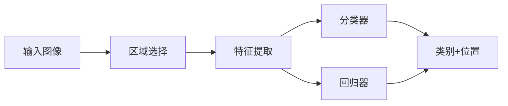

# Object Detection
目标检测算法是一个比较大的CV任务，目的在于在图像中检测物体，给出物体类型和位置。从算法的角度，可以理解为图像区域分类和位置回归。



从目标检测算法的分类来看，可以分为：

* two-stage
* one-stage
或者

* anchor-based
* anchor-free

其中two-stage都是anchor-based的方法，而one-stage包括anchor-based和anchor-free的方法。
为此，将首先简要介绍一下two-stage的方法，目前并不是太常用；重点总结一下one-stage的方法，将主要从label assignment的角度来总结。

## two-stage
### RCNN
RCNN是首次将深度学习应用于目标检测的算法。ROI的提取采用传统的selective search, NN网络主要用于提取ROI特征，最后通过SVM来分类。其中NN网络的训练是通过fine-tuning已有的分类网络来实现的。  
存在的问题是，在inference的时候需要将每个ROI送入网络提取特征，这样导致特征提取的时间复杂度非常高。  
#### Bounding Box Regression(边界框回归算法)
BBR的目的是微调建议框，使其与真实框的位置和大小相似。 
[](https://zhuanlan.zhihu.com/p/404035883)

* 已知建议框的中心坐标($P_x, P_y$)和宽高($P_w, P_h$)以及该建议框区域的特征向量$P$，从本质上希望得到一个回归函数$(G_{x}^{'},G_{y}^{'},G_{w}^{'},G_{h}^{'})=f(P)$
* 而为了避免不同的图像尺寸对回归结果产生影响，提高预测精度，采用回归建议框和真实框之间的坐标偏移量
* 学习的目标
    * 真实框和建议框的中心点横坐标之差（除以建议框宽度）$t_x=(G_x-P_x)/P_w$
    * 真实框和建议框的中心点纵坐标之差（除以建议框高度）$t_y=(G_y-P_y)/P_h$
    * 真实框和建议框的宽度之比（取log）$t_w=log(G_w/P_w)$
    * 真实框和建议框的高度之比（取log）$t_h=log(G_h/P_h)$
    * smooth L1: 

        $$smooth_{L1}(x)=\begin{cases}
        0.5x^2 & \text{if }|x|<1 \\
        |x|-0.5 & \text{if }|x|\geq 1 \\
        \end{cases}$$

* inference
    * inference的位置结果为($t_{x}^{'}, t_{y}^{'}, t_{w}^{'}, t_{h}^{'}$)
    * 预测框的中心横坐标：$G_{x}^{'}=t_{x}^{'}*P_w+P_x$
    * 预测框的中心纵坐标：$G_{y}^{'}=t_{y}^{'}*P_h+P_y$
    * 预测框的宽度：$G_{w}^{'}=P_w*exp(t_{w}^{'})$
    * 预测框的高度：$G_{h}^{'}=P_h*exp(t_{h}^{'})$

#### NMS(非极大值抑制算法)
NMS是一种非极大值抑制算法，用于去除重复的预测框。假如一张图像预测了10个类别共100个预测框，则需要对每个类别的预测框分别进行NMS，算法步骤如下：

* 每个预测框的结果分别为$[x_1,y_1,x_2, y_2, score]$
* 对每个类别的预测框进行排序，按照预测框的得分从高到低排序
* 第一个得分最高的框自然保留
* 然后计算第一个框与其他框的IoU，如果IoU大于阈值，则该框被删除，否则保留

python代码如下[code](https://www.jb51.net/article/229498.htm)：
```
import numpy as np
def nms(dets, thresh):
    x1 = dets[:,0]
    y1 = dets[:,1]
    x2 = dets[:,2]
    y2 = dets[:,3]
    areas = (y2-y1+1) * (x2-x1+1)
    scores = dets[:,4]
    keep = []
    index = scores.argsort()[::-1]
    while index.size >0:
        i = index[0]       # every time the first is the biggst, and add it directly
        keep.append(i)
 
        x11 = np.maximum(x1[i], x1[index[1:]])    # calculate the points of overlap 
        y11 = np.maximum(y1[i], y1[index[1:]])
        x22 = np.minimum(x2[i], x2[index[1:]])
        y22 = np.minimum(y2[i], y2[index[1:]])
        
        w = np.maximum(0, x22-x11+1)    # the weights of overlap
        h = np.maximum(0, y22-y11+1)    # the height of overlap
       
        overlaps = w*h
        ious = overlaps / (areas[i]+areas[index[1:]] - overlaps)
 
        idx = np.where(ious<=thresh)[0]
        index = index[idx+1]   # because index start from 1

```


### SPPNet
前面提到，RCNN在提取特征时，由于存在FC层，输入图像需要固定大小，为此需要将图像中的每个ROI处理到固定尺寸后送入网络提取特征。  
为了提高效率，提出了SPPNet，即将整张图像输入CNN网络，我们知道纯卷积网络是可以适应不同尺寸的输入图像的，然后对每个ROI对应的feature map区域通过金字塔池化处理成相同大小的特征向量，再将特征向量输入FC层进行分类，效率得到大大提高，其与RCNN的区别如下图所示：


不足之处在于，和RCNN一样，SPP也需要训练CNN提取特征，然后训练SVM分类这些特征，这需要巨大的存储空间，并且多阶段训练的流程也很繁杂。除此之外，SPPNet只对全连接层进行微调，而忽略了网络其它层的参数。

### Fast-RCNN
Fast-RCNN在于进一步优化目标检测复杂度，其改进点如下：

* 去除了SVM分类器，采用FC+softmax进行ROI分类
* 采用ROI Pooling，相当于只有一层的空间金字塔池化SPP
* 多任务损失，分类和边框回归损失，其中边框回归损失采用L1损失，分类损失采用交叉熵损失


不足之处在于，Fast-RCNN仍然采用selective search算法来寻找感兴趣区域

### Faster-RCNN
Faster-RCNN是目标检测的里程碑之作，在检测速度和精度上都有了很大提升，其中主要改进点在于去除了通过selective search算法寻找感兴趣区域来获取ROI，而是采用RPN网络来获取ROI。[code](https://github.com/Kyle1993/simplest_FasterRcnn_pytorch)。  
RPN网络的结构如下： 


* 假设网络输入为(N, 3, 224, 224), 则backbone特征最后一层输出为(N, 1024, 14, 14)
* RPN网络的输入为(N, 1024, 14, 14)，输出分为两路，一路为分类输出(N, 2*num_anchors, 14, 14)，另一路为bbox回归输出(N, 4*num_anchors, 14, 14), 其中num_anchors为每个特征点的anchor数量  
* 产生anchors，以下为产生基本anchor的代码，然后将作用到feature map上得到所有的anchors：
```
def _make_anchors(w, h, x_ctr, y_ctr):
    anchors = np.array([x_ctr-(w-1)/2, y_ctr-(h-1)/2, x_ctr+(w-1)/2, y_ctr+(h-1)/2])
    return anchors.T

def _whctrs(anchor):
    w = anchor[2] - anchor[0] + 1
    h = anchor[3] - anchor[1] + 1
    x_ctr = anchor[0] + 0.5 * (w - 1)
    y_ctr = anchor[1] + 0.5 * (h - 1)
    return w, h, x_ctr, y_ctr

def _ratio_enum(anchor, ratios):
    w, h, x_ctr, y_ctr = _whctrs(anchor)
    size = w * h
    ws = np.round(np.sqrt(size / ratios))
    hs = np.round(ws * ratios)
    anchors = _make_anchors(ws, hs, x_ctr, y_ctr) 
    return anchors

def _scale_enum(anchor, scales):
    w, h, x_ctr, y_ctr = _whctrs(anchor)
    ws = w * scales
    hs = h * scales
    anchors = _make_anchors(ws, hs, x_ctr, y_ctr)
    return anchors

def get_anchor_np(base_size, anchor_scales, anchor_ratios):
    base_anchor = np.array([0, 0, base_size-1, base_size-1])
    ratio_anchors = _ratio_enum(base_anchor, anchor_ratios)
    anchors = np.vstack([_scale_enum(ratio_anchors[i, :], anchor_scales) for i in range(ratio_anchors.shape[0])])
    return anchors.astype(np.float32)

```
* proposal layer，将RPN网络的输出进行处理，得到最终的ROI，以下为proposal layer的流程：
    * 将RPN网络输出的loc作用于anchors，得到bbox
    * 对bbox的边界进行处理，使其不超过图片边界
    * 去除太小的bbox
    * 对bbox进行NMS
    * 保留前N(eg:300)个bbox，作为ROI
* anchors与gt进行配对
对于一张图来说，anchors为(N, 4)，gt为(K, 4)，然后计算iou(N, K), 最后需要通过匹配策略得到class label(N, C)和regression label(N,4)，其中C为分类数量，匹配策略为：
    * 从anchor的角度，如果一个anchor与所有GT的iou最大值大于一定的阈值（比如0.7）， 则这个anchor是正样本， 且其label为前景（RPN）或最大IOU对应的GT label（Fast rcnn）；
    * 从GT的角度，对于一个GT，所有anchors与该GT的iou最大值对应的anchor为正样本，这样做的目的是为了让GT尽量有anchor与之匹配；
    * 如果anchors与GT的IoU小于负样本阈值（比如0.3）， 则为负样本；
    * 如果anchors与GT的IoU介于2者之间， 则是忽略样本。

每个anchor匹配好gt后，还需要通过BBR计算regression label(tx, ty, tw, th)

* 计算损失函数
利用RPN网络的输出以及配对得到的label计算分类和回归损失，其中分类损失函数为交叉熵，回归损失函数为smooth L1 loss
* 以上为RPN阶段（也就是第一阶段）的训练过程，接下来是第二阶段的训练过程，也就是Fast rcnn阶段，其训练过程如下：
    * 将proposal layer得到的ROI与gt进行配对，其中iou大于pos_iou_thresh的为正样本，处于[neg_iou_thresh_lo, neg_iou_thresh_hi)之间的为负样本，得到sample_roi, class label和regression label
    * 将sample_roi通过RoI pooling得到feature map，然后将feature map输入到Fast rcnn网络中，得到分类和回归的输出，注意这里的分类输出是n_class+1(包括背景类)，回归输出是n_class*4，比如n_class为21，则回归输出为84
    * 计算分类和回归损失，分类损失函数为交叉熵，回归损失函数为smooth L1 loss，其中计算回归损失的时候，需要将回归输出reshape为(n_class, n_class+1, 4)，然后根据class label选择对应的回归输出，然后计算smooth L1 loss

## One-Stage
以上RCNN系列为two-stage方法，下面主要介绍one-stage方法，one-stage方法的主要思想是将RPN和Fast rcnn合并为一个网络，这样就可以减少一次forward的计算，提高速度。

### SSD