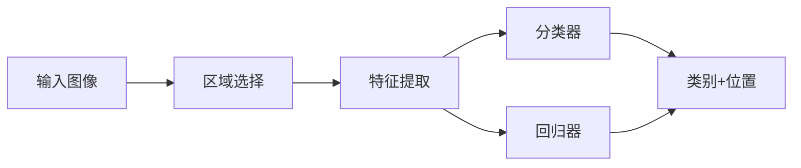

# Object Detection
目标检测算法是一个比较大的CV任务，目的在于在图像中检测物体，给出物体类型和位置。从算法的角度，可以理解为图像区域分类和位置回归。

从目标检测算法的分类来看，可以分为：

* two-stage
* one-stage
或者

* anchor-based
* anchor-free

其中two-stage都是anchor-based的方法，而one-stage包括anchor-based和anchor-free的方法。
为此，将首先简要介绍一下two-stage的方法，目前并不是太常用；重点总结一下one-stage的方法，将主要从label assignment的角度来总结。

## two-stage
### RCNN
RCNN是首次将深度学习应用于目标检测的算法。ROI的提取采用传统的selective search, NN网络主要用于提取ROI特征，最后通过SVM来分类。其中NN网络的训练是通过fine-tuning已有的分类网络来实现的。  
存在的问题是，在inference的时候需要将每个ROI送入网络提取特征，这样导致特征提取的时间复杂度非常高。

### SPPNet
前面提到，RCNN在提取特征时，由于存在FC层，输入图像需要固定大小，为此需要将图像中的每个ROI处理到固定尺寸后送入网络提取特征。  
为了提高效率，提出了SPPNet，即将整张图像输入CNN网络，我们知道纯卷积网络是可以适应不同尺寸的输入图像的，然后对每个ROI对应的feature map区域通过金字塔池化处理成相同大小的特征向量，再将特征向量输入FC层进行分类，效率得到大大提高，其与RCNN的区别如下图所示：

### Fast-RCNN

