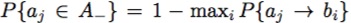
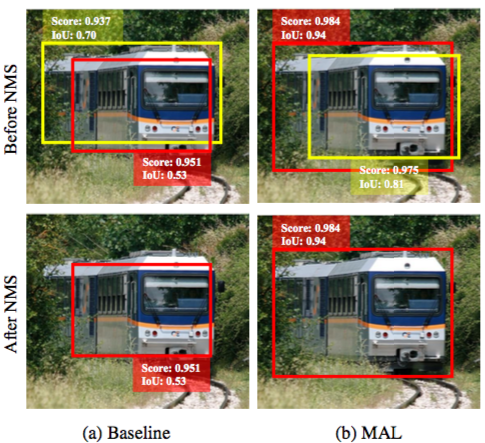
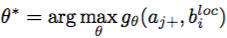
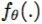

# Anchor-based方法

## 基于人工定义的方法

<!----------------------- YOLOv3 ----------------------->

### 1. YOLOv3

YOLOv3 是针对 [YOLO9000](https://arxiv.org/abs/1612.08242) 的一个改进版本, 其paper地址为：[https://pjreddie.com/media/files/papers/YOLOv3.pdf](https://pjreddie.com/media/files/papers/YOLOv3.pdf).

YOLO 最初是没有 anchor 的，在后续的 YOLO9000 中，使用 bounding box 聚类的方法，将形状类似的框聚为一个 cluster. 而在 YOLOv3 中，进一步引入了多尺度（3 个 scale）的预测，每个 scale 3 个 anchors，一共使用了 3x3 组 anchors. 其最主要的优势是**速度快**，因此即使到了现在，仍然在工业界中被大量使用.

#### 基本原理

**1. YOLOv3 的方法流程**

YOLOv3 采用 gt 框与 anchor 之间的 IoU 根据设定的阈值来区分正负样本. 具体的，其改进如下：

- Bounding box 预测

  与其他 anchor based 方法不同的是，YOLOv3 并没有使用 gt 的中心点 x，y 与 anchor 的 offsets 来进行回归，而是沿用了 YOLOv2 的做法：
  
  

  除此之外，YOLOv3 针对每个 gt 会额外回归一个 objectness score，表示该位置是否包含某个 gt. 论文中称作 **bounding box prior**. 如果某个 anchor 跟 gt 的 IoU 超过阈值 0.5，那么该 anchor 就会被 assign 到跟他 IoU 最高的一个 gt 上. 每个位置会首先预测一个 objectness score，如果一个 bounding box prior 没有被 assign，那么该位置就只计算 classification loss. 

- Classification 预测

  从使用 softmax 改为使用 binary cross entropy loss. 

- 多尺度预测

  使用 3 个 scale 进行预测；并使用 k-means 聚类的方法，在 COCO 数据集上设定了不同 scale 的 9 个 anchors：(10×13), (16×30), (33×23), (30×61), (62×45), (59×119), (116×90), (156×198), (373×326).

- 新的特征提取网络

  YOLOv2 使用了 darknet 19，在 YOLOv3 中，作者提出了 darknet 53，其网络结构如下表所示：

  

<!----------------------- RetinaNet ----------------------->

### 2. RetinaNet

RetinaNet 的全称为 Focal Loss for Dense Object Detection，其paper地址为：[https://arxiv.org/pdf/1708.02002.pdf](https://arxiv.org/pdf/1708.02002.pdf). 

RetinaNet 最主要的贡献，一方面是建立了一个**通用的 one-stage 目标检测的 pipeline**，后续的方法均广泛使用了 FPN 结构进行多尺度预测；另一方面是提出了 **Focal Loss** 来解决 loss 中政府样本不均衡和难易样本不均衡的问题. 本文中，我们将主要介绍其在 label assignment 方面的改进. 

#### 基本原理

**1. RetinaNet的方法流程**

RetinaNet 第一次在 one-stage 检测器中使用了 FPN(即Feature Pyramid Network)，其整体结构如下图所示：


其中，每个 FPN 层都设置了不同 aspect ratios，scale 的 3x3 个 anchors；不同的 FPN 层之间，anchor 的 size 根据当前层的 downsample ratio 进行调整. 下采样的倍数越高，其对应的 anchor size 就越大. 同时结合 IoU 阈值，进行正负样本的划分. 这里面主要包含两个步骤：

- 空间位置分配（Spatial assignment）

  如果某个 gt 框被 assign 到了 FPN 的第 i 层，那么需要在该层选择合适的空间位置，assign 到该 gt 上. 使用 IoU 阈值进行 assign 后的效果如下图所示：

  

  其中，与 gt 的 IoU > 0.5 的 anchors 被当作正样本（foreground），IoU < 0.4 的 anchors 被当作负样本（background），介于两者之间的部分会被 ignore 掉. 上图为了方便起见，将 3x3 个 channel 的 assign 结果进行了合并，实际情况则是，对于某个 spatial location，这 9 个 anchor 中的其中几个可能被 assign 到该 gt 上. 

- 尺度分配（Scale assignment）

  由于引入了 FPN 结构，因此带来的另一个问题是，对于不同大小的 gt 框，怎样将其 assign 到适合它的 scale 上面；同时需要尽量保证不同的 FPN stage 之间的样本数目均衡一些，否则 loss 就会出现不平衡的问题，某些层可能学的不够充分. 为了解决 stages assignment 的问题，RetinaNet 对不同的 FPN 层使用了不同 size 的 3x3 个 anchors. 例如，在 p3 上使用 size 为 8 的，那么在 p7 上则是使用 size 为 128 的 anchors. 这样，就可以隐式的将不同大小的物体，通过 IoU 阈值 assign 到了适合其大小的 FPN 层上. 

在后续的方法中，除了 spatial assignment 之外，只要使用了 FPN 结构 / 多尺度的预测，都需要对 scale assignment 进行处理. 

<!----------------------- ATSS ----------------------->

### 3. ATSS

ATSS全称为Bridging the Gap Between Anchor-based and Anchor-free Detection via Adaptive Training Sample Selection，其paper地址为：[https://arxiv.org/pdf/1912.02424v1.pdf](https://arxiv.org/pdf/1912.02424v1.pdf).

**Motivation**: 本文想探究 anchor-free 和 anchor-based one stage detectors 之间的区别和联系，然后指出了其本质上是采用不同的方式在做同一件事情. 基于此观察，ATSS提出了一种自适应的选择正负训练样本的策略. 具体地，ATSS 首先对 anchor-based 方法（RetinaNet）与 anchor-free 方法（FCOS）进行了实验对比，得出了一个重要的结论：anchor-based 和 anchor-free 方法最本质的区别是如何定义正负样本，而与回归 box 还是回归 points 无关；而后提出了一种根据 anchor 与 gt 框的 IoU 值的统计信息进行正负样本确定的方法，达到了 SOTA 的效果.

#### 基本原理

**1. ATSS的方法流程**

ATSS属于anchor-based方法，也依赖于预定义的anchor. 不同于以往anchor-based方法的地方在于：ATSS没有采用固定的IoU阈值确定正样本，而是基于每个gt框所match到的anchor的统计信息动态调整了每个gt框的IoU阈值，一定程度上保证了每个gt框都有数量相当的正样本. 其确定为每个gt框确定IoU阈值的流程如下：

- Step 1. 设置anchor的scales和ratios，生成相应的anchors

- Step 2. 获取候选正样本

  对于每一个gt框，在FPN的每一层上，计算anchor中心点与gt中心点的L2距离，选择距离最小的k个anchor，k为超参数，默认取值为9

  假设FPN的层数为l，则这一步骤将为每个gt框选择 k*l 个候选正样本.

- Step 3. 计算候选正样本的统计信息

  将每个gt框的候选正anchor汇总起来，计算这些anchor与gt框的iou值的平均值m<sub>g</sub>和标准差v<sub>g</sub>

- Step 4. 基于统计信息为每个gt框确定IoU阈值

  每个gt框的IoU阈值 t<sub>g</sub> = m<sub>g</sub> + v<sub>g</sub>，将候选正样本中IoU值超过t<sub>g</sub>的保留.

  根据相关知识，理论上每个gt框都能分配约16%的候选正样本，进而一定程度上保证了每个gt框的正样本数量相当. 类比于以往的固定阈值的方式，通常会导致不同gt框分配到的正样本数量差异较大的问题，因此导致不同gt框检测性能存在较大差异.

  下图为ATSS对于两个不同的gt的候选正样本在FPN不同层上的分布以及确定的t<sub>g</sub>：

  

  注：这里计算出来的t<sub>g</sub>取值可能会很低，导致有很多低质量的正样本，因此约定t<sub>g</sub>不低于预设的阈值（如0.3）

  注：如果一个anchor同时match到了多个gt，则分配给IoU值最大的gt

- Step 5. 去掉质量较低的正样本

  过滤掉中心点不在gt框的anchor.

#### 重要结论

**1. Anchor-based方法与anchor-free方法的本质区别**

本文首先对anchor-based方法与anchor-free方法的区别进行了实验分析，分别选择了RetinaNet和FCOS作为两种方法的经典代表.

下表展示了两种方法采用两种不同的正负样本确定方法和两种不同的包围框回归方式（分别为原始RetinaNet和FCOS确定正负样本的方法）所展示的检测效果：


从上表可以看出：当采用相同的确定正负样本的方法时，两种不同的包围框回归方式的效果相当；当采用相同的包围框回归方式时，FCOS所采用的确定正负样本的方法效果明显更好. 这说明：

* anchor-based和anchor-free方法最本质的区别是如何定义正负样本，而与回归box还是回归points无关.
* 确定正负样本的方法是至关重要的.

**2. 超参数k不是很敏感，取值为9效果较好**

超参数k的不同取值对应的效果如下：


**3. Anchor的数量是否重要**

Anchor的数量（#scales * #ratios）对于不同的方法有不同的作用，这取决于是否选择了合适的正负样本.

对于RetinaNet，#scales=3，#ratios=3的效果明显优于#scales=1，#ratios=1；对于ATSS，#scales=1，#ratios=1的效果便足够好，在增加anchor数量没有收益.

<!-- #### code

使用ATSS进行anchor匹配的核心code如下：

```python
# --------------------------- atss anchor target --------------------------- #

def get_atss_anchor_target(
    config,
    box_coder,
    all_anchors_list: List[OperatorNodeBase],
    batch_gt_boxes: OperatorNodeBase,
    batch_valid_gt_box_number: OperatorNodeBase,
):

    cls_target_list = []
    box_target_list = []
    ctr_target_list = []

    batch_size = config.batch_size

    all_anchors = O.Concat(all_anchors_list[:], axis=0)
    anchors_num = all_anchors.shape[0]

    for b_id in range(batch_size):
        # gt_boxes.shape [N, 5]
        gt_boxes = batch_gt_boxes[b_id, : batch_valid_gt_box_number[b_id]]
        gt_boxes_num = gt_boxes.shape[0]

        batch_anchors_ctr = (all_anchors[:, 0:2] + all_anchors[:, 2:4]) / 2.0
        gt_center = (gt_boxes[:, :2] + gt_boxes[:, 2:4]) / 2.0
        gt_center = gt_center[:, None, :]
        distances = O.Sqrt(
            O.Pow(gt_center - batch_anchors_ctr[None, :, :], 2).sum(axis=2)
        )
        gt_positions_iou = bdl.box_util.get_iou(gt_boxes[:, :4], all_anchors)
        candidate_idxs = []
        start_idx = 0
        for anchors_i in all_anchors_list[:]:
            end_idx = start_idx + anchors_i.shape[0]
            distances_per_level = distances[:, start_idx:end_idx]
            topk = O.Min(config.topk, anchors_i.shape[0])
            _, topk_idxs = O.TopK(distances_per_level, topk).outputs
            candidate_idxs.append(start_idx + O.ZeroGrad(topk_idxs))
            start_idx += anchors_i.shape[0]

        candidate_idxs = O.Concat(candidate_idxs, axis=1)
        candidate_ious = gt_positions_iou.batch_mi[:, candidate_idxs]

        ious_thr = (
            candidate_ious.mean(axis=1) + misc.std(candidate_ious, axis=1)
        ).add_axis(1)

        is_foreground = O.zeros(gt_boxes_num, anchors_num).astype(np.int32)
        is_foreground = is_foreground.batch_set_mi[:, candidate_idxs](
            O.ones(candidate_idxs.shape).astype(np.int32)
        )
        is_foreground = is_foreground * (gt_positions_iou >= ious_thr)
        offsets = O.Concat(
            [
                batch_anchors_ctr[:, None, :] - gt_boxes[None, :, :2],
                gt_boxes[None, :, 2:4] - batch_anchors_ctr[:, None, :],
            ],
            axis=2,
        )
        is_in_boxes = offsets.min(axis=2) > 0
        # is_in_boxes shape: [gt_boxes_num, anchors_num]
        is_in_boxes = is_in_boxes.dimshuffle(1, 0)

        valid_mask = is_in_boxes * is_foreground
        _, not_valid_mask_pos = O.CondTake(
            valid_mask, valid_mask, "EQ", 0
        ).outputs
        mask_row_pos = (not_valid_mask_pos // valid_mask.shape[1]).astype(
            np.int32
        )
        mask_col_pos = (not_valid_mask_pos % valid_mask.shape[1]).astype(
            np.int32
        )
        gt_positions_iou = gt_positions_iou.set_ai[
            (mask_row_pos, mask_col_pos)
        ](O.ones(not_valid_mask_pos.shape) * -1)
        # if there are still more than one objects for a position,
        # we choose the one with maximum iou
        gt_matched_idxs = O.Argmax(gt_positions_iou, axis=0)
        positions_max_iou = gt_positions_iou.max(axis=0)

        # mask = 1 - positions_max_iou.eq(O.ZeroGrad([-1]))
        pos_mask = positions_max_iou > -1

        cls_target = gt_boxes.ai[gt_matched_idxs, 4]
        cls_target = cls_target * pos_mask * (valid_mask.sum() > 0)
        cls_target = cls_target.astype(np.int32)

        box_target = box_coder.encode(
            gt_boxes.ai[gt_matched_idxs, :4], all_anchors[:]
        )
        if config.regression_type == "POINT":
            left_right = box_target.ai[:, [0, 2]]
            top_bottom = box_target.ai[:, [1, 3]]

        elif config.regression_type == "BOX":
            anchor_gt_ctr_offsets = O.Concat(
                [
                    batch_anchors_ctr - gt_boxes.ai[gt_matched_idxs, :2],
                    gt_boxes.ai[gt_matched_idxs, 2:4] - batch_anchors_ctr,
                ],
                axis=1,
            )
            left_right = anchor_gt_ctr_offsets.ai[:, [0, 2]]
            top_bottom = anchor_gt_ctr_offsets.ai[:, [1, 3]]

        ctr_target = O.Sqrt(
            O.Max(0, left_right.min(axis=1) / left_right.max(axis=1))
            * O.Max(0, top_bottom.min(axis=1) / top_bottom.max(axis=1))
        )
        ctr_target = ctr_target * pos_mask

        cls_target_list.append(cls_target.add_axis(0))
        box_target_list.append(box_target.add_axis(0))
        ctr_target_list.append(ctr_target.add_axis(0))

    cls_target_list = O.Concat(cls_target_list, axis=0)
    box_target_list = O.Concat(box_target_list, axis=0)
    ctr_target_list = O.Concat(ctr_target_list, axis=0)

    return (
        O.ZeroGrad(cls_target_list),
        O.ZeroGrad(box_target_list),
        O.ZeroGrad(ctr_target_list),
    )

``` -->

#### 思考与求证

**1. 相关实验记录汇总**

**2. 是否可以固定正样本数量（例如IoU值最大的20%的候选正样本）的方式替换掉基于正样本IoU值统计信息确定阈值的方式？**

固定每个正样本的数量，感觉与作者通过统计信息得到正样本的初衷是一致的：为不同的gt框分配数量相当的正样本，故猜想能够达到相同的指标.

不过这样显示的增加了一个参数，即正样本的数量，默认可以取值为 0.2 * k * l.


#### 方法小结

ATSS提了一种简单有效的正负样本确定方法，降低了参数数量，一定程度上保证了每个gt框都有数量相当的正样本，提升了检测效果. 此外，ATSS降低了anchor-based方法的anchor数量，相比业务在用的RetinaNet，ATSS能够明显提升inference以及NMS后处理的速度，值得在业务上继续实验.


## 基于模型选择的方法

<!----------------------- GuidedAnchoring ----------------------->

### 1. GuidedAnchoring

GuidedAnchoring 的全称为 Region Proposal by Guided Anchoring，其paper地址为：[https://arxiv.org/pdf/1901.03278.pdf](https://arxiv.org/pdf/1901.03278.pdf). 

#### 基本原理

**1. 方法简介**

**Motivation** ：以往的基于 anchor 的方法中，anchor 都是提前设定好的；而 anchor 可以视为某种人工 prior 的具象化；既然在前面介绍的方法中，label assign 的规则可以进行改进，那么理论上，这种人工 prior 也是可以通过结合具体的 feature 进行调整，从而得到 postprior. 遗忘的固定 anchors setting 存在几个问题，一是 anchor 需要针对不同的 dataset 进行设计和调整，而且因为 anchor 本身是离散的，因此很难覆盖 corner cases. 另一方面是，为了保证足够的 recall，就需要一种 dense 的 anchor 分布，这其中大量的 anchors 都是负样本. 在之前的 RetinaNet 中，需要使用 FocalLoss 对样本不均衡的问题进行处理，可见该问题的重要性. 针对这两个问题，本文提出了一种 learnable 的设置 anchor 的机制，可以由图像本身的语义信息（位置和上下文）来生成 anchors. 整体的框架如下图所示：


核心是中间的 Guided anchoring，其主要由 2 个部分组成. 对于 FPN 的每个 output feature map：

- Anchor generation 模块：有 2 个分支，分别是 anchor 的 location 和 shape 预测. 

  - Location prediction 通过一个子网络生成 probability map 来表示物体可能出现的位置. 每个位置的预测表示该位置存在 objects 的概率. 
  - Shape prediction 通过一个自网络学习每个位置的物体的形状（w 和 h）. 通过选取概率超过某个阈值的位置，可以得到多个对应位置的 anchors . 

- Feature adaptation 模块：有了上面自适应生成的 anchors 之后，考虑到多样的 anchor 分布（不同于传统方法中，每个位置的 anchor shape 是固定的），因此特征的表达应该也不一致，具体地，更大的 anchor 应该 capture 更大的 region 的信息. 

  

  上面的公式表示原始 feature map 中 i 位置的 feature，根据生成的 anchors 的 w 和 h 进行 feature 的 transformation；具体实现方式为一个在 Ns 上 apply 一个 1x1 conv 得到 deformable conv 的 offsets，然后使用原 feature map 和一个  3x3 的 deformable conv 得到新的特征图. 

**2. 训练过程**

整体的 loss 形式为 ，其中， location prediction loss 和 shape prediction loss 的实现细节如下：

- Location prediction loss

  简而言之，需要一个 mask 来指示哪些地方用来计算 location loss；本文对于每个 gt，在 gt 框映射到对应 FPN 层上之后，在框内根据 center，ignore 和 outside 划分了正负样本区域. 训练时采用 Focal Loss. 

- Shape prediction loss

  Shape 的计算类似于 bounding box regression 过程. 首先要找到对应的 gt 框，然后根据 gt 框的尺寸计算 loss. 这里面临的问题是，如何找到对应的 gt. 本文中定义了一个优化问题：

  

  即 vIoU 表示生成的 anchor 和某个 gt 框能产生的最大 IoU，选择 vIoU 最大的 gt 框作为匹配的 target. 文中采用一种近似方法进行优化. 为 w 和 h 取一些常见的值，计算和所有 gt 框的 IoU，选取 IoU 最大的 gt 框进行匹配. w，h 具体的取值使用了 RetinaNet 的 9 种 anchors 的 setting，Loss 使用 Bounded IoU Loss：

  

与后面方法不同的是，以 GuidedAnchoring、MetaAnchor 为代表的通过修改 anchor setting 来改变 label assign 结果的方法，可以更好的覆盖多样的 bounding box 分布，理论上可以解决固定的 anchor setting 难以覆盖的 corner cases. 

<!----------------------- FreeAnchor ----------------------->

### 2. FreeAnchor

FreeAnchor全称为FreeAnchor: Learning to Match Anchors for Visual Object Detection，其paper地址为：[https://arxiv.org/pdf/1909.02466.pdf](https://arxiv.org/pdf/1909.02466.pdf).

**Motivation**: 以往固定的 label assign 策略很难应对多变的数据分布，因此，能否设计一种可以 end-to-end 进行 assign 的策略，优化 label assignment 的结果？

以往的 anchor-based 方法大多基于人工预设的 IoU 阈值进行 anchor 与 gt 框的匹配，进而得到正负 anchor 用于训练网络. 为了解决上述问题，FreeAnchor 首次提出使用 MLE 将 classification 和 regression 任务进行**联合建模**. 基于此，FreeAnchor 引入了优化 positive loss 和 negative loss 分别视为提升 **recall** 和 **precision** 作为训练目标，把 anchor 匹配问题融入网络训练过程中. 

针对每个 gt，FreeAnchor 首先构建了一个 topk IoU 组成的 anchor bags（论文中 k=50 时效果最佳），在网络训练过程中，根据 feature 自适应的调整 anchor bags 中每个 cannidate 的权重，期望随着网络的训练，模型能够挑选出高质量的 anchor（分类和位置回归置信度高）作为主要的正样本用于提升模型的召回率，其余质量相对较低（位置回归置信度相对较低）anchor 尽量往背景学习以提升准确率（降低FP）. FreeAnchor 的出发点很合理，采用的训练方法也比较有效，最终取得了很好的效果.

下图展示了FreeAnchor与以往基于IoU阈值确定正负样本的方法的区别：


#### 基本原理

**1. 方法简介**

FreeAnchor首先对一般的目标检测方法中的loss进行了回顾. 通常情况下，loss可以包含三部分，分别为：正样本的分类loss，正样本的回归loss以及负样本的分类loss，可以用如下公式表示：


注：上述公式中，B表示gt框，A<sub>+</sub>表示匹配到gt的anchor，A<sub>-</sub>表示未匹配到gt的anchor，C表示匹配矩阵（如C<sub>ij</sub>表示gt框 b<sub>i</sub> 匹配到了anchor a<sub>j</sub>）. 

FreeAnchor从最大似然估计（MLE）的视角出发解读了上述loss，可以用如下公式进行表示：


注：上述公式中，和分别表示正负样本的分类置信度，表示正样本的位置回归置信度.

通过MLE的视角来看，上述公式针对如何提升分类置信度和回归置信度进行了优化，却忽略了优化anchor与gt的匹配过程（即匹配矩阵C）. 以往的方法中，anchor与gt的匹配往往通过人工定义，本文则将anchor与gt的匹配融入网络的训练中，作为优化目标的一部分进行优化.

理想的检测模型可能需要将这样三个问题做好，才能够取得很好的检测效果，这3个问题分别是：

1. **提升模型的召回率**，即检测出越多的TP；

2. **提升模型的准确率**，即将位置回归效果差的框判定为背景类；

3. **需要适应NMS的处理逻辑，尽可能保留高质量的TP**，即要求位置回归效果差的框的分类置信度较低，而位置回归效果好的框的分类置信度较高. 

FreeAnchor 针对这 3 点分别进行了设计，如下：

- 如何提升模型的召回率？

  FreeAnchor认为，要提升模型的召回率，需要满足：对于每个gt框，至少有一个anchor的分类与位置回归结果与这个gt接近，即满足如下公式：

  

- 如何提升模型的准确率？

  FreeAnchor通过如下公式提升模型的准确率：

  

  该公式表示：如果一个anchor的位置回归结果没有与任何一个gt框匹配上，则该anchor分类为背景的概率需要较高，否则这个anchor的预测结果就会成为FP.

  在上述公式中，表示anchor a<sub>j</sub> 的位置回归结果没有与任何一个gt匹配的概率. 表示anchor a<sub>j</sub> 的位置回归结果匹配到gt b<sub>i</sub>的概率.


- 如何适应NMS的处理逻辑？

  FreeAnchor指出，为了适应NMS的过滤逻辑，需要满足三个性质：(1) 与IoU值单调递增；(2) 当IoU值低于一定阈值时取值为0；以及 (3) 有且只有一个anchor a<sub>j</sub?> 匹配到 b<sub>i</sub>的概率为1. 因此，FreeAnchor提出了如下分段线性函数：

  

  然后令. 上述分段线性函数能够较好的适应NMS的过滤逻辑.

  基于上述分析，FreeAnchor最终的loss函数如下：

  

  其中，max函数用于从候选正anchor中挑选出一个质量最高的anchor，用这个anchor更新网络的权重，这里的思想与多示例学习（MIL, Multiple Instance Learning）比较类似. 然而，在网络训练的初始阶段，由于训练还不稳定，挑选出的结果未必可靠，因此作者采用了如下Mean-Max函数进行替换：

  

  Mean-Max函数的作用为：在网络训练的初始阶段，每个anchor的贡献差不多，随着网络不断迭代，部分分数较高的anchor凸显出来，开始占据主要作用，即达到FreeAnchor上述设计的初衷.

  下图展示了FreeAnchor不断迭代过程中各个anchor的重要程度（颜色越深越重要）演变过程，可以看出FreeAnchor能够根据特征的重要程度挑选出质量较高的anchor，与之作为对比的是右边为基于人工设计结果：

  

#### 重要结论

1. 候选正样本的初始数量为50时效果最佳

<!-- #### code

使用FreeAnchor进行anchor匹配的核心code如下：

```python
# -------------------------- free anchor matching -------------------------- #

def get_free_anchor_match_loss(
    batch_size: int,
    num_classes: int,
    match_cfg: Dict,
    gt_boxes: OperatorNodeBase,
    batched_valid_gt_box_number: OperatorNodeBase,
    all_anchors_final: OperatorNodeBase,
    rpn_cls_prob_final: OperatorNodeBase,
    rpn_bbox_offset_final: OperatorNodeBase,
    normalize_box_means: np.ndarray = None,
    normalize_box_stds: np.ndarray = None,
) -> OperatorNodeBase:
    """
    Free anchor matching losses.

    Args:
        batch_size (int): number of the batch size
        num_classes (int): number of the classes
        match_cfg (Dict): the free anchor match configuration:
        gt_boxes (OperatorNodeBase):
        batched_valid_gt_box_number (OperatorNodeBase):
        all_anchors_final (OperatorNodeBase):
        rpn_cls_prob_final (OperatorNodeBase):
        rpn_bbox_offset_final (OperatorNodeBase):
        normalize_box_means (OperatorNodeBase):
        normalize_box_stds (OperatorNodeBase):

    Returns:
        free_anchor_match_loss (OperatorNodeBase):
    """

    def positive_bag_loss(logits, dim=1):
        weight = 1.0 / (1.0 - logits)
        weight /= weight.sum(axis=dim, keepdims=True)
        bag_prob = (weight * logits).sum(axis=1)
        return -safelog(bag_prob)

    def negative_bag_loss_func(logits, gamma):
        return (logits ** gamma) * (-safelog(1 - logits))

    positive_numels_list = []
    box_prob_list = []
    positive_losses = []

    for bid in range(batch_size):
        cur_bbox_offset = rpn_bbox_offset_final[bid]
        if normalize_box_means is not None:
            std_opr = O.ConstProvider(normalize_box_stds[None, :])
            mean_opr = O.ConstProvider(normalize_box_means[None, :])
            cur_bbox_offset = cur_bbox_offset * std_opr + mean_opr
        cur_gt = gt_boxes[bid, : batched_valid_gt_box_number[bid]]
        labels = cur_gt[:, 4].astype(np.int32) - 1

        box_localization = bdl.box_util.bbox_transform_inv_opr(
            all_anchors_final[bid], cur_bbox_offset
        )
        gt_on_box = bdl.box_util.get_iou(cur_gt[:, :4], box_localization)
        iou_thresh = match_cfg.iou_thr
        H = megskull.cblk.elemwise.clip(
            gt_on_box.max(axis=1, keepdims=True), iou_thresh + 1e-12, 1.0
        )
        object_box_prob = megskull.cblk.elemwise.clip(
            (gt_on_box - iou_thresh) / (H - iou_thresh), 0, 1.0
        )

        object_box_prob = object_box_prob.set_ai[0, 0](0.001)
        nonzero_value, non_zero_pos = O.CondTake(
            object_box_prob, object_box_prob, "NEQ", 0
        ).outputs[:2]

        box_nonzero_pos = (non_zero_pos % object_box_prob.shape[1]).astype(
            np.int32
        )

        box_lables = labels.ai[
            (non_zero_pos / object_box_prob.shape[1]).astype(np.int32)
        ]

        image_box_prob = O.zeros((object_box_prob.shape[1], num_classes - 1))
        image_box_prob = O.ZeroGrad(
            image_box_prob.set_ai[(box_nonzero_pos, box_lables)](nonzero_value)
        )
        image_box_prob = O.ZeroGrad(image_box_prob.set_ai[0, 0](0.0))
        box_prob_list.append(image_box_prob)

        match_quality_matrix = bdl.box_util.get_iou(
            cur_gt[:, :4], all_anchors_final[0]
        )
        _, matched = O.TopK(
            -match_quality_matrix, match_cfg.bucket_size
        ).outputs
        matched = O.ZeroGrad(matched)
        cls_prob_ = rpn_cls_prob_final[bid]
        matched_flat = matched.reshape(-1)
        cls_prob_bucket = cls_prob_.ai[matched_flat].reshape(
            matched.shape[0], matched.shape[1], -1
        )
        matched_cls_prob = cls_prob_bucket.dimshuffle(0, 2, 1).ai[
            O.Linspace(0, labels.shape[0] - 1, labels.shape[0]).astype(
                np.int32
            ),
            labels.reshape(-1).astype(np.int32),
        ]

        matched_anc = all_anchors_final[bid].ai[matched_flat].reshape(-1, 4)
        matched_object_targets = bdl.box_util.bbox_transform_opr(
            matched_anc,
            cur_gt[:, :4]
            .add_axis(1)
            .broadcast([cur_gt.shape[0], match_cfg.bucket_size, 4])
            .reshape(-1, 4),
        )

        if normalize_box_means is not None:
            std_opr = O.ConstProvider(normalize_box_stds[None, :])
            mean_opr = O.ConstProvider(normalize_box_means[None, :])
            matched_object_targets = (
                matched_object_targets - mean_opr
            ) / std_opr

        matched_box_regression = (
            rpn_bbox_offset_final[bid].ai[matched_flat].reshape(-1, 4)
        )

        retinanet_regression_loss = (
            bdl.get_smooth_l1_base(
                matched_box_regression, matched_object_targets, sigma=3
            )
            .sum(axis=1)
            .reshape(matched_cls_prob.shape)
        )
        retinanet_regression_loss *= match_cfg.box_loss_weight

        matched_box_prob = O.Exp(-retinanet_regression_loss)
        positive_numels_list.append(cur_gt.shape[0])

        compose_prob = matched_cls_prob * matched_box_prob
        positive_losses.append(positive_bag_loss(compose_prob, dim=1))

    positive_numels = O.Concat(positive_numels_list, axis=0).sum()
    positive_loss = O.Concat(positive_losses, axis=0).sum() / O.Max(
        1, positive_numels
    )

    box_prob = O.Concat(box_prob_list, axis=0).reshape(
        batch_size, -1, num_classes - 1
    )

    negative_loss = negative_bag_loss_func(
        rpn_cls_prob_final * (1 - box_prob), match_cfg.focal_gamma
    ).sum() / O.Max(1, positive_numels * match_cfg.bucket_size)

    return (
        positive_loss * match_cfg.focal_alpha,
        negative_loss * (1 - match_cfg.focal_alpha),
    )

``` -->

#### 思考与求证
暂无

#### 方法小结

FreeAnchor的出发点比较科学，将提升检测模型性能转变为提升recall和precision，将anchor匹配这个问题融入网络的训练过程中，基于模型的输出挑选高质量的anchor. FreeAnchor提出的一个理想检测模型需要满足的三点（即提升模型的召回率、提升模型的准确率以及需要适应NMS的处理逻辑，尽可能保留高质量的TP）比较合理，并分别提出了有针对性的优化方案，最终取得了较好的检测效果.


<!----------------------- MAL ----------------------->

### 2. MAL

MAL全称为Multiple Anchor Learning for Visual Object Detection，其paper地址为：[https://arxiv.org/pdf/1912.02252.pdf](https://arxiv.org/pdf/1912.02252.pdf).

**Motivation**：MAL的出发点与FreeAnchor非常类似：将anchor匹配问题融入网络的训练中，基于anchor预测的分类与位置回归结果对anchor进行打分，从中挑选出质量较高的anchor训练网络，从而能够较好地保留分类与位置回归准确度都较好的anchor，进而提升了检测效果.

下图是MAL相比baseline RetinaNet的检测结果. 可以看出，使用MAL训练得到的网络，更加能够将位置回归结果较好的anchor上得到更高的分类置信度，进而在NMS后处理阶段能够保留高质量的检测结果：



#### 基本原理

以往的基于人工确定的基于IoU值分配正负样本的方法，实际是在确定了anchor的分配以后，优化网络的超参数，使得网络能够取得最高的效果.

其分类任务的优化目标如下：


注：上述公式中，a<sub>j+</sub>表示匹配到gt框b<sub>i</sub>的正anchor，a<sub>j-</sub>表示负anchor，f<sub>&theta;</sub>表示分类loss函数.

对于正样本，还需要优化位置回归任务，如下：



不同于以往的方法，MAL将正负anchor的确定也作为网络需要优化的问题，其优化目标如下：


其中，和分别表示分类与回归的置信度，可以分别由相应的loss得到，进而可以表示是如下形式：


注：上述公式仅仅包含分类部分，对于位置回归部分也是类似的.

直观上分析，MAL提出的优化目标相比传统方法确实更加合理，然而上述优化问题是一个非凸优化(Non-Convex)问题，现有的求解方法如SGD容易陷入局部最优解. 为此，MAL提出了一种启发式的训练算法，能够比较有效地求解上述问题，称为**Selection-Depression**方法.

Selection-Depression 方法：

该方法的初衷是：在一次前向传播中，根据每个anchor的分类loss和位置回归loss为anchor进行打分，选择分数较高的anchor更新网络的梯度，不断重复上述过程直至收敛，就得到了最终的检测模型，这一过程可以称为Selection-Training，示意图如下：


然而该想法存在一个缺陷，在网络前期训练中，由于网络不太问题，分类与位置回归的准确度不高，因此容易导致误选高质量的anchor；此外，MAL认为适当让一些较低质量的anchor参与训练，有助于提升网络的鲁棒性，因此提出了 **Depression** 方法.

Depression可以简单地理解为：将高分anchor对应的特征响应进行降低，从而使得其他anchor有机会被选中参与训练. 特征扰动以及整个Selection-Depression过程如下图所示：


注：关于扰动高分anchor特征的方法推荐读者阅读原文

实际上，随着网络不断训练，网络预测的准确性不断提升，为了使NMS后处理之后能够保留位置回归和分类都相对好的anchor，MAL采用了随着训练过程不断减少所选择的参与训练的anchor数量直至为1（此时训练也基本结束），MAL将之称为all-to-1训练策略.

假设训练迭代总数为T，t时选定的anchor为&psi;<sub>(t)</sub>对于第i个gt框，初始选定的anchor数量记为A<sub>i</sub>，则有：&psi;<sub>(t)</sub> = A<sub>i</sub> * (1 - t/T) + 1.

基于上述训练方法，MAL取得了SOTA的效果.

#### MAL 与 FreeAnchor的比较

MAL的出发点与FreeAnchor有很高的相似度，但是二者具体的实现方式方式上有较大差异.

**相同点**

- 出发点类似：为每个 gt 挑选一个分类和位置回归最好的 anchor


- 都设置了候选正样本，具体的 anchor 匹配在训练过程中不断更新

  比较巧合的是，二者在候选正样本数量为 50 的时候达到最佳效果

- 在训练过程中，都根据 anchor 在分类和位置回归表现为 anchor 进行加权


- 都采用了相应的策略解决网络初期训练预测结果不准确的问题


**不同点**

- 样本加权方式不同

  - FreeAnchor 采用 Mean-Max 函数，在网络训练初期各样本权重相当，随着网络不断训练，高质量的 anchor 权重增大.
  
  - MAL 采用了all-to-1 训练策略，不断缩小正样本的数量，相当于不断增强高质量正样本的权重.

- FreeAnchor 有针对 NMS 的优化，期望预测位置准确（或不准确）的 anchor 有较高（或较低）的分类置信度，以保留位置准确的框

- MAL 采用了 depression 策略对高质量 anchor 的特征进行扰动，鼓励低质量 anchor 参与网络的训练

- FreeAnchor 相比 MAL 在建模和实现上更加简洁


#### 重要结论

1. 候选正样本的初始数量为 **50** 时效果最佳

2. all-to-1训练策略能提升效果，AP：38.14->38.39

3. depression 的策略(即需要被扰动的特征数量)对结果影响较大，采用先升高后降低的 **symmetric step** 策略效果最好


4. selection与depression配合使用效果能进一步提升


#### 思考与求证
暂无

#### 方法小结

MAL与FreeAnchor的出发点类似，为每个gt框分配若干候选正样本，并基于每个样本在训练过程中输出的分类与位置回归分数筛选出高质量的样本，并采用了all-to-1训练策略不断减少正样本的数量，最终取得了较好的检测效果.
