# Anchor-free方法

## 基于人工定义的方法

<!----------------------- FCOS ----------------------->

### 1. FCOS

FCOS全称为FCOS: Fully Convolutional One-Stage Object Detection，其paper地址为：[https://arxiv.org/pdf/1904.01355.pdf](https://arxiv.org/pdf/1904.01355.pdf).

**Motivation**：不依赖于 anchor 的 one-stage detector 能否达到跟 anchor-based 方法 comparable 的精度？

与 anchor-based 检测方法不同，FCOS 直接将 pixel 作为训练样本，基于 pixel 与 gt 框的位置关系确定 pixel 的正负标签，回归目标为 gt 框的四条边框相对 pixel 的位置，并采用 FPN 结构、centerness分支提升了检测效果. 其中，pixel 指的是 output feature map 上的每个位置. 

#### 基本原理

FCOS的网络结构非常简单，在RetinaNet的结构上添加了一个centerness分支，用于预测检测框偏离真实gt框的程度；此外，FCOS关于正负样本的构造以及解决scale分配的方法与以往anchor-based方法存在差异. 其网络结构如下图所示：

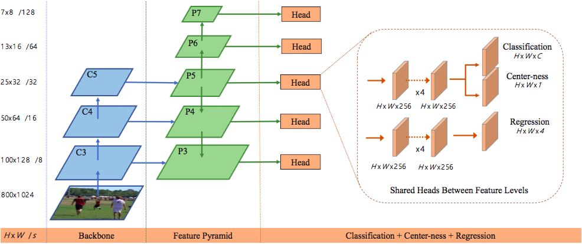

FCOS的主要改进包括：

1. 基于 pixel 的样本分配，不依赖 anchor; 
2. 全卷积结构，采用 FPN 结构解决 scale 分配问题; 
3. 提出 **centerness** 分支，抑制低质量的检测框；

下文进行详细介绍.

**1. 基于 pixel 的样本分配**

- 正负样本分配

在anchor-based方法中，常见的正负样本分配方式是基于anchor与gt框的IoU值，存在诸如anchor setting，IoU阈值等问题需要解决. FCOS采用了基于pixel的样本分配方式：如果feature map上的pixel映射会原图的位置在gt框内部，则该pixel将作为正样本参与训练，并负责检测这个gt框. 当然，如果pixel同时在多个gt框内，则该pixel会负责检测其中面积最小的gt框. 

- 回归目标

与anchor-based方法类似，对于正样本，需要网络回归gt框的位置. FCOS将gt框的上右下左四条边相比pixel的距离作为回归目标，如下：

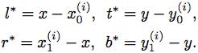

其中，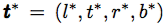是网络所需要学习的目标，(x, y)是分配给gt框B<sup>(i)</sup> = (x<sub>0</sub><sup>(i)</sup>, y<sub>0</sub><sup>(i)</sup>, x<sub>1</sub><sup>(i)</sup>, y<sub>1</sub><sup>(i)</sup>).

FCOS基于pixel的样本分配示意图如下：

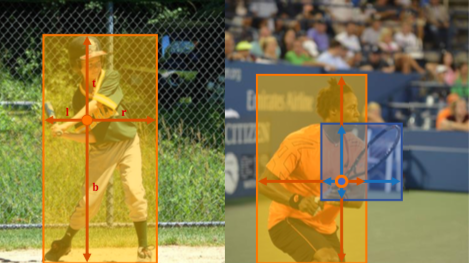

**2. 采用 FPN 结构解决 scale 分配问题**

Anchor-based检测方法中，由于FPN各层的anchor scale不同，在基于IoU进行正负样本的分配时，也同时完成了不同scale的gt框在fpn上的分层. 通常认为，FPN的浅层用于检测scale相对较小的物体，在高层检测scale较大的物体，FCOS也借鉴了类似的想法，完成了scale的分配问题，从而大大降低了早期anchor-free方法（如DenseBox）所面临的样本模糊问题.

具体地，FCOS基于pixel距gt框边界的距离大小在FPN各层上进行分配：距离小的分配在浅层，距离大的分配到高层，这里距离为gt框四条边距离pixel距离的最大值.假设FPN各层分别为：(P<sub>3</sub>, P<sub>4</sub>, P<sub>5</sub>, P<sub>6</sub>, P<sub>7</sub>)，FCOS将正实数空间根据(m<sub>3</sub>, m<sub>4</sub>, m<sub>5</sub>, m<sub>6</sub>)这4个值划分为5个连续不相交的区间：(0, m<sub>3</sub>), (m<sub>3</sub>, m<sub>4</sub>), (m<sub>4</sub>, m<sub>5</sub>), (m<sub>5</sub>, m<sub>6</sub>), (m<sub>6</sub>, +∞)，分别对应FPN的5个层. pixel距离gt框的距离落在某个区间，就将gt分给对应FPN层.

采用FPN结构，将gt框在不同的FPN层进行分层隔离，大大降低了样本模糊的问题，从而提升了检测效果.

**3. 提出 centerness 分支，抑制低质量的检测框**

在使用上述1和2的策略以后，得到的指标低于baseline anchor-based模型，作者发现这是由于：距离物体中心较远的pixel预测和很多低质量的检测框，为了解决这个问题，FCOS提出了增加centerness分支用于预测pixel的位置相比所检测的gt框中心点的偏离程度. centerness的计算方式如下：

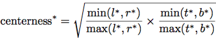

如下是不同位置的centerness大小示意图（越靠近中心的点centerness越高）:

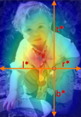


#### 重要结论

1. centerness分支是至关重要的，且还有较大的提升空间

下表展示了使用centerness与否的效果：

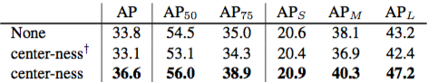

上表中，第3行表示使用FCOS预测的centerness，第二行表示使用预测框计算的centerness.

此外，作者表示，如果使用gt框计算centerness，AP可以到42.1，表明目前关于centerness的预测效果还有很大的提升空间.

<!-- #### code

目前FCOS已经在basedet复现完成.

使用FCOS进行anchor匹配的核心code如下：

```python
# --------------------------- fcos anchor target --------------------------- #

def get_fcos_anchor_target(
    config,
    anchors: List[OperatorNodeBase],
    batch_gt_boxes: OperatorNodeBase,
    batch_valid_gt_box_number: OperatorNodeBase,
):
    """
    Args:
        config:
        anchors:
        batched_anchors:
        batched_valid_gt_box_number:
    Returns:
        cls_target: OperatorNodeBase
        box_target: OperatorNodeBase
        ctr_target: OperatorNodeBase
    """
    cls_target_list = []
    box_target_list = []
    ctr_target_list = []

    batch_size = config.batch_size

    all_anchors = O.Concat(anchors, axis=0)
    anchors_num = all_anchors.shape[0]

    object_size_of_interest = O.zeros(anchors_num, 2)
    start = 0
    end = 0
    for l in range(len(anchors)):
        end = start + anchors[l].shape[0]

        object_size_of_interest = object_size_of_interest.set_ai[start:end, 0](
            O.ones(anchors[l].shape[0], 1) * config.scale_range[l][0]
        )
        object_size_of_interest = object_size_of_interest.set_ai[start:end, 1](
            O.ones(anchors[l].shape[0], 1) * config.scale_range[l][1]
        )
        start = end

    for b_id in range(batch_size):
        b_anchors = O.ZeroGrad(all_anchors[:])

        # gt_boxes.shape [N, 5]
        gt_boxes = batch_gt_boxes[b_id, : batch_valid_gt_box_number[b_id]]
        gt_boxes_num = gt_boxes.shape[0]
        gt_area = O.Abs(
            (gt_boxes[:, 2] - gt_boxes[:, 0] + 1)
            * (gt_boxes[:, 3] - gt_boxes[:, 1] + 1)
        )
        # shape: [anchor_num, 1, 2]
        tmp_anchors = b_anchors.add_axis(1)
        # shape: [1, gt_num, 4]
        all_gtboxes = gt_boxes[:, :4].add_axis(0)

        offsets = O.Concat(
            [
                tmp_anchors - all_gtboxes[:, :, :2],
                all_gtboxes[:, :, 2:] - tmp_anchors,
            ],
            axis=2,
        )

        if config.center_sampling_radius > 0:
            is_in_boxes = []
            gt_center_x = (gt_boxes[:, 0] + gt_boxes[:, 2]) / 2.0
            gt_center_y = (gt_boxes[:, 1] + gt_boxes[:, 3]) / 2.0
            for stride, anchor_per_level in zip(config.fm_stride, anchors[:]):
                radius = stride * config.center_sampling_radius
                center_boxes = O.Concat(
                    [
                        O.Max(gt_center_x - radius, gt_boxes[:, 0])[:, None],
                        O.Max(gt_center_y - radius, gt_boxes[:, 1])[:, None],
                        O.Min(gt_center_x + radius, gt_boxes[:, 2])[:, None],
                        O.Min(gt_center_y + radius, gt_boxes[:, 3])[:, None],
                    ],
                    axis=1,
                ).add_axis(0)
                anchor_per_level = anchor_per_level.add_axis(1)
                center_offsets = O.Concat(
                    [
                        anchor_per_level - center_boxes[:, :, :2],
                        center_boxes[:, :, 2:] - anchor_per_level,
                    ],
                    axis=2,
                )
                is_in_boxes.append(center_offsets.min(axis=2) > 0)
            is_in_boxes = O.Concat(is_in_boxes, axis=0)
        else:
            is_in_boxes = offsets.min(axis=2) > 0

        is_in_level = O.LessEqual(
            object_size_of_interest[:, None, 0], offsets.max(axis=2)
        ) * O.LessEqual(
            offsets.max(axis=2), object_size_of_interest[:, None, 1]
        )

        position_gt_area = gt_area.add_axis(0).broadcast(
            anchors_num, gt_boxes_num
        )
        valid_mask = is_in_boxes * is_in_level
        _, not_valid_mask_pos = O.CondTake(
            valid_mask, valid_mask, "EQ", 0
        ).outputs
        mask_row_pos = (not_valid_mask_pos // valid_mask.shape[1]).astype(
            np.int32
        )
        mask_col_pos = (not_valid_mask_pos % valid_mask.shape[1]).astype(
            np.int32
        )
        position_gt_area = position_gt_area.set_ai[
            (mask_row_pos, mask_col_pos)
        ](O.ones(not_valid_mask_pos.shape) * math.inf)
        # position_gt_area = position_gt_area * valid_mask

        position_min_area = position_gt_area.min(axis=1)
        gt_matched_idxs = O.Argmin(position_gt_area, axis=1)

        box_target = config.box_coder.encode(
            gt_boxes.ai[gt_matched_idxs], b_anchors
        )

        mask = 1 - position_min_area.eq(O.ZeroGrad(math.inf))
        cls_target = gt_boxes.ai[gt_matched_idxs, 4]
        cls_target = cls_target * mask

        left_right = box_target.ai[:, [0, 2]]
        top_bottom = box_target.ai[:, [1, 3]]

        ctr_target = O.Sqrt(
            O.Max(0, left_right.min(axis=1) / left_right.max(axis=1))
            * O.Max(0, top_bottom.min(axis=1) / top_bottom.max(axis=1))
        )
        ctr_target = ctr_target * mask
        cls_target_list.append(cls_target.add_axis(0))
        box_target_list.append(box_target.add_axis(0))
        ctr_target_list.append(ctr_target.add_axis(0))

    cls_target_list = O.Concat(cls_target_list, axis=0)
    box_target_list = O.Concat(box_target_list, axis=0)
    ctr_target_list = O.Concat(ctr_target_list, axis=0)

    return (
        O.ZeroGrad(cls_target_list.astype(np.int32)),
        O.ZeroGrad(box_target_list),
        O.ZeroGrad(ctr_target_list),
    )

``` -->


#### 思考与求证
暂无

#### 方法小结

不同于以往基于anchor的检测方法，FCOS直接将feature map上的pixel作为训练样本. FCOS将位于gt框内的pixel均作为正样本，相比anchor-based方法提升了正样本的数量，这是FCOS能够work的一大原因；FCOS利用FPN结构，将不同scale的物体分配到不同的layer进行检测，大大减轻了早期anchor-free方法（如DenseBox[]）所面临的样本匹配的模糊问题；最后，FCOS增加了centerness分支，通过该分支大大抑制了位置不准确的低质量检测框，提升了准确率. FCOS在形式上比较简单，相比anchor-based方法减少了参数量的同时也提升了速度，是一篇很不错的工作.


<!----------------------- FoveaBox ----------------------->

### 2. FoveaBox

FoveaBox全称为FoveaBox: Beyond Anchor-based Object Detector，其paper地址为：[https://arxiv.org/pdf/1904.03797.pdf](https://arxiv.org/pdf/1904.03797.pdf).

FoveaBox提供了一种anchor-free的检测方法，直接将feature map上的pixel作为训练样本，在每个pixel的位置上，采用分类分支预测物体的类别，同时采用位置回归分支预测物体的位置（与类别无关），取得了较好的效果. FoveaBox在对feature map上的pixel确定正负样本时，在gt框所在的区域内确定了一个中央区域，落在中央区域的pixel作为正样本，这一设计参照了人类视觉系统的特点. 采用FoveaBox进行正负样本分配以及检测的示意图如下：

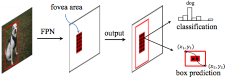

FoveaBox的网络结构如下，可以看出其网络结构与RetinaNet十分相近，不同之处在于：FoveaBox无需预设A个anchor（通常A=9），因此其结构更加简单，速度也更快：

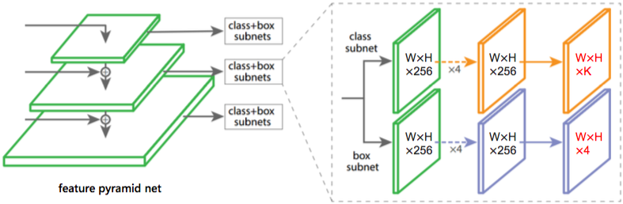

FoveaBox与RetinaNet一样，均采用了FPN结构，但是不同于anchor-based方法可以基于anchor与gt框IoU值完成gt框在在不同FPN层的尺度分配问题，FoveaBox需要提供一种新的分配方法. 下面首先对FoveaBox中的尺度分配方法进行介绍，然后重点介绍Fovea区域的确定方式，最后简单介绍位置回归目标.

#### 基本原理

**1. FoveaBox中的尺度分配方式**

所谓尺度分配问题，即如何将大小不同的物体划分到FPN的不同层进行检测. 将物体按照大小分配到不同的FPN层，通常有如下两大好处：1、通常认为浅层特征对小物体友好，高层特征对大物体友好，按照物体的尺度大小将物体分配到不同的层有利于特征匹配，提升检测效果；2、将尺度不同的物体分配到不同的layer进行检测，有助于缓解样本模糊问题，即降低同一个pixel会匹配到多个gt框的可能性，提升检测效果.

在FoveaBox中，FPN包含5层，分别是P<sub>3</sub>, P<sub>4</sub>, P<sub>5</sub>, P<sub>6</sub>, P<sub>7</sub>，对于P<sub>l</sub>层，预先设置这一层的basic area为S<sub>l</sub> = 2<sup>l</sup> * S<sub>0</sub>，其中S<sub>0</sub>为超参数，取值为16. 那么对于P<sub>l</sub>层的有效物体大小所在的范围为[S<sub>l</sub>/&eta;<sup>2</sup>, S<sub>l</sub>*&eta;<sup>2</sup>] (&eta;为超参数，实验表明取值为2效果较好)，这表示如果某个gt框的面积落在这个范围内，则它将被分配到P<sub>l</sub>层进行检测.

**2. 确定Fovea区域并生成正负样本**

在完成了gt框的尺度分配问题之后，接下来需要考虑的是对于FPN的每一层，如何确定该层的正负样本. FoveaBox采用了anchor-free方法，将基于feature map上pixel与gt框的位置关系确定pixel的正负label以及正样本的位置回归目标.

参考人类视觉系统，FoveaBox认为靠近物体中心的区域具有重要的特征，可以用来完成物体检测任务. 为此，FoveaBox将gt框所在区域按照一定比例收缩（shrink）得到中央区域（Fovea区域），该中央区域即为正样本区域. 如下公式说明了收缩方法，其中&alpha;<sub>1</sub>表示收缩系数：

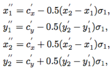

注：x'表示原始的gt框的坐标，c'表示原始gt框的中心点坐标，x''表示收缩之后的gt框坐标.

值得说明的是，在正样本区域之外，并不全是负样本区域，而是采用收缩系数&alpha;<sub>2</sub>（&alpha;<sub>2</sub> > &alpha;<sub>1</sub>）确定了一个了ignore区域，该ignore区域不参与分类分支的训练，但是会参与到位置回归分支的训练中.

注：虽然这里指定了&alpha;<sub>2</sub>确定了ignore区域，文中最终的指标汇报也采用了这个值，但是官方的实现code中没有&alpha;<sub>2</sub>，即正样本区域之外全为负样本区域.

注：在paper的描述中，&alpha;<sub>1</sub>和&alpha;<sub>2</sub>的取值分别为0.3和0.4. 但是官方开源code中&alpha;<sub>1</sub>取值0.4，并且没有采用&alpha;<sub>2</sub>确定ignore区域.

**3. 位置回归目标**

FoveaBox的位置回归目标比较简单，如下：

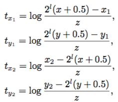

其中，(x<sub>1</sub>, y<sub>1</sub>, x<sub>2</sub>, y<sub>2</sub>)表示gt框，(x, y)表示pixel的位置，z=sqrt(S<sub>l</sub>)是一个norm因子，用于将不同层的不同大小的物体的回归目标归一化到相同的水平，(t<sub>x<sub>1</sub></sub>, t<sub>y<sub>1</sub></sub>, t<sub>x<sub>2</sub></sub>, t<sub>y<sub>2</sub></sub>)表示网络的输出目标.


#### 重要结论

**1. FoveaBox与其他工作的指标对比**

FoveaBox与其他工作在COCO上的指标对比结果如下：

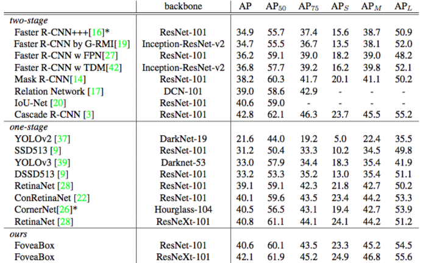

可以看出，FoveaBox相比Retinanet有1.3-1.5左右的提升，此外速度也会有些提升.

**2. FoveaBox对物体的ratio变化更加鲁棒**

下图展示了FoveaBox与RetinaNet在不同ratio (h/w)上的指标，可以看出FoveaBox对于物体的ratio更加鲁棒，这是由于anchor-free方法相比anchor-based方法更容易为不同ratio的gt框分配到正样本.

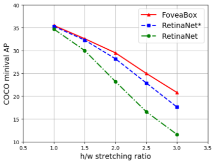

注：上图中，* 表示在训练过程中采用更改gt框ratio的augmentation策略.


#### FoveaBox与FCOS的相似与不同

FoveaBox与FCOS在label assign的方式有一些相似之处和不同的地方，下面进行简要总结.

1. 相同点
   1. 均将特征点作为训练样本
   2. 对于特征点正负label的确定，均考虑了特征点与anchor的位置关系（即正样本均在gt框内）

2. 不同点
   1. FoveaBox通过&alpha;<sub>1</sub>将gt框收缩成了一个正样本区域，而FCOS将整个gt框作为正样本区域
   2. FCOS通过添加centerness分支预测特征点位于物体中心的概率抑制低质量框

其实这里的不同点，本质的目的是一样的：越靠近物体中心的特征点越容易将目标检测做好，远离中心的框则容易产生低质量的检测框，FCOS相比FoveaBox实际上采用了一种更加soft的方式（即添加centerness分支）过滤低质量的正样本.

<!-- #### code

目前FoveaBox已经在basedet复现完成

使用FoveaBox进行anchor匹配的核心code如下：

```python
# --------------------------- foveabox anchor target --------------------------- #

def get_fovea_anchor_target(
    config,
    featmap_size,
    batch_gt_boxes,
    batch_valid_gt_box_number,
    ):
    
    cls_target_list = list()
    box_target_list = list()

    batch_size = config.batch_size
    level_num = len(featmap_size)
    batch_valid_gt_box_number = batch_valid_gt_box_number.astype(np.int32)
    for b_id in range(batch_size):
        gt = batch_gt_boxes[b_id, : batch_valid_gt_box_number[b_id,]]
        all_gt_boxes = gt[:,:4]
        all_gt_labels = gt[:,4]
        gt_area = O.Abs(
            (all_gt_boxes[:, 2] - all_gt_boxes[:, 0])
            * (all_gt_boxes[:, 3] - all_gt_boxes[:, 1])
        )

        labels_list = list()
        bbox_targets_list = list()

        for l in range(level_num):

            h,w = featmap_size[l][0] , featmap_size[l][1]
            gt_area_level = gt_area.reshape(gt_area.shape[0], -1).broadcast(gt_area.shape[0], h*w)

            labels = O.zeros((w*h))
            bbox_targets = O.zeros((w*h,4))

            # using Scale Assignment
            lower_bound = config.low_area[l]
            upper_bound = config.upper_area[l]

            mask = O.LessEqual(gt_area_level, upper_bound) * O.LessEqual(lower_bound, gt_area_level)

            # fovea positive box
            gt_labels = all_gt_labels.ai[:]
            gt_bboxes = all_gt_boxes.ai[ : ] / config.fm_stride[l]

            half_w = 0.5 * (gt_bboxes[:, 2] - gt_bboxes[:, 0])
            half_h = 0.5 * (gt_bboxes[:, 3] - gt_bboxes[:, 1])

            # positive area
            left = clip(megskull.opr.arith.Ceil((gt_bboxes[:, 0] + (1 - config.sigma1) * half_w - 0.5) ).astype(np.int32), 0 , w-1)
            right = clip(megskull.opr.arith.Floor((gt_bboxes[:, 0] + (1 + config.sigma1) * half_w - 0.5)).astype(np.int32), 0, w-1)
            top = clip(megskull.opr.arith.Ceil((gt_bboxes[:, 1] + (1 - config.sigma1) * half_h - 0.5)).astype(np.int32), 0, h-1)
            down = clip(megskull.opr.arith.Floor((gt_bboxes[:, 1] + (1 + config.sigma1) * half_h - 0.5)).astype(np.int32), 0, h-1)
            # right = O.Max(right, left)
            # down = O.Max(down, top)
            pos_valid_area = O.Concat([left[:,None], top[:,None], right[:,None], down[:,None]], axis = 1)
            pos_valid_area = pos_valid_area.add_axis(1)
            # pos_valid_area = megskull.opr.misc.CallbackInjector(pos_valid_area, 'print')
            shift_x = O.Linspace(0, w - 1, w)
            shift_y = O.Linspace(0, h - 1, h)
            mesh_shape = (shift_y.shape, shift_x.shape)
            broad_shift_x = shift_x.reshape(-1, shift_x.shape[0]).broadcast(mesh_shape)
            broad_shift_y = shift_y.reshape(shift_y.shape[0], -1).broadcast(mesh_shape)
            flatten_shift_x = broad_shift_x.flatten().add_axis(1)
            flatten_shift_y = broad_shift_y.flatten().add_axis(1)
            points = O.Concat(
                [flatten_shift_x, flatten_shift_y],
                axis=1,
            )

            points = points.reshape(-1, w*h, 2).broadcast((gt_labels.shape[0], w*h, 2))
            offsets = O.Concat(
                [
                    points - pos_valid_area[:, :, :2],
                    pos_valid_area[:, :, 2:] - points,
                ],
                axis=2,
            )

            # gt * (w*h)
            point_is_in_gt = offsets.min(axis=2) >= 0
            point_is_in_gt_and_level = point_is_in_gt * mask
            pos_points_labels = gt_labels.reshape(gt_labels.shape[0], -1).broadcast((gt_labels.shape[0], w*h))
            pos_points_labels = pos_points_labels * point_is_in_gt_and_level
            pos_points_labels = pos_points_labels.set_ai[0,0](1.)
            labels_value, labels_pos = O.CondTake(pos_points_labels, pos_points_labels, "GT", 0).outputs
            labels = labels.set_ai[labels_pos%(h*w)](labels_value)
            labels = labels.set_ai[0](0.)

            # generate target boxes
            org_boxes = all_gt_boxes.ai[:].reshape(gt_bboxes.shape[0], -1, 4).broadcast(gt_bboxes.shape[0], h*w, 4)
            scaled_points = (points.ai[:] + 0.5)*config.fm_stride[l]
            points_bbox_offset = O.zeros(gt_bboxes.shape[0], h*w, 4)
            points_bbox_offset = points_bbox_offset.set_ai[:,:,0](
                scaled_points.ai[:,:,0] - org_boxes.ai[:,:,0]
            )
            points_bbox_offset = points_bbox_offset.set_ai[:,:,1](
                scaled_points.ai[:,:,1] - org_boxes.ai[:,:,1]
            )

            points_bbox_offset = points_bbox_offset.set_ai[:,:,2](
                org_boxes.ai[:,:,2] - scaled_points.ai[:,:,0]
            )
            points_bbox_offset = points_bbox_offset.set_ai[:,:,3](
                org_boxes.ai[:, :, 3] - scaled_points.ai[:,:,1]
            )
            points_bbox_offset /= config.basic_edge[l]
            # points_bbox_offset = points_bbox_offset.set_ai[:,:,0](
            #     scaled_points.ai[:,:,0] - org_boxes.ai[:,:,0]
            # )
            # points_bbox_offset = points_bbox_offset.set_ai[:,:,1](
            #     scaled_points.ai[:,:,1] - org_boxes.ai[:,:,1]
            # )
            #
            # points_bbox_offset = points_bbox_offset.set_ai[:,:,2](
            #     org_boxes.ai[:,:,2] - scaled_points.ai[:,:,0]
            # )
            # points_bbox_offset = points_bbox_offset.set_ai[:,:,3](
            #     org_boxes.ai[:, :, 3] - scaled_points.ai[:,:,1]
            # )

            bbox_targets = bbox_targets.set_ai[labels_pos%(h*w),:](
                points_bbox_offset.ai[(labels_pos//(h*w),labels_pos%(h*w))]
            )
            # bbox_targets = clip(bbox_targets, 1./32, 32.)
            labels_list.append(labels.reshape(-1))
            bbox_targets_list.append(safelog(bbox_targets).reshape(-1,4))
            # bbox_targets_list.append(bbox_targets.reshape(-1, 4))

        labels_list = O.Concat(labels_list, axis=0)
        bbox_targets_list = O.Concat(bbox_targets_list, axis=0)

        cls_target_list.append(labels_list.add_axis(0))
        box_target_list.append(bbox_targets_list.add_axis(0))

    cls_target_list = O.Concat(cls_target_list, axis=0)
    box_target_list = O.Concat(box_target_list, axis=0)
    return (
        O.ZeroGrad(cls_target_list.astype(np.int32)),
        O.ZeroGrad(box_target_list)
    )

``` -->

#### 思考与求证
暂无

#### 方法小结

FoveaBox是与FCOS相同时间出现的paper，二者的方法有很多共通之处，例如二者通过不同的方式抑制远离box中心的特征点产生的低质量检测框. FoveaBox相比anchor-based方法能够取得更好的效果，尤其是对于一些ratio较大的物体. 此外，FoveaBox在RetinaNet上将anchor数量减小了8/9，可以明显提升inference以及NMS后处理的速度，值得在业务上尝试.


## 基于模型选择的方法

<!----------------------- SAPD ----------------------->

### 1. SAPD

SAPD全称为Soft Anchor-Point Object Detection, 其paper地址为[https://arxiv.org/pdf/1911.12448.pdf](https://arxiv.org/pdf/1911.12448.pdf)

**Motivation**: SAPD认为目前基于特征点的检测方法存在两大问题，分别为：attention bias和feature selection. attention bias表示图像中视觉信息丰富的物体容易吸引网络的注意，使得其他物体不容易被检测；feature selection表示在将gt框分配给FPN各层时，基于经验的启发式规则或者将gt框assign给单一fpn层的方法没有充分利用相应的特征. 

为了解决上述两个问题，SAPD分别提出了soft-weighted anchor points和soft-selected pyramid levels进行解决，取得了较好的检测效果. SAPD方法的整体示意图如下：

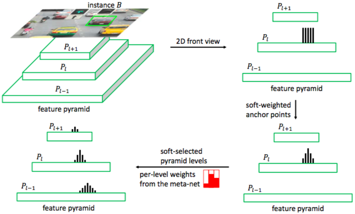

#### 基本原理

**1. Vanilla anchor point detector**

为了方便研究，本文首先提出了vanilla anchor point detector，作为anchor-free方法的代表性模型，vanilla detector的结果如下：

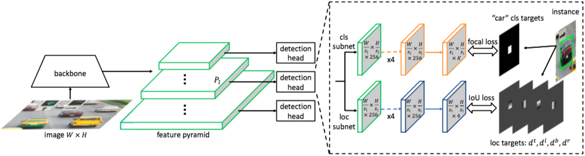

Vanilla detector的head包含分类与位置回归两部分，其训练样本为特征图上的特征点，其label assignment策略如下：将位于gt框内的特征点作为正样本，其label为该gt框的类别，其位置回归目标为特征点距离gt框四条边的距离.

**2. Soft-weighted anchor points (SW)**

基于vanilla detector训练的检测模型，存在的一个问题是attention bias，即网络的注意力会集中于视觉信息丰富、特征明显的物体上，这样会导致其他一些物体（如遮挡物体或者小物体）的特征不容易突出，从而导致漏检. 为了解决这个问题，SAPD采用了soft-weighted anchor points方法. 下图(b)和(c)分别展示了原始vanilla detector和采用了soft-weighted anchor points训练的检测模型在输入图片(a)上的响应图，可见SAPD方法能够将响应集中于物体的中心，从而更加利于检测一些视觉特征不明显的物体.

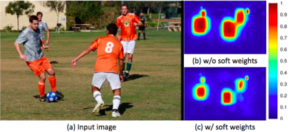

Soft-weighted anchor points方法，即对anchor point进行加权，越靠近gt中心的anchor point权重越高，靠近gt边缘的anchor point权重较低，其加权方法类似于FCOS中centerness计算方法，如下：

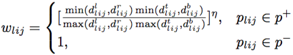

上述计算公式中，&eta;为超参数，实验中取值为1时效果最佳.

注：当&eta; = 1时，上述公式与FCOS中计算的centerness计算方法一样.

**2. Soft-selected pyramid levels (SS)**

在以往的anchor-based或者anchor-free方法中，通常以人工定义的规则决定将gt框分配到FPN的哪些层（例如RetinaNet中基于IoU值，FCOS基于特征点距离gt框的距离）. 这些人工定义的规则虽然简单，但是却未必能够充分利用FPN的特征信息. 为此，SAPD提出了soft-selected pyramid levels方法解决这个问题.

Soft-selected pyramid levels方法的想法比较简单，在FPN的不同层分别提取gt框的特征，随后通过一个meta selection子网络学习不同层的权重，其网络结构如下：

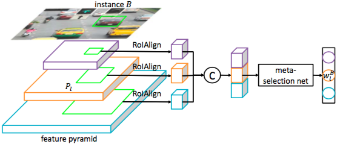

注：该meta selection子网络与检测网络一起训练. 在实际应用中，超参数 k 表示每个gt框分配给权重最高的top-k个fpn层.

该meta network的网络结构如下：

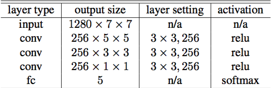

最终，SAPD方法中每个anchor point的权重为anchor point的权重与子网络学得的权重的乘积，如下所示：

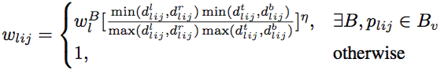

#### 重要结论

**1. SW与SS能够明显提升网络的检测效果**

使用SW和SS的效果如下表所示：

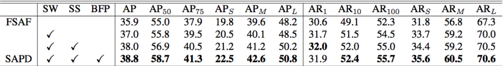

**2. 每个gt框选择3个fpn layer效果最好**

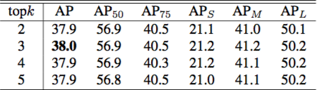

**3. 取得了SOTA的检测效果**

SAPD相比FCOS、FreeAnchor、FoveaBox甚至key-point based方法CenterNet相比效果都更好，如下：

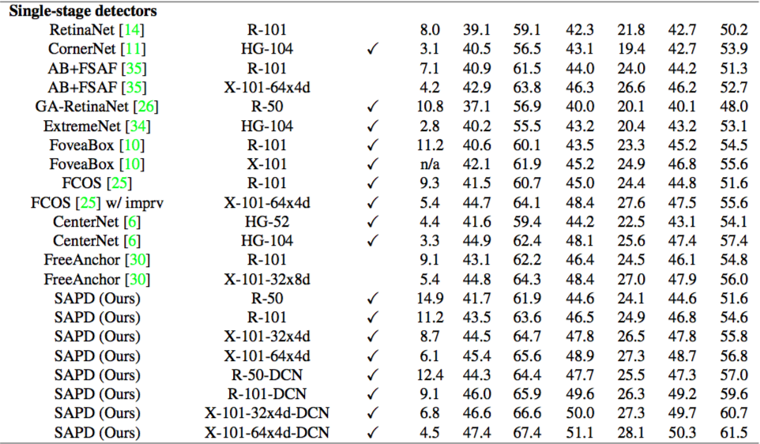


#### 思考与求证
暂无

#### 方法小结

SAPD提出的soft-weighted anchor points和soft-selection fpn levels方法分别用于解决attention bias和feature selection问题，取得了较好的效果；此外，SAPD方法对inference效果没有影响，值得在业务上尝试.
