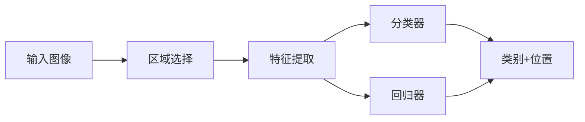

# Object Detection
目标检测算法是一个比较大的CV任务，目的在于在图像中检测物体，给出物体类型和位置。从算法的角度，可以理解为图像区域分类和位置回归。



从目标检测算法的分类来看，可以分为：

* two-stage
* one-stage
或者

* anchor-based
* anchor-free

其中two-stage都是anchor-based的方法，而one-stage包括anchor-based和anchor-free的方法。
为此，将首先简要介绍一下two-stage的方法，目前并不是太常用；重点总结一下one-stage的方法，将主要从label assignment的角度来总结。

## two-stage
### RCNN
RCNN是首次将深度学习应用于目标检测的算法。ROI的提取采用传统的selective search, NN网络主要用于提取ROI特征，最后通过SVM来分类。其中NN网络的训练是通过fine-tuning已有的分类网络来实现的。  
存在的问题是，在inference的时候需要将每个ROI送入网络提取特征，这样导致特征提取的时间复杂度非常高。  
#### Bounding Box Regression(边界框回归算法)
BBR的目的是微调建议框，使其与真实框的位置和大小相似。 
[](https://zhuanlan.zhihu.com/p/404035883)

* 已知建议框的中心坐标($P_x, P_y$)和宽高($P_w, P_h$)以及该建议框区域的特征向量$P$，从本质上希望得到一个回归函数$(G_{x}^{'},G_{y}^{'},G_{w}^{'},G_{h}^{'})=f(P)$
* 而为了避免不同的图像尺寸对回归结果产生影响，提高预测精度，采用回归建议框和真实框之间的坐标偏移量
* 学习的目标
    * 真实框和建议框的中心点横坐标之差（除以建议框宽度）$t_x=(G_x-P_x)/P_w$
    * 真实框和建议框的中心点纵坐标之差（除以建议框高度）$t_y=(G_y-P_y)/P_h$
    * 真实框和建议框的宽度之比（取log）$t_w=log(G_w/P_w)$
    * 真实框和建议框的高度之比（取log）$t_h=log(G_h/P_h)$
    * smooth L1: 

        $$smooth_{L1}(x)=\begin{cases}
        0.5x^2 & \text{if }|x|<1 \\
        |x|-0.5 & \text{if }|x|\geq 1 \\
        \end{cases}$$

* inference
    * inference的位置结果为($t_{x}^{'}, t_{y}^{'}, t_{w}^{'}, t_{h}^{'}$)
    * 预测框的中心横坐标：$G_{x}^{'}=t_{x}^{'}*P_w+P_x$
    * 预测框的中心纵坐标：$G_{y}^{'}=t_{y}^{'}*P_h+P_y$
    * 预测框的宽度：$G_{w}^{'}=P_w*exp(t_{w}^{'})$
    * 预测框的高度：$G_{h}^{'}=P_h*exp(t_{h}^{'})$

#### NMS(非极大值抑制算法)
NMS是一种非极大值抑制算法，用于去除重复的预测框。假如一张图像预测了10个类别共100个预测框，则需要对每个类别的预测框分别进行NMS，算法步骤如下：

* 每个预测框的结果分别为$[x_1,y_1,x_2, y_2, score]$
* 对每个类别的预测框进行排序，按照预测框的得分从高到低排序
* 第一个得分最高的框自然保留
* 然后计算第一个框与其他框的IoU，如果IoU大于阈值，则该框被删除，否则保留

python代码如下[code](https://www.jb51.net/article/229498.htm)：
```
import numpy as np
def nms(dets, thresh):
    x1 = dets[:,0]
    y1 = dets[:,1]
    x2 = dets[:,2]
    y2 = dets[:,3]
    areas = (y2-y1+1) * (x2-x1+1)
    scores = dets[:,4]
    keep = []
    index = scores.argsort()[::-1]
    while index.size >0:
        i = index[0]       # every time the first is the biggst, and add it directly
        keep.append(i)
 
        x11 = np.maximum(x1[i], x1[index[1:]])    # calculate the points of overlap 
        y11 = np.maximum(y1[i], y1[index[1:]])
        x22 = np.minimum(x2[i], x2[index[1:]])
        y22 = np.minimum(y2[i], y2[index[1:]])
        
        w = np.maximum(0, x22-x11+1)    # the weights of overlap
        h = np.maximum(0, y22-y11+1)    # the height of overlap
       
        overlaps = w*h
        ious = overlaps / (areas[i]+areas[index[1:]] - overlaps)
 
        idx = np.where(ious<=thresh)[0]
        index = index[idx+1]   # because index start from 1

```


### SPPNet
前面提到，RCNN在提取特征时，由于存在FC层，输入图像需要固定大小，为此需要将图像中的每个ROI处理到固定尺寸后送入网络提取特征。  
为了提高效率，提出了SPPNet，即将整张图像输入CNN网络，我们知道纯卷积网络是可以适应不同尺寸的输入图像的，然后对每个ROI对应的feature map区域通过金字塔池化处理成相同大小的特征向量，再将特征向量输入FC层进行分类，效率得到大大提高，其与RCNN的区别如下图所示：


不足之处在于，和RCNN一样，SPP也需要训练CNN提取特征，然后训练SVM分类这些特征，这需要巨大的存储空间，并且多阶段训练的流程也很繁杂。除此之外，SPPNet只对全连接层进行微调，而忽略了网络其它层的参数。

### Fast-RCNN
Fast-RCNN在于进一步优化目标检测复杂度，其改进点如下：

* 去除了SVM分类器，采用FC+softmax进行ROI分类
* 采用ROI Pooling，相当于只有一层的空间金字塔池化SPP
* 多任务损失，分类和边框回归损失，其中边框回归损失采用L1损失，分类损失采用交叉熵损失


不足之处在于，Fast-RCNN仍然采用selective search算法来寻找感兴趣区域

### Faster-RCNN
[[paper](https://arxiv.org/pdf/1506.01497.pdf)][[code](https://github.com/Kyle1993/simplest_FasterRcnn_pytorch)]

Faster-RCNN是目标检测的里程碑之作，在检测速度和精度上都有了很大提升，其中主要改进点在于去除了通过selective search算法寻找感兴趣区域来获取ROI，而是采用RPN网络来获取ROI。。  
RPN网络的结构如下： 


* 假设网络输入为(N, 3, 224, 224), 则backbone特征最后一层输出为(N, 1024, 14, 14)
* RPN网络的输入为(N, 1024, 14, 14)，输出分为两路，一路为分类输出(N, 2*num_anchors, 14, 14)，另一路为bbox回归输出(N, 4*num_anchors, 14, 14), 其中num_anchors为每个特征点的anchor数量  
* 产生anchors，ratios=[0.5, 1, 2], scales=[8, 16, 32]，以下为产生基本anchor的代码，然后将作用到feature map上得到所有的anchors：
```
def _make_anchors(w, h, x_ctr, y_ctr):
    anchors = np.array([x_ctr-(w-1)/2, y_ctr-(h-1)/2, x_ctr+(w-1)/2, y_ctr+(h-1)/2])
    return anchors.T

def _whctrs(anchor):
    w = anchor[2] - anchor[0] + 1
    h = anchor[3] - anchor[1] + 1
    x_ctr = anchor[0] + 0.5 * (w - 1)
    y_ctr = anchor[1] + 0.5 * (h - 1)
    return w, h, x_ctr, y_ctr

def _ratio_enum(anchor, ratios):
    w, h, x_ctr, y_ctr = _whctrs(anchor)
    size = w * h
    ws = np.round(np.sqrt(size / ratios))
    hs = np.round(ws * ratios)
    anchors = _make_anchors(ws, hs, x_ctr, y_ctr) 
    return anchors

def _scale_enum(anchor, scales):
    w, h, x_ctr, y_ctr = _whctrs(anchor)
    ws = w * scales
    hs = h * scales
    anchors = _make_anchors(ws, hs, x_ctr, y_ctr)
    return anchors

def get_anchor_np(base_size, anchor_scales, anchor_ratios):
    base_anchor = np.array([0, 0, base_size-1, base_size-1])
    ratio_anchors = _ratio_enum(base_anchor, anchor_ratios)
    anchors = np.vstack([_scale_enum(ratio_anchors[i, :], anchor_scales) for i in range(ratio_anchors.shape[0])])
    return anchors.astype(np.float32)

```
* proposal layer，将RPN网络的输出进行处理，得到最终的ROI，以下为proposal layer的流程：
    * 将RPN网络输出的loc作用于anchors，得到bbox
    * 对bbox的边界进行处理，使其不超过图片边界
    * 去除太小的bbox
    * 对bbox进行NMS
    * 保留前N(eg:300)个bbox，作为ROI
* anchors与gt进行配对：对于一张图来说，anchors为(N, 4)，gt为(K, 4)，然后计算iou(N, K), 最后需要通过匹配策略得到class label(N, C)和regression label(N,4)，其中C为分类数量，匹配策略为：

    * 从anchor的角度，如果一个anchor与所有GT的iou最大值大于一定的阈值（比如0.7）， 则这个anchor是正样本， 且其label为前景（RPN）或最大IOU对应的GT label（Fast rcnn）；
    * 从GT的角度，对于一个GT，所有anchors与该GT的iou最大值对应的anchor为正样本，这样做的目的是为了让GT尽量有anchor与之匹配；
    * 如果anchors与GT的IoU小于负样本阈值（比如0.3）， 则为负样本；
    * 如果anchors与GT的IoU介于2者之间， 则是忽略样本。
    * 每个anchor匹配好gt后，还需要通过BBR计算regression label(tx, ty, tw, th)

* 计算损失函数：利用RPN网络的输出以及配对得到的label计算分类和回归损失，其中分类损失函数为交叉熵，回归损失函数为smooth L1 loss

* 以上为RPN阶段（也就是第一阶段）的训练过程，接下来是第二阶段的训练过程，也就是Fast rcnn阶段，其训练过程如下：
    * 将proposal layer得到的ROI与gt进行配对，其中iou大于pos_iou_thresh的为正样本，处于[neg_iou_thresh_lo, neg_iou_thresh_hi)之间的为负样本，得到sample_roi, class label和regression label
    * 将sample_roi通过RoI pooling得到feature map，然后将feature map输入到Fast rcnn网络中，得到分类和回归的输出，注意这里的分类输出是n_class+1(包括背景类)，回归输出是n_class*4，比如n_class为21，则回归输出为84
    * 计算分类和回归损失，分类损失函数为交叉熵，回归损失函数为smooth L1 loss，其中计算回归损失的时候，需要将回归输出reshape为(n_class, n_class+1, 4)，然后根据class label选择对应的回归输出，然后计算smooth L1 loss

## One-Stage
以上RCNN系列为two-stage方法，下面主要介绍one-stage方法，one-stage方法的主要思想是将RPN和Fast rcnn合并为一个网络，这样就可以减少一次forward的计算，提高速度。

### SSD
[[paper](https://arxiv.org/pdf/1512.02325.pdf)][[code](https://github.com/amdegroot/ssd.pytorch)]

SSD是目标检测早期one-stage的代表算法之一，其主要思想是将输入图片分成多个feature map，然后在每个feature map上进行anchor的生成，然后将每个feature map的anchor通过卷积网络得到分类和回归的输出，最后将所有feature map的输出进行NMS，得到最终的检测结果。


SSD的主要特点在于采用了多尺度的feature map，这样可以检测不同尺度的目标，比如小目标和大目标，同时也可以检测不同比例的目标，比如长方形和正方形。但与后来的retinaNet相比：

* SSD的多尺度是独立的，RetinaNet的FPN在不同尺度之间进行了层间融合
* SSD的采用softmax多分类，RetinaNet以及后续改进的FCOS都是采用K个二分类（Focal loss默认是二分类），RetinaNet的K个二分类可以看作是一个多分类，只不过每个类别的概率是通过sigmoid函数计算得到的，而不是softmax函数
* 为了与配合focal loss，RetinaNet的分类分支最后的卷积层的bias初始化为-log((1-0.01)/0.01)，可以加快训练和收敛，也就是为了避免初期分类损失过大的问题
* RetinaNet的不同层head部分共享参数，检测和分类分支之间参数不共享，各层分类/回归结果concat再求loss

SSD相关要点：

1. SSD采用6个不同尺度的feature map来做检测，以SSD300为例，6层feature map分别为(38,38),(19,19),(10,10),(5,5),(3,3),(1,1),其中大尺度的特征图用于检测小物体，小尺度的特征图用于检测大物体
2. SSD采用了多种尺度的anchor，比如(min_size,max_size)=(30,60),(60,111),(111,162),(162,213),(213,264),(264,315)，其中每个anchor的宽高比为1,2,3,1/2,1/3,1',比如第二个feature map,其有两种尺度的anchor，分别为sk=60,$\sqrt{60*111}$（也就是anchor的宽高为60和$\sqrt{60*111}$），对于尺度为60的anchor还需要变换宽高比（ar=2,3,1/2,1/3）来得到4个anchor，变换公式如下。另外对于sk=111的anchor则只有宽高比为1的anchor，因此总共有6个anchor。注意，对于第1，5，6个feature map，没有宽高比为3和1/3的anchor，因此只有4个anchor。
$$
w_{k}^{a}=s_{k} \sqrt{a_{r}}, h_{k}^{a}=s_{k} \sqrt{1 / a_{r}}
$$
3. anchor的匹配策略：
    - 对于图片中的每个ground truth，找到与其iou最大的anchor，将其标记为正样本，可以保证每个ground truth一定与某个anchor匹配
    - 对剩余的未匹配anchor，若与某个ground truth的IOU大于某个阈值，那么也该anchor也与这个ground truth匹配，一个ground truth可以匹配多个anchor，反之则不行；如果一个anchor与多个ground truth的IOU都大于某个阈值，那么只与iou最大的ground truth匹配
    - SSD采用hard negative mining，就是对负样本进行抽样，抽样时按照置信度误差进行降序排列，选取误差较大的top-k个负样本，以保证负样本比例接近1：3

### YOLO
[[paper](https://arxiv.org/pdf/1506.02640.pdf)][[code](https://github.com/motokimura/yolo_v1_pytorch/blob/master/loss.py)]

YOLO是较早的one stage方法，本质上就是将检测问题统一成回归问题，将检测框的坐标回归到ground truth的坐标，同时将检测框的类别回归到ground truth的类别。YOLO的网络结构如下图所示。


* YOLO的网络结构比较简单，只有一个卷积层和一个全连接层，卷积层的输出是一个7x7x30的tensor，其中7x7是feature map的尺寸，30是每个cell的输出
* 每个网格要预测B个bounding box，每个bounding box除了要回归自身的位置之外，还要附带预测一个confidence值。这个confidence代表了所预测的box中含有object的置信度和这个box预测的有多准两重信息
* 每个bounding box要预测(x, y, w, h)和confidence共5个值，每个网格还要预测一个类别信息，记为C类。则SxS个网格，每个网格要预测B个bounding box还要预测C个categories。输出就是S x S x (5*B+C)的一个tensor

YOLO的损失函数如下：
在数据处理时，会把target也处理成7x7x30的tensor，其中每个cell的输出是一个30维的向量，0-3，5-8个是bounding box的坐标，第4，9个是confidence，后20个是类别的one-hot编码。在计算损失时，会把每个cell的输出和对应的target进行比较，计算每个cell的损失，然后求和得到总的损失。损失函数的计算过程如下：


### YOLOV2
[[paper](https://arxiv.org/pdf/1612.08242.pdf)][[code](https://github.com/longcw/yolo2-pytorch)]

YOLOV2相对于V1最主要的改进在于借鉴了region proposal的anchor机制，而其中比较有创新的点是anchor的尺度是通过k-means聚类来实现的，论文通过聚类得到5个尺度的width和height，聚类时的具体步骤：

* 首先给定k个聚类中心  ，这里的w和h是指anchor boxes的宽和高，anchor boxes的位置不确定，所以不需要x和y坐标；
* 计算每个gt box和每个聚类中心的距离d(按照上面那个公式计算)，计算时每个box的中心点都与聚类中心重合，这样才能计算IOU值，将box分配给距离最近的聚类中心；
* 所有box分配完毕以后，对每个聚类重新计算中心点，就是求该聚类中所有box的宽和高的平均值；
* 重复上面两步，直到聚类中心改变量很小。

YOLOV2对bbox的中心坐标回归采用V1的方式，即相对网格位置坐标的的偏移，这样可以将输出限制在0-1之间，示例如下图：


另外，还涉及到较多trick，比如采用了Batch Normalization，预训练分类模型采用了更高分辨率的图片，Multi-Scale Training，Darknet-19

YOLOv2的训练主要包括三个阶段：

* 第一阶段就是先在ImageNet分类数据集上预训练Darknet-19，此时模型输入为224×224,共训练160个epochs。
* 第二阶段将网络的输入调整为448*448,继续在ImageNet数据集上finetune分类模型，训练10个epochs，此时分类模型的top-1准确度为76.5%，而top-5准确度为93.3%。
* 第三个阶段就是修改Darknet-19分类模型为检测模型，并在检测数据集上继续finetune网络。

### YOLOV3
[[paper](https://arxiv.org/pdf/1804.02767.pdf)][[code](https://github.com/BobLiu20/YOLOv3_PyTorch)]

YOLOV3主要的改进在于借鉴了RetinaNet的特征金字塔，YOLOV3的结构如下图所示：


YOLOV3的anchor仍然采用k-means聚类得到。  

YOLOV3的loss计算方法，我们以特征金字塔的一层输出为例来说明：

* 假设该层featuremap的大小为(fh, fw)，则检测模型输出为pred(bs, (num_anchors*(5+num_class)), fh, fw)
* 在计算loss时，需要将输出reshape为(bs, num_anchors, fh, fw, 5+num_class)
* 然后就是计算target，target的计算包括mask, noobj_mask, tx，ty，tw，th，tconf，tcls，其中tcls的shape为(bs, num_anchors, fh, fw, num_class),其它都是(bs, num_anchors, fh, fw)
* target计算时就是遍历batch中每张图像中的每个gt_box，计算gt_box与anchor（注意这里的anchor需要进行缩处理，系数为featuremap的下采样系数）的iou，找到iou最大对应的anchor；计算gt_box对应的格点位置、offset、log(宽高比)等，最后将这些值分别填入target中
* 最后pred和target一起计算loss

### YOLOV4
[[paper](https://arxiv.org/pdf/2004.10934.pdf)][[code](https://github.com/bubbliiiing/yolov4-pytorch)]
YOLOV4主要是用到了很多tricks，相当于一个tricks大总结。

以下对一些tricks进行简单介绍：

1. 各种IOU Loss
    - IoU Loss：IoU算法是使用最广泛的算法，大部分的检测算法都是使用的这个算法。
    - GIoU Loss：GIoU考虑到，当检测框和真实框没有出现重叠的时候IoU的loss都是一样的，因此GIoU就加入了C检测框（C检测框是包含了检测框和真实框的最小矩形框），这样就可以解决检测框和真实框没有重叠的问题。但是当检测框和真实框之间出现包含的现象的时候GIoU就和IoU loss是同样的效果了。
    - DIoU Loss：DIoU考虑到GIoU的缺点，也是增加了C检测框，将真实框和预测框都包含了进来，但是DIoU计算的不是框之间的交并，而是计算的每个检测框之间的欧氏距离，这样就可以解决GIoU包含出现的问题
    - CIoU Loss：CIoU就是在DIoU的基础上增加了检测框尺度的loss，增加了长和宽的loss，这样预测框就会更加的符合真实框

### YOLOV5
[[paper](https://arxiv.org/pdf/2004.10934.pdf)][[code](


### RetinaNet
[[paper](https://arxiv.org/pdf/1708.02002.pdf)][[code](https://github.com/yhenon/pytorch-retinanet)]
RetinaNet是一个一阶段的anchor-based的检测模型，其性能开始超过二阶段模型。RetinaNet主要的trick是使用了Focal Loss，FPN，后期的检测模型基本都是以此范式来进行设计的。


RetinaNet的输出为：
* cls：list[(batch_size, num_anchors * num_classes, featuremap_h, featuremap_w)]
* reg：list[(batch_size, num_anchors * 4, featuremap_h, featuremap_w)]

其中FPN各层的输出是共享参数的。

下面主要分析RetinaNet的loss计算方式，这其实是各种目标检测算法的核心，也是各种目标检测算法的不同之处。[可参考](https://blog.csdn.net/weixin_41981679/article/details/123823507)


### FCOS
[[paper](https://arxiv.org/pdf/1904.01355.pdf)][[code](https://github.com/open-mmlab/mmdetection/blob/master/mmdet/models/dense_heads/fcos_head.py)]

FCOS是一个anchor-free的检测模型，其没有采用anchor的方式来预测检测框，而是直接通过特征点来预测类别和检测框，如下图：


下面主要分析FCOS的的loss计算方式，这其实是各种目标检测算法的核心，也是各种目标检测算法的不同之处。

首先我们看下FCOS的输出：

* cls：list[(bs, num_class, fh, fw)]
* reg：list[(bs, 4, fh, fw)]
* centerness：list[(bs, 1, fh, fw)]

注意：FCOS中的head各层是共享参数的

接下来我们看如何得到target：

* 由于每张图标注的真实框数量不一样，因此我们需要对每张图单独计算target，计算target需要:
    * points (list[Tensor]): Points of each fpn level, each has shape
                (num_points, 2).
    * gt_bboxes_list (list[Tensor]): Ground truth bboxes of each image,
                each has shape (num_gt, 4).
    * gt_labels_list (list[Tensor]): Ground truth labels of each box,
                each has shape (num_gt,).
    * regress_ranges (tuple[tuple[int, int]]): Regress range of multiple
            level points.
* 将fpn的各层points连接起来转换成一个tensor，shape为(num_points, 2)
* 将regress_ranges根据points进行扩展后转换成一个tensor，shape为(num_points, 2)
* 计算每个真实框的面积area，并扩展为(num_points, gt_nums)
* 然后计算每个特征点的边框回归值，这里的边框回归值指的是特征点到真实框上下左右的距离(left, top, right, bottom)，shape为(num_points, gt_nums, 4)
* 找到每个特征点到真实框的最小距离，shape为(num_points, gt_nums)，最小距离大于0的点就是正样本，小于0的点就是负样本。这里还有一种center sample的方法，就是只将 gt_bbox 周围 stride*radius 范围内的点当成正样本
* 找到每个特征点的最大距离，shape为(num_points, gt_nums)，最大距离在对应的regress_range之间的点就是正样本，否则为负样本
* 然后将以上两种方法得到的负样本对应的area设置为INF，最后再按行计算每个特征点对应的最小面积真实框，这样就保证了每个特征点只对应一个真实框或背景
* 最后对每个点分配label和box_target，label的shape为(num_points, )，box_target的shape为(num_points, 4)
* 以上为label和box_target的计算，接下来计算centerness_target，只有正样本才计算centerness，其计算方式如下：

$$
centerness^* = \sqrt{\frac{min(l^*, r^*)}{max(l^*, r^*)} \times \frac{min(t^*, b^*)}{max(t^*, b^*)}}
$$

得到了label，box_target，centerness_target后，就可以计算loss了，计算loss的方式如下：

* cls_loss = FocalLoss()(cls, label)
* reg_loss = IoULoss()(reg, box_target)
* centerness_loss = CrossEntropyLoss()(centerness, centerness_target)

### YOLOVX
[[paper](https://arxiv.org/pdf/2107.08430.pdf)][[code](https://github.com/Megvii-BaseDetection/YOLOX)]

YOLOX是贵司出品的anchor-free的检测算法，结构如下：


主要贡献：

* Decoupled Head

第一个改进就是YOLOv3的head部分。一直以来，YOLO工作都是仅使用一个branch就同时完成obj、cls以及reg三部分的预测。而我们所熟知的RetinaNet则是使用两个并行分支去分别做cls和reg的预测。YOLOX作者认为仅使用一个分支是不合适的，于是，就把原先的Coupled head改成类似于RetinaNet的那种Decoupled head

* 数据增强：Mosaic和Mix-up

YOLOX继续给baseline增加了Mosaic和Mix-up两个数据增强手段。在训练的最后15个epoch，这两个数据增强会被关闭掉。这是因为这两个数据增强往往会产生出一些不好的图片，对数据分布有太大的改动，如下图展示的一些例子，其中很多目标是不会出现在真实场景中的，尽管这有助于提升模型的鲁棒性和泛化性，但是，在一定程度上，也会破坏数据的真实分布，使得模型学习到一些不好的信息。为了缓解这个问题，在训练的最后15 epoch，马赛克增强和混合增强会被关闭，仅保留随机水平翻转和颜色扰动两个较为简单的数据增强操作，以便让网络修正一些从马赛克增强和混合增强中学到的不好的信息。这是YOLOX工作给出的一个很实用的训练经验。

使用强大的数据增强后，ImageNet预训练模型无益，所有后续模型都是随机初始化权重。

* Anchor-free

基本按照FCOS的套路

* Multi positives

在完成了anchor-free化的改进后，我们会发现一个问题，那就是一个gt框只有一个正样本，也就是one-to-one，这个问题所带来的最大阻碍就是训练时间会很长，同时收敛速度很慢。为了缓解这一问题，YOLOX作者便自然想到可以增加正样本的数量，使用one-to-many策略。很简单，之前只考虑中心点所在的网格，这会改成以中心点所在的网格的3x3邻域，都作为正样本，直观上来看，正样本数量增加至9倍。每个grid都去学到目标中心点的偏移量和宽高


* SimOTA

假设我们已经将YOLOv3的三个尺度的输出都已经沿着空间维度拼接了起来，得到最后的输出：$Y_{conf}\in \Re^{M\times 1}$ 、$Y_{cls}\in \Re^{M\times N_c}$  以及$Y_{reg}\in \Re^{M\times 4}$，其中$M=H_1W_1+H_2W_2+H_3W_3$。同时，我们假设目标框的类别标签为$\hat{Y}_{cls}\in \Re^{N\times N_c}$，位置标签为$\hat{Y}_{reg}\in \Re^{N\times 4}$，其中$N$是目标的数量，类别标签采用了one-hot格式。

首先，我们将置信度预测与类别预测相乘得到完整的类别预测$Y_{cls}=\sqrt{Y_{conf}Y_{cls}}$，注意，乘积外开了跟根号，这可能是借鉴了FCOS，因为$Y_{conf}$和$Y_{cls}$都是01之间的值，两个小于1的数值相乘只会更小，所以，开放可以缓解这个问题。然后，我们就计算预测框与目标框之间的类别代价$C_{cls}\in \Re^{M\times N}$，其中$C_{cls}(i, j)$表示第$i$个预测框与第$j$个目标框之间的类别代价，即BCE损失：
$$
C_{cls}(i, j)=\sum_{c}BCE(Y_{cls}(i, c), \hat{Y}_{cls}(j, c))
$$

同理，我们使用GIoU损失去计算预测框与目标框的回归代价$C_{reg}\in \Re^{M\times N}$，其中$C_{reg}(i,j)$表示第$i$个预测框与第$j$个目标框之间的GIoU损失：
$$
C_{reg}(i, j)=1-GIoU(Y_{reg}(i), \hat{Y}_{reg}(j))
$$

那么，总的代价就是二者的加权和：
$$
C_{tot}(i, j)=C_{cls}+\gamma C_{reg}
$$
其中，$\gamma$为权重因子。但是，这里我们需要考虑一个事实，那就是不是所有的预测框都有必要去和目标框计算代价。经验上来说，对于处在边界框之外的网格（亦称之为anchor）一般是不会检测到物体的，而中心区域往往会给出一些质量较高的预测，至少，有效的预测也是在目标框内。所以，SimOTA将目标框的中心点邻域（如3x3邻域或5x5邻域）目和标框范围内的anchors视作正样本候选，即正样本只会来自于这些区域，而边界框之外的网格统统视作负样本候选。

```
cost = (
            pair_wise_cls_loss
            + 3.0 * pair_wise_ious_loss
            + 100000.0 * (~is_in_boxes_and_center)
        )
```
然后开始构建矩阵，一个矩阵是筛选出的样本点与所有GT的cost矩阵，另一个矩阵时筛选出的样本点与所有GT的IoU矩阵，如下图所示：


IoU矩阵横向求和并向下取整后得到的值即为该GT所要分配的正样本数k，这种策略在OTA一文中称为dynamic k estimation。对于GT1而言，需要分配3个正样本，那么在cost矩阵中GT1一行中将cost由小到大排序后选择前三个样本点作为正样本，即样本点1、样本点6、样本点2。以此类推对GT2和GT3的正样本进行分配。

值得注意的一种特殊情况是：若某一个样本点被同时分配给了多个GT，比如样本点3倍同时分配给了GT2和GT3，那么这时候那个GT的cost小，就由哪个GT进行分配。


### ATSS
[[paper](https://arxiv.org/abs/1912.02424)] [[code](https://github.com/sfzhang15/ATSS/blob/master/atss_core/modeling/rpn/atss/loss.py)]

论文指出one-stage anchor-based和center-based anchor-free检测算法间的差异主要来自于正负样本的选择，基于此提出ATSS(Adaptive Training Sample Selection)方法，该方法能够自动根据GT的相关统计特征选择合适的anchor box作为正样本，在不带来额外计算量和参数的情况下，能够大幅提升模型的性能，十分有用。
论文的主要贡献如下：

* 指出anchor-free和anchor-based方法的根本差异主要来源于正负样本的选择；
* 提出ATSS( Adaptive Training Sample Selection)方法来根据对象的统计特征自动选择正负样本；
* 证明每个位置设定多个anchor是无用的操作；
* 不引入其它额外的开销，在MS COCO上达到SOTA。

该方法根据目标的相关统计特征自动进行正负样本的选择。

* 对于每个GT box $g$，首先在每个特征层找到中心点最近的$k$个候选anchor boxes(非预测结果)。
* 计算候选box与GT间的IoU$D_g$，计算IoU的均值$m_g$和标准差$v_g$，
* 得到IoU阈值$t_g=m_g+v_g$
* 选择阈值大于$t_g$的box作为最后的输出。如果anchor box对应多个GT，则选择IoU最大的GT。

